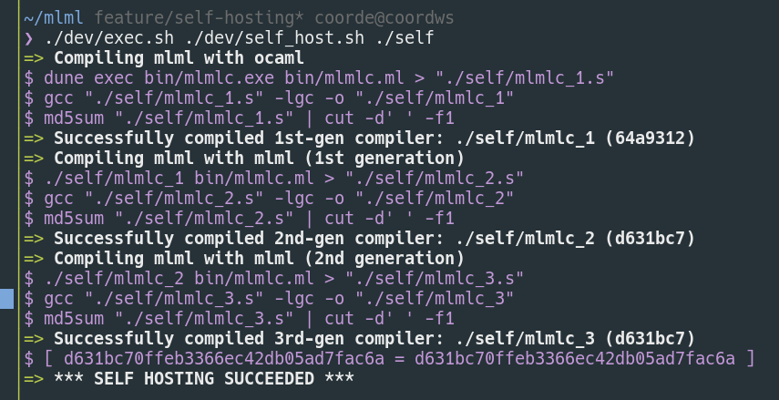

## 概要

ここ最近作っていた OCaml^[とある関数型プログラミング言語 <https://ocaml.org/>]コンパイラ**mlml**^[開始当初は"モルモル"と読むつもりだったが実際そう読んだことはない]でセルフホストを達成しました。ﾔｯﾀｰ

[embed](https://github.com/coord-e/mlml "coord-e/mlml"){ description="self-hosted compiler for a subset of OCaml" }

mlml には以下に代表されるような、OCaml の基本的な機能が実装されています。

- 再帰関数
- ヴァリアント、レコード
- パターンマッチ
- カリー化
- モジュール

また、[多少の標準ライブラリも実装されています。](https://github.com/coord-e/mlml/tree/develop/stdlib)

## mlml の特徴

### ほぼフルスクラッチ

今回 LLVM やパーサジェネレータに頼らないコンパイラづくりを体験するのが目的の一部だったので、結果的にフルスクラッチらしきこと^[ビビリなので自信がない 「フルスクラッチ」ってなんだ？]になりました。OCaml の標準ライブラリ以外の外部ライブラリを使用しておらず、字句解析器・構文解析器は手書きです。

### OCaml で書かれている


セルフホストしたのでそれはそうなんですが、OCaml で書かれています。

また、言語処理系を書く場合ランタイムライブラリは C 言語で用意してリンクする場合が多いと思いますが、今回は謎に意地を張ってしまい[全て OCaml 内で完結させました](https://github.com/coord-e/mlml/blob/develop/mlml/codegen/runtime.ml)。これがよかったのかはよくわからないんですが、文字列などのデータ構造を扱うのにコード生成部と共通のコードを使えるので保守性が上がった(気がします)。

### x86_64 のアセンブリを吐く

GAS^[というか面倒なので gcc に流すわけだが]に流すことを想定している、x86_64 で glibc の環境向けのアセンブリを吐きます。

今まで LLVM IR を出力するコンパイラしか作ったことがなかったので、x86 もやってみようと今回チャレンジしてみました。

### dune の真似をするバンドラーがくっついている

mlml では[dune](https://dune.build/)をビルドシステムとして使っています。そのため気軽にソースを複数のファイル・ディレクトリに分割して開発できました。

しかしセルフホストするときに自分自身が複数のファイルに分割されていると、それらをまとめる部分も作らなければいけません。
ということで、mlml には dune の動作をシミュレートするバンドラーがくっついています。内部ではファイル間の依存関係を解決する部分まで書く羽目になりました。これはかなり沼で^[しかも `Sys.readdir` を実装しなきゃいけない！]、セルフホストをやるうえでは設計ミスだったなと思っています。カッコつけずに少ないファイルで作ればよかった。

## 作り始めたきっかけ

なんとなく OCaml を書けるようになろうと思ったので、[公式のチュートリアル](https://ocaml.org/learn/tutorials/)をやりました。4 月の初め頃のことです。

それが一通り終わったのでコンパイラを作ることにしました。

<blockquote class="twitter-tweet"><p lang="ja" dir="ltr">今ですが、OCamlの練習として(?)パーサジェネレータとLLVMを使わない縛りでコンパイラを書いている<br>やっと簡単なコード生成ができるようになった (x86に不慣れすぎる…) <a href="https://t.co/O7KdJaYPja">pic.twitter.com/O7KdJaYPja</a></p>&mdash; coord_e (@coord_e) <a href="https://twitter.com/coord_e/status/1113826198230978562?ref_src=twsrc%5Etfw">April 4, 2019</a></blockquote>

コンパイラならなんでも良かったんですが、[\@ushitora_anqou](https://twitter.com/ushitora_anqou)さんの記事"[はりぼて自作 OCaml コンパイラ AQaml でセルフホストしてみた | カオスの坩堝](https://anqou.net/poc/2019/01/27/post-2700/)"を読んでセルフホストは楽しそうだなー思い、OCaml コンパイラを作ることに決めました。

その後は[ハッシュタグ#mlml_compiler](https://twitter.com/hashtag/mlml_compiler)に進捗を投稿しつつ制作を続け、開始からだいたい 50 日でセルフホストに至りました。二ヶ月ですね^[ ゴールデンウィーク中に終わらせるつもりだったんですが全然終わらなかった(それはそう) ]

## 実装の方針

完璧な OCaml コンパイラを作ろうとしたらいつまでたっても終わらないので、制作を始めるときにいくつか制限を決めました。

### 出力コードの効率は気にしない

x86_64 を直接扱うコンパイラを書くのは初めてなので、まずは効率を気にせず確実に動くコードを吐かせることを優先してコードを書いていくことにしました。

### 型システムは作らない

これなんですが、作り始めた当時「型システムは実行時エラーを静的に検出するためのものなのに僕は型情報に依存したコード生成をやっている^[[expressi](https://github.com/coord-e/expressi)とかでやってた]！型がなくてもコード生成ができるべきだ」という考えがあったことに起因します。(あとで知ったんですがこの考えは正しいわけではなく、OCaml 含む大抵の言語は型情報が項に内因的に含まれています^[型付けできない項は invalid である、Curry-style typing とも]。よってコード生成で型情報を利用するのは当然のことです)

結果、型なしで OCaml を実装することになりました。意外にも大体の機能が型推論なしで実装できたんですが、使い勝手が悪かったり一部妥協があったりします。^[例えばフォーマット文字列と通常の文字列を使われ方によって切り替えることができないので、`Printf.printf "Hello"` は実行時エラーになります]

### テストイメージ内以外での動作は考えない

出力の可搬性を重視したいなら LLVM IR を吐けばいい話なので、"動く環境が存在する"ことを重視することにしました。開発用の Docker イメージを用意し、その内部でテストなどを走らせました。

Docker コンテナ内でワークフローを回せるようになっているので、macOS や Windows でも開発が行えるようになっています(きっと)

## 内部構成

[技術的な詳細は別記事にまとめた](/post/2019-05-24-mlml-impl.html)ので、ここでは処理の流れを描いた図を示すだけに留めます。



クロージャ変換や α 変換、ヴァリアント/レコード/パターンマッチを実装する体験ができたのは良かったです。作る前はどうやってやるのか見当もつかなかったので…

## セルフホストについて

mlml では

- 自分自身をコンパイルできる
- 第一世代と第二世代のコンパイラに自分自身を食わせたときの出力が一致する

ことを検証し、セルフホストできたという結論に達しました。^[テストケースを第一世代に流すスクリプトをいずれ書くかもしれない]

[セルフホスト用スクリプト](https://github.com/coord-e/mlml/blob/develop/dev/self_host.sh)を書いたので、誰でも試すことができます。clone したディレクトリで以下のコマンドを実行します^[docker が必要です] (完了まで一日ぐらいかかります):

```bash
./dev/exec.sh ./dev/self_host.sh
```

ちなみに"セルフホスト"の定義について Twitter でアンケートをとったら以下のようになりました。

<blockquote class="twitter-tweet"><p lang="ja" dir="ltr">&quot;セルフホスト&quot;</p>&mdash; coord_e (@coord_e) <a href="https://twitter.com/coord_e/status/1130272270629216258?ref_src=twsrc%5Etfw">May 20, 2019</a></blockquote> <script async src="https://platform.twitter.com/widgets.js" charset="utf-8"></script>

「自分自身をコンパイルできる」派が優勢のようです。僕は「第一世代と第二世代の出力が一致する」派です。真相はいかに

## 感想

前方参照がないことのキツさ^[`let rec … and …` が本当につらい 特にコンパイラを書く人にとって…]やヴァリアント・レコードの実装の簡単さ^[やってみると大抵のものはタプルだった]といったことを身をもって感じられたのが一番の収穫だと思っています。

OCaml への理解は深まったかというとそうでもなくて、オブジェクト指向や GADT、ファンクタなどに触れていない。これは残念です。(セルフホストがしたかったのでしょうがないが)

あとは地味に再帰をガリガリ書く関数型プログラミングをやるのは今回が初だったりするので、慣れることができてよかったなと思っています再帰にかなり苦手意識があったので…

## 今後の展望

TaPL を読み進めたり Software Foundations を進めたりしたいのでしばらくは mlml から離れるつもりです。しかし、例外の実装には興味があるのでいずれ mlml に追加したいなと思っています。

## 次回に続く

読んでいただきありがとうございました。

次は役に立つことを書くぞ！！　(技術的な詳細を書いていこうと思います)

追記: 実装の詳細について書きました。

[embed](/post/2019-05-24-mlml-impl.html "mlmlの実装について - coord-e.com"){ description="自作 OCaml コンパイラの実装の詳細をまとめました。" }
