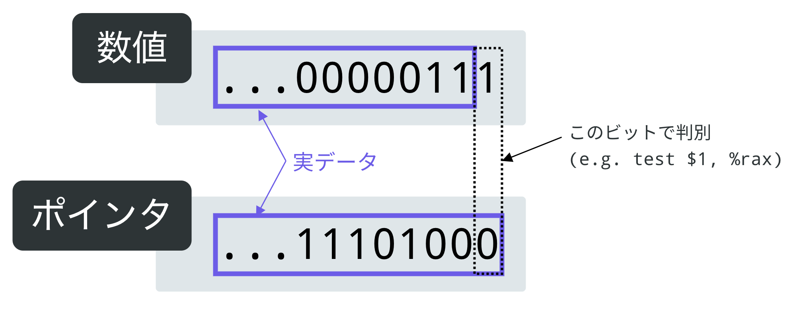
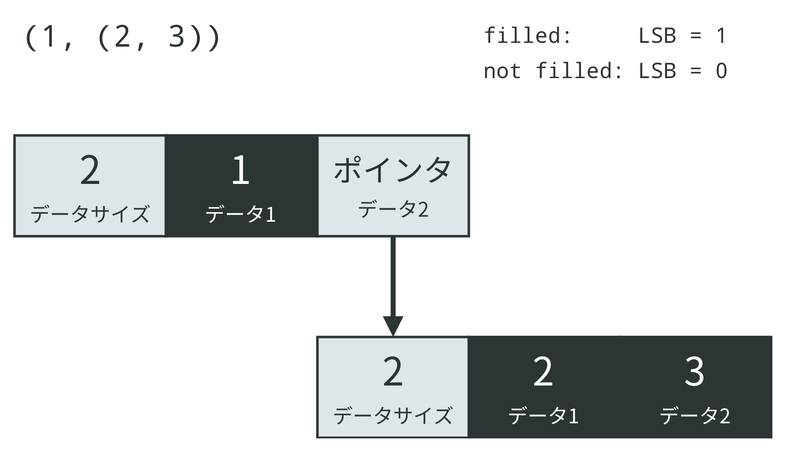
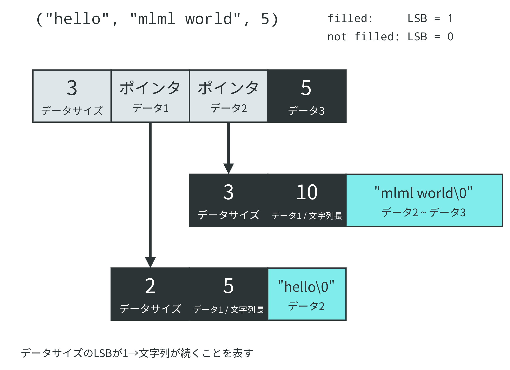

前記事: [自作 OCaml コンパイラでセルフホストした - coord-e.com](/post/2019-05-23-mlml-self-host.html)

mlml の制作のまとめとしてここに実装の詳細を記しておきます。

## mlml とは

自作 OCaml コンパイラです。詳しくは[前記事](/post/2019-05-23-mlml-self-host.html)を参照してください。

## 全体の構成

以下の図に mlml の構成を示します。


ファイル名を入力として受け取ります(①)。そのファイルをエントリポイントとして Bundler が必要なソースを集めて 1 つの AST にまとめ、Analysis に渡します(②)。Analysis が AST に様々な変形を施し、Codegen に渡します(③)。Codegen は AST からアセンブリを生成し、出力します(④)。

## 依存関係の解決 (Bundler)

[mlml/mlml/bundler at develop · coord-e/mlml · GitHub](https://github.com/coord-e/mlml/tree/develop/mlml/bundler)

まず受け取ったファイルに字句解析・構文解析を済ませます。次に構文解析によって作られた AST に対して依存関係の解析を行い、そのファイルが依存しているモジュールを探します。見つかった依存モジュールに対しても同じように解析を行い、下のようなツリー状のデータ構造^[ツリーというか有向グラフやな]を構築します。


次に、”自身が依存するモジュールが常に自分の前に存在するように"、このツリーを潰して直線状に並べます。(追記: この操作はトポロジカルソートと呼ぶようです。[\@syobon_hinata](https://twitter.com/syobon_hinata/)さん、ありがとうございます)


最後にこの並びに従ってモジュールを並べてやることで、それぞれのモジュールが必要なモジュールを参照可能な状態になった大きな AST が出来上がります。

めでたしめでたし…という感じですが、これは本来コンパイラがやるものではなくてビルドシステムにやらせるのが賢明だと思います。作ってしまったものはしょうがないんですが

## 識別子の名前解決 (Analysis)

[mlml/resolve.ml at develop · coord-e/mlml · GitHub](https://github.com/coord-e/mlml/blob/develop/mlml/analysis/resolve.ml)

今回はコード生成器でモジュールを意識したくなかったので、Analysis で名前解決^[なんて呼べばいいかわからないのでそれっぽい呼び方をしました]を行ってしまうことにしました。私はこの変換を"Resolve"と呼んでいます。

以下のような OCaml コードを考えます。

```ocaml
module Module1 = struct
  let f x = Printf.printf "Hello from Module1: %s\n" x
  let g () = f "g"  (* (1) *)
end

module Module2 = struct
  let f x = Printf.printf "Hello from Module2: %s\n" x
end

open Module2 ;;
f "mlml" ;;  (* (2) *)
Module1.g ()
```

ここではソースコード上で表記されている名前(`f`、`Module.g`など)を**相対パス**、変換後(Resolve 後)の名前を**絶対パス**と呼ぶことにしましょう。

さて、このコード内では 2 回 `f` という相対パスが使われていますが、その 2 つは実は違う実体を参照していることがわかります。
参照先が明確になるよう書き換えてみると(1)の `f` は `Module1.f` 、(2)の `f` は `Module2.f` になります。

このように文脈を考慮して参照先を決定し、絶対パスに書き換える操作を Resolve では行っています。

相対パスは文脈によって参照している実体が変わりますが、絶対パスは文脈に関係なく参照先が定まります。そのため、全ての名前を絶対パスに変換してしまえばコード生成器でモジュールの文脈を意識する必要がありません。

参照だけではなく定義の名前も絶対パスに変換すると、変換後のコードは以下のようになります

```ocaml
(* 擬似コード *)
module Module1 = struct
  let Module1.f x = Printf.printf "Hello from Module1: %s\n" x
  let Module1.g () = Module1.f "g"  (* (1) *)
end

module Module2 = struct
  let Module2.f x = Printf.printf "Hello from Module2: %s\n" x ;;
end

open Module2 ;;
Module2.f "mlml" ;;  (* (2) *)
Module1.g () ;;
```

全ての名前が絶対パスになったので、もうモジュールに関する文脈(`module`定義や `open` など)は必要ありません。最終的にはそれらが取り除かれ以下のようになります。

```ocaml
(* 擬似コード *)
let Module1.f x = Printf.printf "Hello from Module1: %s\n" x
let Module1.g () = Module1.f "g"  (* (1) *)
let Module2.f x = Printf.printf "Hello from Module2: %s\n" x ;;

Module2.f "mlml" ;;  (* (2) *)
Module1.g () ;;
```

これでコード生成器内で名前が扱いやすくなりました。

## カリー化

mlml では複数の引数を受け取る関数をカリー化しており、全ての関数が 1 つしか引数を受け取りません。

例えば次の OCaml コードを考えます。

```ocaml
let f x y z = x + y + z in
let g = f 1 2 in
g 3
```

ここでは `f` が `x` , `y`, `z`の三引数を受け取る関数として定義されています。これは mlml では糖衣構文で^[現実装、脱糖がパーサ内で行われているんですが、ダサいのでどうにかしたい]、脱糖すると以下のコードになります。

```ocaml
let f x = fun y -> (fun z -> x + y + z) in
let g = (f 1) 2 in
g 3
```

複数引数を受け取る関数を「1 つ引数を受け取り、関数を返す関数」として扱うことで、カリー化が実現できます。また、引数を 1 つだけ考えればよくなるため、後の変換やコード生成が楽になります。

## クロージャ変換 (Analysis)

[mlml/closure.ml at develop · coord-e/mlml · GitHub](https://github.com/coord-e/mlml/blob/develop/mlml/analysis/closure.ml)

OCaml では、関数内部で引数だけではなく外にある名前も参照することができます。以下の OCaml コードを考えます。

```ocaml
let a = 10 ;;
let b = 20 ;;
let f x = x + a + b ;;
f 1
```

関数 `f` 内で `a` 、`b`が参照されていますが、それは関数の引数(`x`)ではありません。ここでは `a` 、`b`のような変数を**キャプチャ変数**と呼ぶことにします。また、それとは別に、引数や `let` 式に束縛されていない変数のことを**自由変数**と呼びます。例えば定義 `let f x = x + a + b` を単体で見たときの自由変数は{a, b}です。

さて、最終的にアセンブリに出力する際、関数内から関数外の変数を参照することはできません^[グローバルに置いたりスタックを異常な使い方をしたりすれば可能ですが、ややこしいので考えません]。そのため、変換によって関数定義から自由変数を取り除く必要があります。この変換を**クロージャ変換**と呼びます。基本的なアイデアとしては、関数を関数とキャプチャ変数の組として扱うというものになります。

クロージャ変換については[MinCaml のページ](http://esumii.github.io/min-caml/)でわかりやすく解説されています。

mlml のクロージャ変換では関数定義のキャプチャ変数をタプルにまとめ、引数を本来の引数とキャプチャ変数のタプルで受け取るように変形します。そして、関数を実体とキャプチャ変数のタプルとして定義し直します。このタプルを**クロージャ**と呼びます。また、関数適用ではクロージャを関数本体とキャプチャ変数のタプルに分解し、それを引数に渡してやることで意図した動作を実現しています。^[日本語にすると全然わからない]

この通りに変換すると先ほどのコードは以下のようになります。^[実際には `_f` 、`_fv` は適用される式に対して fresh になるように選ばれます]

```ocaml
let a = 10 ;;
let b = 20 ;;
let f =
  let f (x, (a, b)) = x + a + b in
  f, (a, b)
;;
let (_f, _fv) = f in _f (1, _fv)
```

変換後のコードに現れる関数定義(`let f (x, (a, b)) = x + a + b`)には自由変数がなくなっています。これで関数のコード生成が可能になります。

## フォーマット文字列 (Analysis)

[mlml/format_string.ml at develop · coord-e/mlml · GitHub](https://github.com/coord-e/mlml/blob/develop/mlml/analysis/format_string.ml)

OCaml では Printf もカリー化されており、以下のような扱いをすることができます。

```ocaml
let printer = Printf.printf "%s %d" in
List.iter (printer "hello") [1; 2; 3]
```

しかし考えてみると、Printf が受け取る引数の数は第一引数として受け取っているフォーマット文字列に依存します。
例えば `Printf.printf "%s"` は文字列を 1 つ受け取る関数ですが、`Printf.printf "%d %s"`は数値と文字列を受け取る関数です。
これは一見コンパイラマジックでも使わないと実現不可能なように思われます。しかし、フォーマット文字列を関数に変換することでこれを実現することができます。

mlml では、フォーマット文字列は「関数を受け取り、その関数を必要な引数を受け取ってフォーマットした結果に適用する関数」に変換されます。

ややこしいので具体例をみていきましょう。

例えば `"%s and %d"` は、以下のような関数に変換されます。

```ocaml
fun k -> (fun s -> (fun d -> k (s ^ " and " ^ string_of_int d)))
```

フォーマット文字列自体に文字列を組み立てる機能を持たせる感じです。

そして `printf` を以下のように定義します。

```ocaml
let printf fmt = fmt (fun x -> print_string x)
```

こうすることで、

```ocaml
printf "%s and %d"
```

が

```ocaml
fun s -> (fun d -> print_string (s ^ " and " ^ string_of_int d))
```

に簡約できることがわかると思います。結果としてカリー化された Printf が実現できています。

## 値の内部表現 (Codegen)

OCaml には構造比較演算子 `=` があります。これは 2 つの値が構造的に等しいかどうか判定するものです。

例えば `(1, (2, 3)) = (1, (2, 3))` は `true` に評価されます。当たり前のようですが、タプルはポインタとして実装されているので単純な `cmp` では実現できません。値を再帰的に比較していく必要があります。

しかし、ただ値 2 つを渡されてもそれらを再帰的に比較することはできません。なぜならそれが数値なのかポインタなのかもわからない^[型がない!!] (=再帰的に比較すべきなのかどうかわからない)上に、ポインタだとしてデータのサイズがわからないとどこまで比較を進めていいのかわからないからです。

そこで、これらの情報を値に埋め込んでいます。

あらためてまとめると、埋め込むべき情報は以下の 3 つです。

- 数値なのかポインタなのか？
- ポインタなら、続くデータのサイズ
- 文字列なのかどうか (文字列を埋め込むとポインタと解釈されかねないので、例外的に扱い直接比較させる)

なお、mlml では簡単のためデータを 8 バイト単位で扱っています。

### 数値なのかポインタなのか

ほとんどの場合^[調べてみたら怪しくなってきた 実際 malloc が返すポインタは大抵アラインされているんですが、仕様で規定はされていないらしい…？]ポインタはアラインされているので下位 2~3 ビットが 0 になっています。ということで 1 つ目の「数値なのかポインタなのか？」については"数値の最下位ビットを必ず 1 にする"という決まりを作ってしまえばうまく区別できそうです。このアイデアは ocaml^[OCaml という言語ではなく公式の ocaml コンパイラを指しています、以下 lowercase の場合コンパイラを指しています]の実装から得たもので、これが OCaml の整数が 1 ビット足りない理由だったりします。^[いや、OCaml には型あるやんけって感じなんですがどうも GC に使うらしいです]

これを実現するために、数値は全て左シフトしたのち最下位ビット(以下 LSB と呼びます)を立てています。(n\*2+1、ここではこの状態を**marked**と呼ぶことにします^[tagged 呼びの方が一般的っぽいのかな] ) 実際に中身を使うときは右シフトすれば元の値が取り出せます。



いちいち整数を扱うたびにこの変換を噛ませるのは大きなオーバーヘッドになりそうですが、意外とそうでもないのがこの表現の面白いところです。
例えば `n+m` を考えると、求める marked な値は `(n+m)*2+1` となります。これは `(n+m)*2+1=(n+m)*2+2-1=(n*2+1)+(m*2+1)-1` と変形できるので、marked な整数同士の加算は `add` と `dec` の二命令で実装できるわけです！これと同じように減算や乗算、論理否定なども"値を取り出す → 計算する → 作り直す"の手順を踏まずに少ない命令数で実装できます。最初に考えた人頭いいなあ。

ということで、値の LSB を見れば数値なのかポインタなのか判別できるようになりました。

### ポインタに続くデータのサイズ & 文字列なのかどうか

ポインタが指す先の 1 つ目のデータにデータサイズを格納しています。

ただ、文字列かどうかも判別しなければいけないのでこのデータサイズ用の領域の LSB をこのフラグに使っています。データサイズ領域の LSB が 1 なら文字列、0 ならそれ以外のデータです。

具体例を見ていきましょう。下の図に `(1, (2, 3))` を mlml がどう扱うかを示します。背景の色が黒なら LSB=1、白なら LSB=0 であることを表しています。



タプルは文字列ではないので、データサイズ領域の LSB は 0 になっています。

文字列を含む構造は以下のようになります。文字列の長さをデータサイズ領域の次に marked int として格納しています。これは文字列長が O(1)で求められると色々と^[libc の関数に mlml の文字列を渡すとき、ポインタ計算で文字列長が頻繁に必要になる]便利だからです。



### 構造比較の実装

と、いうような感じで値の種類を実行時に判別しています。

構造比較演算子 `=` は[ランタイムライブラリで実装されています](https://github.com/coord-e/mlml/blob/develop/mlml/codegen/runtime.ml#L134)。基本的には値の種類を見て再帰的に構造を比較していく感じです。

### 各種データ構造の実装

タプルは先ほどの画像で示したとおりデータが並んでいるだけです。

ヴァリアントはインデックス付きのタプルとして実装しました。以下の型 `t` を考えます。

```ocaml
type t =
  | A
  | B of int * int
  | C of t
```

ヴァリアント定義に現れた順番で各コンストラクタにインデックスを振っていきます。上の例では `A` →0、`B`→1、`C`→2 です。
そしてコンストラクタが受け取る値とコンストラクタのインデックスをタプルにした値に評価されるようにします。

```ocaml
let a = A ;;             (* (0, ()) *)
let b = B (10, 20) ;;    (* (1, (10, 20)) *)
let c = C (B (3, 4)) ;;  (* (2, (1, (3, 4))) *)
```

こうすることで構造比較はタプルとして比較することができますし、パターンマッチはインデックス同士を比較することで実現できます。

レコードはただのタプルとして実装されています。レコードのフィールドと要素のインデックスがコンパイル時に結びついています。以下のコードを考えます。

```ocaml
let t = { value: int; tuple: (int * int) } ;;
let v = { tuple = (2, 3); value = 1 } in
print_int v.value
```

ここで、型 `t` は `value` と `tuple` の 2 つのフィールドをもつレコード型です。出現順にフィールドにインデックスをつけていきます。ここでは `value` →0、`tuple`→1 です。

そしてレコードの値を生成するときに、フィールドのインデックスに従ってタプルに値を配置します。上のコードでは `{ tuple = (2, 3); value = 1 }` とフィールドの順番が型定義と異なっていますが、インデックスに従って並べ替えられ、タプル `(1, (2, 3))` に評価されます。

レコードから値を取り出すときにもフィールドのインデックスを利用します。`v.value`では `value` は 0 番目のフィールドなので、タプル `v` の 0 番目の要素を取り出すように評価されます。

このように、複雑に思えるデータ構造も単純化してタプルとして実装することができました。

## GC (Codegen)

mlml には[Boehm GC](https://www.hboehm.info/gc/)を使用した GC がついています。Boehm GC は `malloc` を `GC_malloc` に変えるだけでお手軽に GC が使えてしまう^[ libgc にリンクしなければいけない、`GC_init` が必要な場合があるなどありますが] 、本当に最高な優れものです。GC なしだとセルフホストしようとしたときにあっという間にメモリを食いつぶしてしまったので、GC が必須でした。

## おわり

ここまで読んでくださりありがとうございました。mlml の実装で凝ったことしている部分はだいたいこんな感じです。

あまり調べもせず思いついた方法に突っ走ってしまう傾向が強かった気がしています。モジュールの扱いはかなり改善の余地があると感じているので次に似たようなことをするときはもう少しマシな実装になるよう前例を調べてみようと思います。ocaml のモジュールはレコードになっているらしい^[<https://no-maddojp.hatenablog.com/entry/2015/06/06/165620>]。

## 参考資料

mlml の制作にあたり、以下の資料を参考にしました。

- [GitHub - ushitora-anqou/aqaml: Yet another tiny self-hosted OCaml compiler with an also tiny standard library.](https://github.com/ushitora-anqou/aqaml)
- [はりぼて自作 OCaml コンパイラ AQaml でセルフホストしてみた | カオスの坩堝](https://anqou.net/poc/2019/01/27/post-2700/)
  - パーサとレキサは aqaml を参考に作りました。ありがとうございます。
- [The OCaml system, release 4.07](https://caml.inria.fr/pub/docs/manual-ocaml/)
- [速攻 MinCaml コンパイラ概説](http://esumii.github.io/min-caml/)
- [OCaml の format (型安全な printf/scanf) の仕組み - 簡潔な Q](https://qnighy.hatenablog.com/entry/2017/01/26/215948)
- [Compiler Explorer](https://godbolt.org/)
- [Random memo of OCaml programming](https://github.com/camlspotter/ocaml-zippy-tutorial-in-japanese/blob/master/bb/random_memo.rst)
