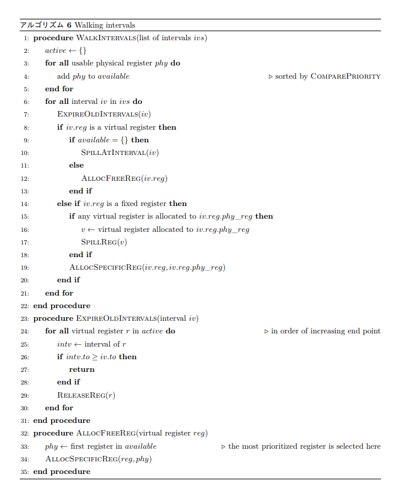
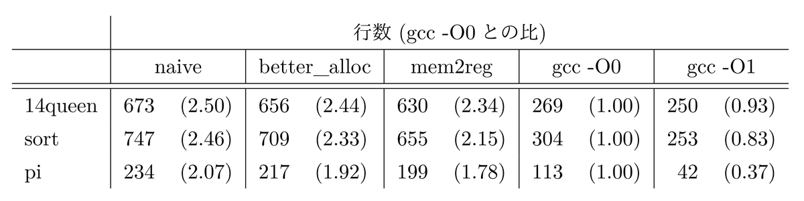

<!-- textlint-disable ja-technical-writing/no-mix-dearu-desumasu -->

この記事は[言語実装 Advent Calendar 2019](https://qiita.com/advent-calendar/2019/lang_dev)の 23 日目です。

<!-- textlint-enable ja-technical-writing/no-mix-dearu-desumasu -->

## はじめに

実は、この記事の大半の文章は以前に[別の目的](https://twitter.com/coord_e/status/1203620846259933186?s=20)で執筆したものだ。
そういえば ccc について記事を書いていないな、ということで、少し内容を変更しつつ体裁を整えて公開することにした。
なお、ブログやスライドなどで散々「セルフホストする」「`gcc -O1`に勝つ」と豪語していたが、そのどちらも達成できていない。残念。

この記事には PDF 版があり、以下のリンクからダウンロードできる。

<!-- textlint-disable no-dead-link -->

- [`backend_of_ccc_compiler.pdf`](https://github.com/coord-e/article-ccc-backend/releases/latest/download/backend_of_ccc_compiler.pdf)

<!-- textlint-enable no-dead-link -->

元が$\text{\LaTeX}$なので PDF の方が読みやすいと思われる。基本的には PDF とはてなブログの内容は同一だが、長いアルゴリズムなどは省略して PDF にのみ載せていることがある^[それについてはその都度記載している]。また、内容が同じ 2 つの文書を同時に up-to-date に保つのは大変そうなので、何か変更する必要が生じたときは僕のやる気によっては PDF 版のみ更新してはてなブログの内容が古くなる可能性がある。

## 概要

**ccc**は、自分が[セキュリティ・キャンプ 2019](https://www.ipa.go.jp/jinzai/camp/2019/zenkoku2019_index.html)に参加した際に開発したコンパイラだ。
C11 のサブセットをコンパイルすることができ、暗黙の型変換や初期化子、宣言子に代表される複雑な言語機能を規格に忠実に実装している。
さて、ccc は効率の良いコードに効率よくコンパイルすることをテーマに開発を行った。
そのテーマのもと、出力コードの効率を高めるために ccc に実装した技術についてこの記事では説明する。
最後にベンチマークの結果を示し、実装の効果を確かめる。

## ccc コンパイラの構成

ccc コンパイラは C のソースコードを受け取りアセンブリのコードを出力する。ccc ではワンパスでは行えないと思われる変形や最適化を用いているため、コンパイルの段階に応じて複数の中間表現を用いている。

1 つ目の中間表現が**抽象構文木**(_Abstract Syntax Tree, AST_)だ。これは構文解析の結果を木構造で表現したもので、この上で意味解析が行われる。
もう 1 つの中間表現は**IR**と名付けた^[もちろん Intermediate Representation なのだが、中間表現全体を指すわけではなく特定の段階の中間表現を指して**IR**と呼んでいる。「名付けた」と言っているのもそのためである。]。これは AST よりもアセンブリに近い構造を持っており、この上で最適化やレジスタ割り当てが行われる。IR については次節で詳しく説明している。

図 1 はコンパイラ全体の構成を表している。ccc コンパイラの内部パスはソースコードから AST を扱う**フロントエンド**(_frontend_)と、IR を扱う**バックエンド**(_backend_)に概念上分類することができる。
フロントエンドではソースコードに対して字句解析と構文解析を行って AST を生成し、AST の上で意味解析を行ったのち IR を生成する。バックエンドは生成された IR の上でコード変形や最適化を行い、最終的に一般的なアセンブラで処理可能な形式の x86_64 アセンブリを生成する。

なお、バックエンドは今日では LLVM に代表されるようなコンパイラ基盤で置き換えることができる。
しかし ccc では低レイヤ・オタク特有のいわゆる“一から作りたい欲求”に身を任せ、バックエンドを既存のフレームワークを使用せずに自作している。
この記事では主に ccc コンパイラのバックエンドに焦点を絞って説明する。

この記事では構文解析に代表されるようなフロントエンドについては説明しない。理論的な側面については[[1]](#av2009)が詳しい。また、フロントエンドに限らないが、実装から入る場合は[[2]](#ruicompilerbook)が非常に良いオンラインブックであるとして有名だ。

## IR

IR は出力先のネイティブコードに近い構造を持つように設計した。IR 内では関数が単位となっており^[翻訳単位に対応する IR は、翻訳単位内で定義された複数の関数 IR が集まったものである]、これを**関数 IR**と呼ぶことにする。IR に対する操作も基本的に関数 IR 単位で行われる。
関数 IR はメタデータを除けば**IR 命令**(_IR instruction_)の列である。IR 命令は命令の種類である**オペコード**(_opcode_)^[ここでは“命令の種類”の意味で使っており、ccc の IR で書く命令に対応する自然数があるというわけではない]と命令の引数である**オペランド**(_operand_)で構成されている。また、ccc の IR 命令列は**基本ブロック**(_basic block_)に分割されており、各基本ブロックは**後続節**(_predecessors_)と**先行節**(_successors_)の情報を保持している。
これらの情報から基本ブロックは**制御フローグラフ**(_Control Flow Graph, CFG_)を構成する(図 2)。

IR 命令はレジスタをオペランドにとる。ccc の IR 上のレジスタには以下の 3 つの種類がある。

- **仮想レジスタ**(_virtual register_)は、IR 生成の際に使われる、無限個存在するレジスタ。
- **物理レジスタ**(_physical register_)は、レジスタ割り当てが終わったレジスタ。有限個であり、出力コードのレジスタに一対一で対応している。
- **固定レジスタ**(_fixed regitser_)は、後に説明するターゲット固有 IR への変換で生成される、割り当てられる物理レジスタが事前に決まっている仮想レジスタ。

IR を表す図中では、n 番目の仮想レジスタを `vn` 、n 番目の物理レジスタを `rn` 、`rn`に割り当てられる m 番目の固定レジスタは `f(vm:rn)` と表記する。

さて、IR 命令の命令セットを表 1 に示す。
なお、今後の表やアルゴリズムでは命令の出力オペランドを$\mathrm{rd}$、n 番目の入力オペランドを$\mathrm{ra}[n]$と表記する^[入力オペランドの表記として rs が一般的だと気づいたのはある程度 ccc を実装し終えた後でした…]。

表には記載がないが、これらの他に `BIN_IMM` といった片方のオペランドに定数をとる命令や `BR_CMP` といった複合命令が実装されている。これらは主にレジスタ上のデータの流れを用いた最適化である**データフロー最適化**で効率的なアセンブリを出力するために用いている。

IR は AST から生成され、IR の上で最適化やレジスタ割り当てが行われたのちにコード生成パスで x86_64 のアセンブリに変換される。

## ターゲット固有 IR への変換

アーキテクチャや ABI(ここでは 2 つをまとめて**ターゲット**と呼ぶ)によっては、命令がある決まったレジスタを使用することがある。
例えば x86_64 アーキテクチャにおいて除算命令 `div` は被除数を `rax` にとり、商を `rax` に格納する。
また System V ABI において `call` 命令は `rdi, rsi, rdx, rcx, r8, r9` に引数をとり戻り値を `rax` を格納する。
こういった特別に扱われるレジスタをここでは**特殊レジスタ**と呼ぶことにする。
また、x86_64 では `add, sub` などのいくつかの命令において演算の左辺と演算結果が同じレジスタでなければならないという制約がある。

一方で、ccc の IR では表 1 からわかるとおりオペランドのレジスタに特に制限を設けていない。
そのため、単純な実装ではコード生成時に適切に `mov` 命令を挿入して決まったレジスタを使うようにすることになる。
しかし、この方法では特殊レジスタを汎用的に使うことができず、レジスタ割り当てに使えるレジスタの数が制限されてしまう。
また、1 つの IR 命令に対応するアセンブリ命令が多くなってしまうと最適化の効果が制限されてしまうことも予想された。

そこで、ccc ではレジスタ割り当て前に IR 上でターゲット特有の変換を行うことでこれらの問題を解決している。
図 1 では「Target Conversion」と表記している。
これは IR 上で固定レジスタへの `MOV` 命令を生成することでコード生成時に正しいレジスタが使用されていることを保証しながら IR 上で特殊レジスタの使用を表現するものだ。
こうすることでレジスタ割り当ての時点で特殊レジスタの使用が把握できるため、特殊レジスタが使われていない部分では通常のレジスタとして割り当てに使用できるようになる。
図 3 にこの変換の例を示す。関数呼び出しや除算が固定レジスタを使うように変換されているのが見て取れる。

## 最適化

効率の良いコードを出力するため、最適化を行う。
ccc ではデッドコード削除やコピー伝播に代表されるデータフロー最適化や AST 上の定数畳み込みなどを実装しているが、ここではそれらについては説明しない。
特にデータフロー最適化について、技術書展 8 に[OtakuAssembly](https://twitter.com/OtakuAssembly)で記事を出す予定なので、ぜひそちらを楽しみにしていてください。

さて、ここでは `LOAD` /`STORE`以外の操作を受けていないスタック上の領域をレジスタで置き換える最適化について説明する。
この最適化パスを**mem2reg**と名付けた^[LLVM に同じような名前の最適化パスがあり、実際それから名前は着想を得たが、最適化の内容については関連はないものとする]。
mem2reg で使用および実装したアルゴリズムをアルゴリズム 1 に示す。

ここではアドレスとして用いられているレジスタを**アドレスレジスタ**(_address register_)と呼ぶ。
`LOAD`/`STORE`命令のアドレスの位置にあるオペランドとして使われているレジスタがアドレスレジスタである。

`CollectUses`(アルゴリズム 2)でアドレスレジスタのうち、置き換え可能なものを求める。
ここではアドレスレジスタを `candidates` に集めながら、`LOAD`/`STORE`以外の操作を受けているレジスタを `excluded` に集めている。
また、`STACK_ADDR`命令で代入されているレジスタを個別に `in_stack` に集めている。

さて、置き換え可能なアドレスレジスタは、以下の 3 条件を満たしているものである。

1.  スタックのアドレスを保持している
2.  `LOAD`/`STORE`以外の操作を受けていない
3.  置き換え不可能なアドレスレジスタと同じスタック位置を共有していない

1., 2。を満たすアドレスレジスタの集合は、$(\texttt{candidates} - \texttt{excluded}) \cap {\texttt{in\_stack}}$で求められる^[集合の実装に Bit Vector と呼ばれるデータ構造を使用しており、集合の演算が非常に効率的に行える]。
そして 3。を満たさないものを除外するために、置き換え不可能なアドレスレジスタのスタック位置の集合を求め、そのあとにそれを共有しているものを除外するというナイーブな方法をとった。

そして、置き換え可能なアドレスレジスタが求められたのち、`ReplaceInstructions`(アルゴリズム 3、PDF 版に掲載)で命令をレジスタを使うように書き換えている。

図 4 にこの最適化による変形の例を示す。一部のスタックに対する操作がレジスタに置き換わっていることが見て取れる。
この最適化による出力コードの効率の変化についてはこの記事の後半で検討する。

## レジスタ割り当て

ccc では出力の実行効率を意識し、入力をレジスタマシンにコンパイルする。
そのために、**レジスタ割り当て**(_register allocation_)を行う。一般的なプロセッサにおいてレジスタは有限だ。例えば x86_64 においては 16 本、そのうち汎用的に使えるのは 14 本しかない。
すなわち、全ての値をレジスタに保存しておくことはできない。値を保存するレジスタが足りなくなったときに、レジスタの代わりにスタックの領域を使う。これを**spill**と呼ぶ。
spill されたレジスタは使用時にスタックから読み込まれ、値の変更時にスタックに書き戻される。
レジスタへのアクセスはメモリへのアクセスと比べて非常に高速であるため、頻繁にアクセスされる値をレジスタに、そうでない値をメモリに配置することが出力コードの効率向上に繋がる。

一方で最適なレジスタの割り当てを求める問題は NP 完全であることが知られている。そこで、コンパイル時間と実行時の効率のバランスが取れたアルゴリズムが考案されてきた。
そのよく知られた例の 1 つが、レジスタ割り当てをグラフ彩色問題とみなす方法[[3]](#chaitin1981)である。しかしこの方法はコンパイル時間が長くかかるほか、実装が複雑になることが予想されたため今回は採用しなかった。

ccc では、**linear scan register allocation**を使用した。これは Poletto らによって[[4]](#poletto1997)で使われたレジスタ割り当てアルゴリズムだ。
これはグラフ彩色による手法に比べて割り当てにかかる計算量が少なくて済むうえに、ほとんどの場合で同程度に効率の良いコードを出力できる。

ccc の実装では、まず IR 上で**backward data-flow analysis**[[1]](#av2009)を行い、仮想レジスタの生存区間を求めたのち、レジスタ割り当てを行う。
生存区間解析の実装はほぼ[[5]](#wimmer2004)で使われているアルゴリズムの通りである。
レジスタ割り当てのアルゴリズムは[[6]](#poletto1999)を元にしたが、固定レジスタを扱うために一部変更を加えている。
実際に使用したアルゴリズムをアルゴリズム 4 に示す。

このアルゴリズムでは、割り当てに際して 3 つのグローバルな変数を持っている。

- `available`は現在利用可能な物理レジスタのリスト^[available と active には先頭と末尾へのポインタを保持した双方向リンクリストを用い、要素の挿入/取得が定数時間で行えるようにしている]で、後に述べる優先度でソートされている。
- `active`は現在使われている仮想レジスタのリストで、生存区間の終了が遅い順にソートされている。
- `result`は仮想レジスタから割り当てられた物理レジスタへの写像^[物理レジスタと仮想レジスタには自然数のインデックスがついているので、レジスタからの写像は配列で実装されている]。

これらの変数に対する操作は、`AllocSpecificReg`(アルゴリズム 8、PDF 版に掲載)と `ReleaseReg` (アルゴリズム 9、PDF 版に掲載)の 2 つの操作に抽象化されている。
アルゴリズム本体ではこれら 2 つの操作と spill を適切な条件で行うことで、割り当てを行なっている。
また、`available`は次の条件もとソートされている。(アルゴリズム 5)
なお、関数呼び出しで保存されないレジスタ^[System V ABI では rax, rdi, r9 など]のことを**scratch register**と呼ぶ。

1.  現在の関数内の固定レジスタで使用されている物理レジスタより、そうでない物理レジスタを優先する。
2.  現在の関数が関数呼び出しを含むならば、scratch register でない物理レジスタを優先する。そうでないならば scratch register を優先する。

`AllocSpecificReg`(アルゴリズム 8、PDF 版に掲載)からわかるとおり、割り当てる物理レジスタは `available` の先頭から選ばれる。これにより、アルゴリズム 5 で優先されているものから順に割り当てられる物理レジスタが選出されることになる。

さて、linear scan register allocation は、生存区間に対する 1 回の走査によって行われる。
アルゴリズム 6 に走査部分のアルゴリズムを示す。また、spill 関連のアルゴリズムを PDF 版のアルゴリズム 7 に示してある。
固定レジスタの割り当てでは、必要な物理レジスタがすでに割り当てられていた場合にそれを spill することで物理レジスタを確保する。また、spill の対象のレジスタを選ぶ際に固定レジスタを避けるようにしている。それ以外はほぼ[[6]](#poletto1999)の通りである。

図 5 にレジスタ割り当ての例を示す。全て仮想レジスタが物理レジスタに割り当てられているだけでなく、変換前に固定レジスタだったレジスタは、正しく指定されたレジスタに割り当てられていることが見て取れる。

## 評価

ターゲット固有 IR への変換や最適化の効果を確かめるために、ベンチマークを行った。
ベンチマーク環境は以下の通り。

- CPU: AMD Ryzen 7 2700
- RAM: 32GB
- kernel: 5.2.8-arch1-1-ARCH
- OS: Arch Linux
- gcc: 9.1.0

今回は三種類のプログラムをベンチマークに用いた。それぞれ次の通り。

- 14queen - N-queen 問題の n=14 の場合の全ての解を求める
- sort - 30000000 個のランダムな要素からなる配列のマージソート
- pi - 円周率を 200000 桁求める

以下の 5 種のコンパイラにこれらのプログラムをコンパイルさせ、コンパイル時間と実行時間、および出力コードの行数を計測した。
計測はそれぞれ 8 回行い^[なんで 8 回にしたかまるで記憶がない]、平均値を算出した。

1.  固定レジスタを導入する前の ccc (naive)
2.  固定レジスタを導入し 14 本のレジスタを活用できるようになった ccc (better_alloc)
3.  2。に mem2reg 最適化を導入した ccc (mem2reg)
4.  gcc -O0
5.  gcc -O1

### コンパイル時間

コンパイル時間のベンチマーク結果を表 2 と図 6 に示す。

### 実行時間

実行時間のベンチマーク結果を表 3 と図 7 に示す。なお、naive の sort についてはその時点での ccc の実装にバグがあり実行時エラーが生じているため正常な計測ができていない。

### 出力コード行数

出力コード行数のベンチマーク結果を表 4 に示す。

## 考察と展望

当然ながら ccc はどのベンチマークにおいても gcc よりも速くコンパイルできている。
ccc の方が高速なコードを出力しているケースにおいても、最適化を行っていない `gcc -O0` と比べて最適化を行った ccc の方が高速にコンパイルできている。
効率よくコンパイルするという目標はよく達成できていると思う。^[自己満足の話であり、gcc より効率が良いと言いたいわけではない。]

その一方で実行時間については、ほとんどのベンチマークで `gcc -O0` より遅いという結果になった。しかし mem2reg が pi で `gcc -O0` より高速なコードを出力できている。
これは 14queen と sort が配列に対する操作が基本となるベンチマークであるのに対し、pi はスカラ変数に対する操作が中心であることに起因すると考えている。
配列操作はどうしてもメモリアクセスが必要となってしまうが、スカラ変数に対する操作は mem2reg でレジスタ操作に置き換えることができる。そのため pi では mem2reg 最適化の効果が強く出たのではないかと考えられる。

また、表 4 を見ると実行時間が遅い項目は出力コード行数も多くなっていることがわかる。
したがって、ccc をより高性能なコンパイラにするために、今後は出力命令数を減らすために IR 命令セットの再検討を行いたい。
また、まだ実装していない loop unwinding や末尾再帰などの最適化パスも実装し、最終的に `gcc -O1` に主要なベンチマークで勝利できるコンパイラを目指す。

## 結論

本記事では ccc コンパイラの実装について紹介した。
効率の良いコードに効率よくコンパイルするという目標を念頭に、ccc のバックエンドにおける最適化やレジスタ割り当てのアルゴリズム、および実装上の工夫について説明した。
最後にベンチマークを示し、本記事で説明したアルゴリズムの実装によって ccc の出力コードの効率が向上することを確かめた。

## 参考文献

- <a name="av2009">[1]</a> AV エイホ。 コンパイラ: 原理・技法・ツール。 サイエンス社、 2009.
- <a name="ruicompilerbook">[2]</a> Rui Ueyama. 低レイヤを知りたい人のための c コンパイラ作成入門。 [https://www.sigbus.info/compilerbook](https://www.sigbus.info/compilerbook). (Accessed on 12/11/2019).
- <a name="chaitin1981">[3]</a> Gregory J Chaitin, Marc A Auslander, Ashok K Chandra, John Cocke, Martin E Hopkins, and Peter W Markstein. Register allocation via coloring. _Computer languages_, Vol. 6, No. 1, pp. 47–57, 1981.
- <a name="poletto1997">[4]</a> Massimiliano Poletto, Dawson R Engler, and M Frans Kaashoek. tcc: A system for fast, flexible, and high-level dynamic code generation. In _ACM SIGPLAN Notices_, Vol. 32, pp. 109–121. ACM, 1997.
- <a name="wimmer2004">[5]</a> Christian Wimmer. Linear scan register allocation for the java hotspottm client compiler. _Master’s thesis, Johannes Kepler University Linz_, 2004.
- <a name="poletto1999">[6]</a> Massimiliano Poletto and Vivek Sarkar. Linear scan register allocation. _ACM Transactions on Programming Languages and Systems (TOPLAS)_, Vol. 21, No. 5, pp. 895–913, 1999.
