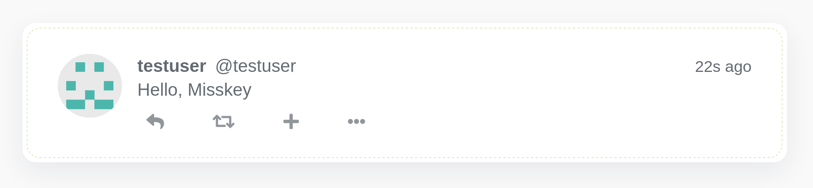
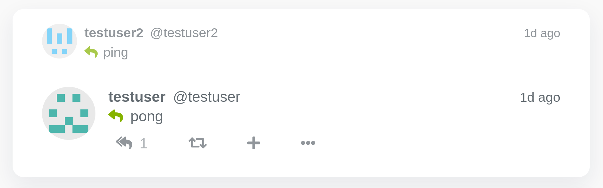

この記事は [Misskey Advent Calendar 2020](https://adventar.org/calendars/5026) の 19 日目の記事です。

[embed](https://adventar.org/calendars/5026 "Misskey Advent Calendar 2020"){ description="Misskey のことであればなんでも結構です。サーバー運用のこと、API を使ってアプリを作ったり、フォークのことなどなど。" }

こんにちは。Rust というプログラミング言語から [Misskey](https://github.com/misskey-dev/misskey) の API を扱うライブラリ [`misskey-rs`](https://github.com/coord-e/misskey-rs) を作りました。

この投稿では Rust でプログラムを書いたことがない人や Rust でのプログラミングを始めたての人に向けて、 `misskey-rs` の使い方を紹介します。
もしあなたが Rust でのプログラミングに慣れているならば、[example](https://github.com/coord-e/misskey-rs/tree/develop/example) を眺めたり [API ドキュメント](https://docs.rs/misskey/0.2.0/misskey/)を参照するのが手っ取り早いかもしれません。

## 目次

[:contents]

## なぜ

身内でやっている Misskey インスタンスがあるんですが^[あるんですよ〜]、そこで Rust を宣伝するにも書いてくれる仲間がいなくて寂しかったんですよね^[ここ語尾どうすればいいかぜんぜんわからない。ですよ〜とか？かわいい女の子がこの語尾で言うとかわいいな〜みたいなのは思いつくけど一方で僕はかわいい女の子じゃないからよく考えないとおかしな文面になってしまいますね…]。
あとそこで bot を作っている人がいて楽しそうだったし、身近な題材なので何かきっかけがあれば^[興味はあるんだけど…って人が多いから]みんな勢い良く bot を作りはじめて面白い感じになるんじゃないかと思っていました。

そこで Rust でめちゃめちゃ使いやすい Misskey のライブラリを作れば Misskey の bot 作成と Rust の両方について始めるきっかけにしてもらえるんじゃないかと思って作り始めたのがきっかけです。

ところで Misskey というのはめちゃめちゃたくさん機能があって^[そういうとこが好きなんだけどね！]、まあ多いんやなあということは知っていたし普段から使っているからなんとなく多いね〜みたいなこともわかっているんだけど、実際それ全部を相手にするライブラリを書いてマジでこれはたくさん機能があるんだな^[`clip` ってなんだよ〜って思ってた矢先フロントの実装が入ったのはおもしろかった]としみじみと感じました^[この段落は「Misskey はデカい」しか言っていなくてそれがおもしろポイントです。笑って！]。

いつもそのデカさにやられて体力が持たずウオーとなって休み休みで開発をしていたんですが^[v0.1 を出した後に力尽きてしばらく更新が止まっていたが]、最後のほうはもう巨大建造物を完成させるような気持ちで開発に臨んでいたしやはり今見ると Misskey にも `misskey-rs` も巨大建造物に感じる憧れと似たものを感じています。でかいものはかっこいいんだよな

### なぜ Rust で書くのか

というわけで動機の一部に Rust を使ってもらいたいというのがあるので、ここで Rust の宣伝を挟みます^[自分が過去に書いたスライドでさらにたのしい説明と始め方の解説をしているので、こちらもどうぞ :point_right: [Introduction to Rust](https://coord-e.github.io/slide-coins20lt-rust-intro/)]。Rust とはどういうプログラミング言語なのか、[公式の本](https://doc.rust-lang.org/stable/book/)の[日本語訳](https://doc.rust-jp.rs/book-ja/)から引用してみます。

> Rust プログラミング言語は、高速で信頼できるソフトウェアを書く手助けをしてくれます。 高レベルのエルゴノミクス(訳注: ergonomics とは、人間工学的という意味。砕いて言えば、人間に優しいということ)と低レベルの制御は、 しばしばプログラミング言語の設計においてトレードオフの関係になります; Rust は、その衝突に挑戦しています。バランスのとれた強力な技術の許容量と素晴らしい開発者経験を通して、 Rust は伝統的にそれらの制御と紐付いていた困難全てなしに低レベルの詳細(メモリ使用など)を制御する選択肢を与えてくれます。
>
> <https://doc.rust-jp.rs/book-ja/ch00-00-introduction.html>

Rust はしばしば書いていてしんどい^[これはマジでない]んじゃあないかとか、学習が大変^[これは少しあるが、インターネットでアクセスできる資料の質は非常に高いし、学習をちゃんとやらないでもそこそこのコードが書けるというのもあります]そうだとかいう認識を持たれます。
しかし実際のところ、上に書いてあるとおり Rust の大きな特徴は**人間に優しい**点にあります。

[Rust の Web サイト](https://www.rust-lang.org/ja/)で「パフォーマンス」と「信頼性」に並んで掲げられているのが「生産性」です。

> Rust には優れたドキュメント、有用なエラーメッセージを備えた使いやすいコンパイラ、および統合されたパッケージマネージャとビルドツール、多数のエディタに対応するスマートな自動補完と型検査機能、自動フォーマッタといった一流のツール群が数多く揃っています。
>
> <https://www.rust-lang.org/ja/>

開発者体験を上げることが、Rust の目的の 1 つとして強く意識されています。

Rust の特徴としてよく知られている信頼性や速度というのは Misskey の bot には必要ない場合がほとんどです。
正直なところ Misskey の bot を書くのに最適なプログラミング言語が Rust かと言われれば微妙なのです。
しかし最適ではなくても Rust で書こうとする理由はここにあって^[ここらへん難しくて、正直なところ僕は単純に Rust が手に馴染むから使っているんだけど、それがなんでなのかをめちゃくちゃ頭をひねって考えながらこの節を書いている]、Rust はとことん人に優しい作りをしているのでコードを書いている体験が非常に良い。

たとえば Rust のコンパイラ `rustc` はエラーメッセージが非常に親切です。
よく難しいと言われる所有権に関係するエラーを出させてみるとこんな感じ:

```
error[E0382]: borrow of moved value: `x`
 --> src/main.rs:5:20
  |
2 |     let x = "hello".to_string();
  |         - move occurs because `x` has type `String`, which does not implement the `Copy` trait
3 |     println!("{}", x);
4 |     let y = x;
  |             - value moved here
5 |     println!("{}", x);
  |                    ^ value borrowed here after move
```

どうですか？
用語の意味はともかくめちゃめちゃ丁寧に説明してくれるし、直し方を考えるための手がかりもたくさんあります。
少なくとも「moved な値を borrow するのはエラーで、ここでは四行目で move された `x` を五行目で利用しようとしたがそれはできない」までは容易に読み取れると思います。なので対策としては四行目で move しないようにする…！と進んでいけるわけです。

もっと簡単な例だと、直し方を教えてくれることがあります。

```
error[E0596]: cannot borrow `x` as mutable, as it is not declared as mutable
 --> src/main.rs:3:5
  |
2 |     let x = vec![1];
  |         - help: consider changing this to be mutable: `mut x`
3 |     x.push(1);
  |     ^ cannot borrow as mutable
```

`help: consider changing this to be mutable` として直し方を教えてくれています。優しい…

別の例として、[Clippy](https://github.com/rust-lang/rust-clippy) というツールがあります。
新しいプログラミング言語を学ぶ際、コード規約とか文化とかを理解するのには時間がかかるのでしんどいですよね。
Clippy はそういうのを自動で見つけて指摘・たまに自動修正してくれるツールです。
と書いたのですがつまりは少し頭のよい linter です…
しかし、こういうものを公式が開発しているというのはおそらく特筆すべき点で、開発者体験を向上しようとする姿勢がよく表れていると思います。

それに、見方を変えれば Rust の「信頼性」というのも人間への優しさなのです。
Rust の信頼性というのが何を言っているかというと「コンパイルが通ったプログラムはある程度よい振る舞いをする」みたいなもので、よい振る舞いというのは具体的にはデータ競合が起きないとかヌルポが起きないとかそういうやつです。
つまり言い方を変えると、よくない振る舞いをするプログラムはコンパイルさせない^[コンパイル"できない"ではなく、まずいことが起きないようにコンパイル"しない"]というわけです。
人がミスをしてしまってもコンパイラがミスを見つけてくれるのは優しさっぽいですね。
テストを書くまでもなく^[もちろんコンパイラの目が届かない範囲についてはテストは書いたほうがいいですが]コンパイルする時点で様々なバグが見つかるなら、それはとてもいいことだと思いませんか？

Rust の学習を始めるための資料を[付録１](#appendix-1)に置いたので、興味を持ってくれたらぜひそちらも見てみてくださいね！

## つかいかた

ということで `misskey-rs` の使い方を紹介します！

もしまだ Rust をインストールしていない場合、[Install Rust](https://www.rust-lang.org/tools/install) から Rust をインストールしてください！
日本語版の本の[インストールの章](https://doc.rust-jp.rs/book-ja/ch01-01-installation.html)も参考になります。

Rust を用意したら、まずクレートを作ります。
クレートというのは Rust のパッケージのことで、ここではプロジェクトの役割を果たしています。
JavaScript でアプリケーションを作るときに `npm init` でパッケージをつくるのと似ていますね。

```shell
$ cargo new --bin hello-misskey-rs
```

ん `cargo` は何^[Rust を変なことをせずにインストールしたら `cargo` も同時にインストールされているはずです]？`cargo` は Rust のパッケージマネージャ^[兼ビルドツール]です^[`npm` みたいなものです]。
さて、上記のコマンドで `hello-misskey-rs` ディレクトリにクレートが初期化されます。
`Cargo.toml` ファイルができていると思うので、`[dependencies]` に以下のように追記をします。

```toml
[dependencies]
misskey = "0.2"
tokio = { version = "0.3", features = ["full"] }
anyhow = "1.0"
```

`Cargo.toml` は Cargo のための設定ファイルです^[`package.json`みたいなものです]。
ここにプロジェクトが必要とする依存パッケージを書いています^[`npm install <package>` みたいなものはデフォルトでは存在しないが、どのバージョンを使うのか確認しながらできるのでいいことだと思う]。
[`misskey`](https://crates.io/crates/misskey/0.2.0) というのは今話している `misskey-rs` です。
[`tokio`](https://crates.io/crates/tokio/0.3.6) と [`anyhow`](https://crates.io/crates/anyhow/1.0.35) というのは例で使う特に関係のないライブラリで、それぞれ非同期処理とエラーハンドリングに使っていますがここは引っかからなくていいです。

つぎに `src/main.rs` に次の内容を書きます^[[GitHub](https://github.com/coord-e/misskey-rs) の README のとおりです]。

```rust
use misskey::prelude::*;
use misskey::HttpClient;

#[tokio::main]
async fn main() -> anyhow::Result<()> {
    let client = HttpClient::builder("https://your.instance.example/api/")
        .token("API_TOKEN")
        .build()?;

    client.create_note("Hello, Misskey").await?;

    Ok(())
}
```

`your.instance.example` の部分を使うインスタンスのホストに、`API_TOKEN` の部分を使うアカウントのアクセストークンに置き換えてください。
アクセストークンは動かしたいアカウントの設定 →API から取得できます。

それではとりあえず動かしてみましょう。`cargo run` でコンパイルして実行できます。

```shell
$ cargo run
   Compiling hello-misskey-rs v0.1.0 (/home/coorde/hello-misskey-rs)
    Finished dev [unoptimized + debuginfo] target(s) in 3.62s
     Running `target/debug/hello-misskey-rs`
```

ターミナルにはおもしろいことは何も出てきませんが、タイムラインを見てみてください！
うまくいけば "Hello, Misskey" とノートが投稿されているはずです。



やったー！

## 何をしているのか

では出来上がったソースコードがこちらです！という感じになっているので^[三分クッキング（？）、いまいち他人の記憶っぽくて自分で見たことがあるのか思い出せない…みなさんは本当の三分クッキングをみたことがありますか？]、これがなんなのか見ていきます。

まず冒頭のこちら。

```rust
use misskey::prelude::*;
use misskey::HttpClient;
```

これは `import` みたいなもので、`misskey-rs` が提供するクライアントなどをインポートしています^[そうなんだ感]。

```rust
#[tokio::main]
async fn main() -> anyhow::Result<()> {
  ...
}
```

ここでは `main` という名前で非同期な^[「非同期な」って関数の形容詞として大丈夫かな〜って思ったんだけどちゃんとしたドキュメントに asynchronous function って記述があってまあいっかってなっちゃった。真相はよくわからん、ごめん]関数を定義しています。

冒頭の `#[tokio::main]` から順を追って説明していきます。
まず JavaScript の `async` / `await` と同じような非同期処理の文法が Rust にもあり、例によって `await` は `async` な関数の内部でしか使えません。
そして Rust では `main` 関数から処理が始まるのですが、`main` 関数の内部で [`await`](https://doc.rust-lang.org/std/keyword.await.html) を使うために `main` を [`async`](https://doc.rust-lang.org/std/keyword.async.html) にする必要があります。
`main` を `async` にしても通常通り実行できるようにするために、`#[tokio::main]` が必要になっています^[そうなんですね並感]。
とはいえここで困ることはほとんどないので引っかからなくていいです。

`-> anyhow::Result` というのは `anyhow::Result<()>` という型の値をこの関数から返す、ということを言っています。
`Result` っていうからには結果なんだろう…そうですこれは結果で、 [`anyhow`](https://docs.rs/anyhow) というライブラリが提供する結果を表す型を用いています。
ただしここでいう結果というのは成功して値が返ってきたか失敗してエラーが返ってきたかのどちらかを保持している値です。
様々なエラーがプログラムからは出てくるのですが、 `anyhow` の `Result` を使うとその様々なエラーを全部吸い込んでくれます。
これは例を示すうえで関係のない複雑さを隠すために使っているので、引っかからないでください^[引っかからないでも書き進められるようにこれを使っているのもあります]。

```rust
let client = HttpClient::builder("https://your.instance.example/api/")
    .token("API_TOKEN")
    .build()?;
```

ついに `main` 関数の内部です。ここでははじめにインポートした `HttpClient` 型の値を作り、それに `client` という変数名をつけています。
まず `HttpClient::builder(..)` 、これは `HttpClient` に実装されている [`builder` 関数](https://docs.rs/misskey/0.2.0/misskey/struct.HttpClient.html#method.builder) を呼ぶ文法です。`builder` 関数は `HttpClient` を作るためのビルダーというものを返します。
ビルダーってなんじゃいという話があると思うんですが、メソッド^[この投稿中ではメソッドと関数を言葉の上で呼び分けておらず、メソッドを関数と呼んだりする。や、メソッドは関数なんだが…「そこは引っかからなくていい」ってやつです]をチェインして値を作ることができるやつみたいな認識でオッケーです。
そして、`builder` 関数から返ってきたビルダー^[[`HttpClientBuilder`](https://docs.rs/misskey/0.2.0/misskey/http/struct.HttpClientBuilder.html) です]に [`token` 関数](https://docs.rs/misskey/0.2.0/misskey/http/struct.HttpClientBuilder.html#method.token) でアクセストークンを設定し、[`build` 関数](https://docs.rs/misskey/0.2.0/misskey/http/struct.HttpClientBuilder.html#method.build) で実際に `HttpClient` を作ります。

ここで注目してほしいのが最後に付いている `?` です。
ドキュメントから [`build` 関数](https://docs.rs/misskey/0.2.0/misskey/http/struct.HttpClientBuilder.html#method.build)は `Result<HttpClient, Error>` 型を返すことがわかりますが、ここで欲しいのは左にある `HttpClient` だけです。
つまり^[先述のとおり、`Result` というのは成功して値が返ってきたか失敗してエラーが返ってきたかのどちらかを保持している]はエラーだったらそのエラーを `main` から返却して^[`main` は `Result` を返すようになっていて、つまりエラーか成功を表す値を返すことになっているので、エラーを返すこともできるわけですね]、エラーではなければ `HttpClient` を取り出したい、というのがやりたいことになります。
`?` はまさにそれをやってくれる演算子で、`<何か式>?` と書くと `<何か式>` が返す `Result<T, E>` から `T` を取り出す^[`E` だった場合に `return` することによって]ことができます^[先に述べた `anyhow::Result` はいろいろな `E` を吸い込むことができるので、`main` の型に `E` がなくてもちゃんと型が合います。]！

Rust では `let` で変数を定義します^[JavaScript の `let` を連想すると思いますが、これはどちらかというと（まじでどちらかと言うならば） `const` に近い意味合いです。しかしシャドーイングは許可されているが（再代入だけではなく）値の変更は許可されておらず、そういった点で JavaScript の気持ちが適用できない感は強いです。とりあえず `let` で怒られたら `let mut` を使うみたいな運用でいいと思います。]。ここでは `client` という名前をつけています。
ということで、めでたく `client` は `HttpClient` 型の値になりました。
これでこのクライアントを利用して Misskey インスタンスとコミュニケーションができます。

```rust
client.create_note("Hello, Misskey").await?;
```

メソッド名からわかるとおり、`Hello, Misskey` という文面でノートを作っています！
ノートを作るのは時間がかかる処理なので非同期関数になっており、実際に実行するためには `await` する必要があります。
そしてやはりノートの作成は^[ネットワークのエラーや Misskey からのエラーによって]失敗することがあるので、このエラーも `?` でもしエラーだった場合に返してあげるようにします。

勘の良い^[？]読者^[？]の方は気づいたかもしれません、ここで呼んでいる `create_note` は [`HttpClient`](https://docs.rs/misskey/0.2.0/misskey/struct.HttpClient.html) の関数ではありません。
では何やねんと言うと、[`ClientExt` に書いてあります](https://docs.rs/misskey/0.2.0/misskey/trait.ClientExt.html#method.create_note)。
つまり `ClientExt` に書いてあるメソッドがいろいろな理由^[[`HttpClient`](https://docs.rs/misskey/0.2.0/misskey/struct.HttpClient.html) が [`Client`](https://docs.rs/misskey/0.2.0/misskey/trait.Client.html) を実装していて、[`ClientExt`](https://docs.rs/misskey/0.2.0/misskey/trait.ClientExt.html) は全ての [`Client`](https://docs.rs/misskey/0.2.0/misskey/trait.Client.html) に実装されている]で `HttpClient` から使えるようになっていて、そして `misskey-rs` では便利なメソッドは全部 `ClientExt` に載っています。
や、その事実はいまはどうでもいいんですが、そういうわけなのでクライアントを使って何ができるか探すときは [`ClientExt`](https://docs.rs/misskey/0.2.0/misskey/trait.ClientExt.html) のドキュメントを見てください。

```rust
Ok(())
```

さっきこの `main` が `anyhow::Result<()>` を返すと書いたので、やっぱり `anyhow::Result<()>` を返さないとコンパイルが通りません。
そして Rust では関数の最後に書いた値がその関数の戻り値になります。
つまり `Ok(())` が `anyhow::Result<()>` 型の値です。
`Ok` 関数に `T` 型の値を渡すと `Result<T, E>` 型の値ができるので、`Ok(())` と書いてやれば `anyhow::Result<()>` が作れるという理屈です^[うん、`E` の説明を誤魔化している… [`anyhow::Result<T>` は `Result<T, anyhow::Error>` のエイリアスで](https://docs.rs/anyhow/1.0.36/anyhow/type.Result.html) 、`anyhow::Result<T>` で `E` が消えているのはそういうことです。そして `Ok` はエラーを作っているわけではないので `Ok` から作られる `Result<T, E>` はなんだってよく、つまり `anyhow::Error` でもよい…ということで型が合います。]

`create_note` の行が終わってもうやることはないので、正常終了でええやろという感じです。
よさそうですね。

## もっと！

これでノートの作り方がわかったと思います。
せっかくなのでもっといろいろやりましょう^[ここからは by example 形式ですすめていくよ]。

### タイムラインを流す

まず、最初にやったみたいに `Cargo.toml` の `[dependencies]` セクションに下の行を追加します。

```toml
futures = "0.3"
```

[futures](https://docs.rs/futures) は Rust の非同期エコシステムの中心にいるクレートで、今回はストリームを扱うために必要となります。

```rust
use futures::stream::TryStreamExt;
use misskey::prelude::*;
use misskey::WebSocketClient;

#[tokio::main]
async fn main() -> anyhow::Result<()> {
    let client = WebSocketClient::builder("wss://your.instance.example/streaming")
        .token("API_TOKEN")
        .connect()
        .await?;

    let mut notes = client.home_timeline().await?;

    while let Some(note) = notes.try_next().await? {
        if let Some(text) = &note.text {
            println!("@{}: {}", note.user.username, text);
        }
    }

    Ok(())
}
```

実行して待っていると、ホームタイムラインの投稿がターミナルに流れてくるはずです :tada:

さて、今回も少しづつ紐解いていきます。
`main` まではさっきまでとほぼ同じなので大丈夫ですね。

```rust
let client = WebSocketClient::builder("wss://your.instance.example/streaming")
    .token("API_TOKEN")
    .connect()
    .await?;
```

う〜ん。さっきの例と違って [`WebSocketClient`](https://docs.rs/misskey/0.2.0/misskey/struct.WebSocketClient.html) を使っています。
`WebSocketClient` は先程登場した [`HttpClient`](https://docs.rs/misskey/0.2.0/misskey/struct.HttpClient.html) と違ってリアルタイムでイベントを受信するような使い方ができます。
ストリーミングと言うとわかりやすいかもしれません。
今回の例はタイムラインの投稿をリアルタイムで取得するのが目的なので、`WebSocketClient` を使う必要があります^[じゃあいつも `WebSocketClient` を使えばいいじゃあないかというとそうではなくて、`WebSocketClient` ではファイルのアップロードができません。`HttpClient` のほうが単純な方法なのでトラブルが少なそう、みたいな直感的な理由もあります]。

`WebSocketClient` はその名前の通り WebSocket という技術^[プロトコル]で Misskey インスタンスと通信を行います。
さっき使った `HttpClient` は「必要になったときに接続する」スタイルだったのに対し、`WebSocketClient`（というか WebSocket）は「最初に接続してその接続をずっと使う」スタイルを取ります。
そのため `WebSocketClient` を作る段階で接続をやる必要があり、ここでさっきと違って `connect` だとか `await` だとかがあるのはそれです。
`connect` で接続をし、接続は非同期関数なので `await` し、接続は失敗しうるので `?` でエラーだったら返します。

```rust
let mut notes = client.home_timeline().await?;
```

ここでは [`home_timeline`](https://docs.rs/misskey-util/0.1.0/misskey_util/trait.StreamingClientExt.html#method.home_timeline) メソッド^[例のごとく [`WebSocketClient`](https://docs.rs/misskey/0.2.0/misskey/struct.WebSocketClient.html) にそんな名前のメソッドは存在しないですが [`StreamingClientExt`](https://docs.rs/misskey/0.2.0/misskey/trait.StreamingClientExt.html) にあって、様々な理由で `StreamingClientExt` のメソッドが `WebSocketClient` から使えるようになっています。さらに `WebSocketClient` では先程出てきた [`ClientExt`](https://docs.rs/misskey/0.2.0/misskey/trait.ClientExt.html) も使えます。]を使い、ホームタイムラインの投稿をリアルタイムに取得するストリームを作っています。
正確にはこのメソッドはホームタイムラインに接続して^[「これからこっちにホームタイムラインのノートを送ってください」みたいなお願いをして、「いいですよ」って返ってくるのを待っている]おり、その接続というのは時間がかかるので非同期関数です。
なので `await` しており、接続は失敗する可能性があるので例のごとく `?` でエラーを返してやります。

これで `notes` 変数がホームタイムラインのストリームになりました。
`let mut` の `mut` は今後 `notes` 変数の状態を変更しうるという印です。
ストリームから値を取り出すのはストリームの状態を変更することになるため、あとで値を取り出すためにここでは `mut` にしてあります^[試しに `mut` 外してみると `mut` をつけろって具体的な直し方を添えてエラーが出てくるので優しいね〜となります :smiling_face_with_three_hearts:] ^[あれっクライアントを使うのも状態を変更しそうだし `client` は `mut` じゃないといけないんじゃない？って思った人鋭い！！Rust が可変な参照の扱いに対して厳しい制限をかけていて（例えば複数スレッドで共有できない）、しかし現実的にそういうものは必要になります。なので Rust の静的な検査を外れたところで（= `mut` なしで）値を変更する手段が用意されています。もちろんそれは危険な操作なので（複数スレッドから変更が可能だとデータ競合の可能性がある）そのままでは扱えない（扱わないほうがいい）のですが、そういった危険性がないことを実行時にチェックすることによって安全に内部可変性を提供するラッパーが提供されており（スレッド間で共有する話だったら、ミューテックスがそれをやる）、それを内部で使っているから `client` は外から見たら変更無しでいろいろな操作ができるんですね]。

```rust
while let Some(note) = notes.try_next().await? {
  ...
}
```

なんか難しい風ですね。実際これはちょっと深いことを言っている。

右にいる `notes.try_next().await?` から見ていきましょうか。
これは `notes` の `try_next` というメソッドを呼んでいる。
あれっ `notes` の型ってなんだっけ…いままで「ストリーム」という曖昧な呼び方をしていましたが、これは [`Stream`](https://docs.rs/futures/0.3.8/futures/stream/trait.Stream.html) トレイトを実装している型^[これはインターフェースの動的ディスパッチというか…呼び出し側からは具体的な型がわからないようになっている。ホントは動的ディスパッチではなくて静的にやりたいんだけど、Rust コンパイラの技術的な問題によって現状このシチュエーションではそれはできない。]です。
いやトレイトってなんやねんというのはいったん置いておいてその事実だけを書いておき、実用上の問題としては `notes` には [`TryStreamExt`](https://docs.rs/futures/0.3.8/futures/stream/trait.TryStreamExt.html) と [`StreamExt`](https://docs.rs/futures/0.3.8/futures/stream/trait.StreamExt.html) に書いてあるメソッドが使えます^[ナントカ Ext って名前のトレイトは慣習上ナントカを実装する型全てに対して実装をすることでナントカを拡張するみたいな使われ方をします。さっきから出てきている `ClientExt` も同様です。詳しくは[こことか](https://rust-lang.github.io/rfcs/0445-extension-trait-conventions.html)]。
そして [`try_next`](https://docs.rs/futures/0.3.8/futures/stream/trait.TryStreamExt.html#method.try_next) は [`TryStreamExt`](https://docs.rs/futures/0.3.8/futures/stream/trait.TryStreamExt.html) のメソッドです。なるほど！

`try_next` はストリームから次の要素を取り出す非同期関数で、これまた `Result` を返します。
なのでまた `await` して `?` でエラーを剥ぐ…このパターンが定番になってきましたね。
これで右側 `notes.try_next().await?` が何をやっているかはわかったと思います。

さて、一般的にストリームというのは終わることがあって^[タイムラインに終わりはないので今回はそういった場合はありえないのですが]、そのため `try_next` ももしかしたら返す値がない可能性があります。
他の言語ではこういう"ない"可能性がある値を nullable だとか optional みたいに呼ばれる概念で扱うことがありますが、Rust では [`Option<T>`](https://doc.rust-lang.org/std/option/enum.Option.html) という普通の型を持つ普通の値で、こういった"ない"可能性がある値を表します。
そういうわけで `notes.try_next().await?` は `Option<Note>` という型を持っています。`Note` がある場合とない場合があるといった感じです。

次の `while let Some(note) = ...` の部分はこの"あるかないか型" `Option` と密接に関わってきます。
まず皆さんおなじみ、JavaScript などで `while (<なんか式>) { <たくさんの文> }` と書くと `<なんか式>` が `true` ^[余談ですが、Rust には `true` っぽい `false` っぽいみたいな概念はなくて、条件の部分はちゃんと `bool` 型であることを要求します]である間ずっと `<たくさんの文>` を繰り返し実行するという意味合いになるという認識があると思います。
Rust の `while` もほとんど同じです。しかし `while let` は実行を続ける条件が少し普通の `while` と違います。
Rust で `while let <パターン> = <なんか式> { <たくさんの文> }` と書くと、`<なんか式>` が^[を評価した結果が] `<パターン>` にマッチする間ずっと `<たくさんの文>` を繰り返します。
ここでは `<パターン>` の部分に `Some(note)` というのがありますね。`Some` というのは"ある"場合のことで、あるので `Note` 型の `note` が取り出せています。
一方で"ない"場合は `None` というの^[すまん説明をぼやかす]になり、その場合はこの `Some(note)` というパターンにマッチしない。
なので `while let` のループはそこで終了…という理屈で、「`notes` ストリームが値を返す間ずっと繰り返す」になっています。

う〜んとはいえパターンマッチとかの説明はここでカバーするにはデカすぎる。
釈然としない場合は[本の該当章](https://doc.rust-jp.rs/book-ja/ch06-00-enums.html)とか [`Option` について書いてある部分](https://doc.rust-jp.rs/book-ja/ch06-01-defining-an-enum.html#option-enum%E3%81%A8null%E5%80%A4%E3%81%AB%E5%8B%9D%E3%82%8B%E5%88%A9%E7%82%B9)を見てもらえると理解が深まると思います。

では次に進みます。
理解を深めなくても次に進むことはできるので次に進んでしまいましょう。

```rust
if let Some(text) = &note.text {
  ...
}
```

`if let` はさっき出てきた `while let` の `if` 版みたいな感じで、パターンにマッチした場合実行するといった感じでしょうか。
右側ではまずノートのテキストを `note.text` で取ってきます。
`note` は [`Note`](https://docs.rs/misskey/0.2.0/misskey/model/note/struct.Note.html) 型です。いろいろなフィールドがありますね。`text` もその 1 つです。
ノートにはテキストがない場合があり^[ファイルを添付するとテキストがなくてもノートできるやつ]、そのため `note.text` は `Option<String>` 型、すなわち実際にはテキストが入っていない場合 `None` と入っている場合 `Some(text)` の二通りがあります。
ここでは `if let` で `Some(text)` だった場合にのみ中身を実行しています。

`&note.text` の `&` は、`note` の所有権を奪わないようにつけています。出たよ所有権。
Rust の世界ではそれぞれの値に所有権を持つ変数がただ 1 つ存在することになっています。
そして値を渡すようなこと（代入とか関数の引数に渡すとか、ここではパターンマッチ）を普通にやると（ここでは `text` に、部分的に `note` の）所有権を渡すことになります。
しかし「所有権を持つ変数がただ 1 つ」だったので、所有権を渡してしまったらその後で元の変数（ここでは `note`）はもはや所有権を失い使うことができなくなってしまいます。
もう一度使うためには所有権を返してもらう必要がありますが、毎回渡して返してをやるのは面倒なので Rust には借用という概念があります。
これは所有権を渡さずにもとの値へのアクセスを得るための方法で、借用を渡せば所有権は元の変数に残り続けます。
一方で借用の側からも値にアクセスすることができて、いい話という感じですね。
その借用を作るために `&` を使っています。
つまり今回の例では `note` を今後も使いたいので `note` の借用に対してパターンマッチをすることで `note` の所有権を奪われないようにしているためにこういう書き方になっており、なので `text` 変数は `note` の中のテキストを借りているという状態になっています。

```rust
println!("@{}: {}", note.user.username, text);
```

さて、中身です。
`println!` は何？[`println`](https://doc.rust-lang.org/std/macro.println.html) はターミナルに文字列を出力します。
ここではノートを投稿した人のユーザーネームとさっき取り出したテキストを出力しています。
`println!` の記法は左の文字列の `{}` の部分が順番に右の引数で埋められていく感じです^[なんか詳しくは結構いろいろあって [`std::fmt`](https://doc.rust-lang.org/std/fmt/index.html) に書いてあります]。

### 自動フォローバック

ひえ〜大変だ、なんだか説明がたいへんに長くなってしまった…でもあとはほとんど同じ概念の使い回し！

今度は bot 定番のフォローされたら自動でフォロバする機能を実装してみます。

```rust
use futures::stream::TryStreamExt;
use misskey::prelude::*;
use misskey::streaming::channel::main::MainStreamEvent;
use misskey::WebSocketClient;

#[tokio::main]
async fn main() -> anyhow::Result<()> {
    let client = WebSocketClient::builder("wss://your.instance.example/streaming")
        .token("API_TOKEN")
        .connect()
        .await?;

    let mut stream = client.main_stream().await?;

    while let Some(event) = stream.try_next().await? {
        if let MainStreamEvent::Followed(user) = event {
            println!("followed from @{}", user.username);

            if !client.is_following(&user).await? {
                client.follow(&user).await?;
            }
        }
    }

    Ok(())
}
```

さっきと雰囲気が似ていますね！

```rust
let mut stream = client.main_stream().await?;
```

ふむ、今度は [`main_stream`](https://docs.rs/misskey/0.2.0/misskey/trait.StreamingClientExt.html#method.main_stream) 関数で "main stream" というやつのストリームを取ってきているらしい…
"main stream" というのが何なのか僕も正直詳しくは知らないんですが、ここにはアカウントに関するイベント^[通知含む]が流れてきます。

```rust
while let Some(event) = stream.try_next().await? {
  ...
}
```

これはさっきとほぼ同じです。
取ってきているものがノートではなくて main stream に流れてくるイベントなので変数名を `event` にしてみました。
`event` の型は [`MainStreamEvent`](https://docs.rs/misskey-api/0.2.0/misskey_api/streaming/channel/main/enum.MainStreamEvent.html) で、そのドキュメントにはどんなイベントが発生しうるのかが列挙されています。

```rust
if let MainStreamEvent::Followed(user) = event {
  ...
}
```

今回はフォローされたときに反応したいので、[`Followed`](https://docs.rs/misskey-api/0.2.0/misskey_api/streaming/channel/main/enum.MainStreamEvent.html#variant.Followed) イベントに注目します。
先程出てきた `if let` を用いて、 `event` が `Followed` だったときのみ中身を実行するようにしています。

```rust
println!("followed from @{}", user.username);
```

中身その１。フォローされましたっていうログを出しています。（ログを出すのが好きなので）

```rust
if !client.is_following(&user).await? {
    client.follow(&user).await?;
}
```

中身その２。
[`ClientExt`](https://docs.rs/misskey/0.2.0/misskey/trait.ClientExt.html) の [`is_following`](https://docs.rs/misskey/0.2.0/misskey/trait.ClientExt.html#method.is_following) 関数でフォローしてきたユーザー `user` を自分がフォローしているかどうかを判定しています。
`&` をつけて借用を渡しているのは今後も `user` を使いたいからです。
もしフォローしていなかったら、次に [`follow`](https://docs.rs/misskey/0.2.0/misskey/trait.ClientExt.html#method.follow) 関数で `user` をフォローします。
これでフォローバック完了です。


### チャットボット

勢いがついてきましたか？私は勢いがついています！
今度はメンションに反応して返信する簡単なチャットボットを作ってみます！よろしくおねがいします！よろしくおねがいします！

```rust
use futures::stream::TryStreamExt;
use misskey::prelude::*;
use misskey::streaming::channel::main::MainStreamEvent;
use misskey::WebSocketClient;

#[tokio::main]
async fn main() -> anyhow::Result<()> {
    let client = WebSocketClient::builder("wss://your.instance.example/streaming")
        .token("API_TOKEN")
        .connect()
        .await?;

    let mut stream = client.main_stream().await?;

    while let Some(event) = stream.try_next().await? {
        if let MainStreamEvent::Mention(note) = event {
            let text = match &note.text {
                Some(text) => text,
                None => continue,
            };

            if !text.contains("ping") {
                continue;
            }

            println!("got ping from @{}", note.user.username);
            client.reply(&note, "pong").await?;
        }
    }

    Ok(())
}
```

ワクワク！

```rust
if let MainStreamEvent::Mention(note) = event {
  ...
}
```

メンションされたときに反応したいので今回は [`Mention`](https://docs.rs/misskey-api/0.2.0/misskey_api/streaming/channel/main/enum.MainStreamEvent.html#variant.Mention) イベントだったときに中身を実行するようにしています。
`note` 変数にはメンションしてきたノートが [`Note`](https://docs.rs/misskey-api/0.2.0/misskey_api/model/note/struct.Note.html) 型で入っています。

```rust
let text = match &note.text {
    Some(text) => text,
    None => continue,
};
```

<!-- textlint-disable terminology -->

エッこれは何…^[これは `if let Some(text) = &note.text { ... }` でも同じことが書けますが、ネストが深くなるのは大変だな〜と思ってこういう書き方をしています]
[`match`](https://doc.rust-jp.rs/book-ja/ch06-02-match.html) は JavaScript とかの `switch` がすごく強力になった感じのもので、この例では `note.text` が取りうるパターン（つまり `Some(text)` か `None` の二通り）の全てに対して分岐を書いています。
そして `Some(text)` だったら `text` を返しそれが左側にいる `let text = ...` によって `text` 変数に代入される… `None` だったら `continue`、すなわち `while` の条件に戻って次のイベントを待ちます。

<!-- textlint-enable terminology -->

```rust
if !text.contains("ping") {
    continue;
}
```

文字列に対する^[`text` は `String` 型なのですが、様々な理由で `str` 型の `contains` メソッドが呼べます] [`contains`](https://doc.rust-lang.org/std/primitive.str.html#method.contains) メソッドでノートが `"ping"` という文字列を含んでいなかったら `continue` するようにしています。
つまり `"ping"` を含むメンションが来たら `continue` せずに次に進みます。

```rust
println!("got ping from @{}", note.user.username);
client.reply(&note, "pong").await?;
```

次です。
まずログを出した後^[ログを出すのが好きなので]、[`reply`](https://docs.rs/misskey/0.2.0/misskey/trait.ClientExt.html#method.reply) 関数を使って `"pong"` を返信しています。



やったー！

### 同時に動かす

いくつか個別に機能ができたら、それをたくさん組み合わせたくなりますね！
今回作ってみた３つ、すなわち

- ホームタイムラインのノートをターミナルに出力
- フォローされたら自動フォローバック
- `"ping"` を含むリプライに `"pong"` を返す

を同時に動かしてみます。

その前段階として、それぞれの処理を関数に切り分けます。流石に全てが 1 つに入っているとデカすぎて大変なので…
しかし様々な理由から同じクライアントで二度 `main_stream` や `home_timeline` を呼ぶことができないので^[呼ぶと固まります、わかりにくい挙動ですまん] ^[気付くのが遅くて v0.2.0 で直せなかった…] ^[次のバージョンでなおすので、おたのしみに！]、`main_stream` を使っている 2 つは同じ関数にまとめてやります。つまり、こう:

```rust
async fn events(client: &WebSocketClient) -> anyhow::Result<()> {
    let mut stream = client.main_stream().await?;

    while let Some(event) = stream.try_next().await? {
        match event {
            MainStreamEvent::Followed(user) => {
                println!("followed from @{}", user.username);

                if !client.is_following(&user).await? {
                    client.follow(&user).await?;
                }
            }
            MainStreamEvent::Mention(note) => {
                let text = match &note.text {
                    Some(text) => text,
                    None => continue,
                };

                if !text.contains("ping") {
                    continue;
                }

                println!("got ping from @{}", note.user.username);
                client.reply(&note, "pong").await?;
            }
            _ => {}
        }
    }

    Ok(())
}
```

ちょっと大きめですが^[イベントで分岐した後はそれぞれまた関数に分けてもいいかもしれませんね]、どうでしょうか。
いままで `if let` でやっていた部分を `match` で分岐して、 `Followed` だった場合と `Mention` だった場合にそれぞれ先程説明した処理を書いています。
最後の `_ => {}` で、その他の（`Followed` でも `Mention` でもない）イベントが飛んできたときに^[[`_` は何にでもマッチする](https://doc.rust-jp.rs/book-ja/ch06-02-match.html#_%E3%81%A8%E3%81%84%E3%81%86%E3%83%97%E3%83%AC%E3%83%BC%E3%82%B9%E3%83%9B%E3%83%AB%E3%83%80%E3%83%BC)]それを無視しています。
`match` は `if let` と違って `event` が取りうる全てのパターンを列挙する必要があるので、こうやって追加のケースが必要になる場合があります。

そしてもう 1 つ、ホームタイムラインのノートを出力するやつはこう:

```rust
async fn timeline(client: &WebSocketClient) -> anyhow::Result<()> {
    let mut notes = client.home_timeline().await?;

    while let Some(note) = notes.try_next().await? {
        if let Some(text) = &note.text {
            println!("@{}: {}", note.user.username, text);
        }
    }

    Ok(())
}
```

うん、こちらはスッキリしていますね。
2 つの関数で `client` は共有したいので引数で受け取るようになっています。なお、ここで `WebSocketClient` ではなくて `&WebSocketClient` を受け取っているのは、クライアントの所有権を渡したくないからです。この 2 つは同時に実行したいので、両方に所有権を渡そうとすると所有者が二人いることになってしまいそれは不可能です。しかしこのように `&` で借用を受け取ることによって複数の場所から同時に参照することができています^[この場合、所有者は `main` 関数のローカルな `client` 変数ということになる。`main` 関数はどちらの関数よりも長生きするので、これで問題ない。]。

では `events` 関数と `timeline` 関数を呼び出しましょう！！ワクワク！
しかし、かなしいことにこれらを順番に呼び出しても予期した動作になりません。

```rust
// これはうまく行かないコード
#[tokio::main]
async fn main() -> anyhow::Result<()> {
    let client = WebSocketClient::builder("wss://your.instance.example/streaming")
        .token("API_TOKEN")
        .connect()
        .await?;

    // ↓これは終わらないので…
    events(&client).await?;
    // ↓ここには到達しない！
    timeline(&client).await?;

    Ok(())
}
```

このように書いても `events` は終わらない^[もちろんエラーの場合を除く]（イベントが来なくなるということはないので、ずっとイベントを待ち続ける）ので、`events` は実行されますが `timeline` は実行されることはありません！そんな…

ということで今私たちがほしいのは、2 つの非同期関数を同時に `await` する機能です。それは `join` と呼ばれていて、[`futures`](https://docs.rs/futures) クレートに実装されています！
具体的には、こう:

```rust
#[tokio::main]
async fn main() -> anyhow::Result<()> {
    let client = WebSocketClient::builder("wss://your.instance.example/streaming")
        .token("API_TOKEN")
        .connect()
        .await?;

    // 同時に await！
    futures::try_join!(main_stream(&client), timeline(&client))?;

    Ok(())
}
```

ここでは [`try_join`](https://docs.rs/futures/0.3.8/futures/macro.try_join.html) を使っています。
単純に [`join`](https://docs.rs/futures/0.3.8/futures/macro.join.html) をすると両方の処理が終わるまで待機ということになるのですが、実際に欲しい挙動は「両方の処理が正常に終わるかどちらかがエラーを返したら終了」です。
[`try_join`](https://docs.rs/futures/0.3.8/futures/macro.try_join.html) はまさにその挙動を実現してくれます。
そしてどちらかがエラーを返したときのためにこれは `Result` を返すため、最後に `?` をつけています。
なお [`try_join`](https://docs.rs/futures/0.3.8/futures/macro.try_join.html) はマクロで^[`println!` しかり、Rust で `!` がついている呼び出しはマクロです]、マクロは引数の数が決まっていないので^[通常の関数は引数の数が決まっています]他に同時にやりたい非同期関数が出てきても引数に追加していけば動きます。

## おわり

お疲れ様でした、ここまで来れば後はどんどん機能を追加していくだけです！
ぜひキミだけのたのしい Misskey bot を作ってみてください！

わたしは [\@coord2e\@misskey.io](https://misskey.io/@coord2e) にいるので、わからないこと^[このエラー何？とか これどういう意味？とか 大室撫子の彼女は誰？とか]があればなんか言ってもらえればできる限り対応します。
バグやんけ草、みたいなのがあれば GitHub リポジトリ [coord-e/misskey-rs](https://github.com/coord-e/misskey-rs) に Issue を立ててもらえると泣いて喜びます、プルリクエストもぜひ。

`misskey-rs` の開発は軽い気持ちで始めたのですが、気づけば 2020 後半期で一番魂を使っていました。
その分いいものになっている自信があるのでぜひ使ってみてください。

## 付録１: Rust を学ぶための資料 { #appendix-1 }

- [Rustlings](https://github.com/rust-lang/rustlings/)
  - 実際にエラーを修正していく形で Rust を読み書きできるようになる教材
  - とにかく手を動かし始められるしおすすめ
  - オンラインでも: [Gitpod](https://gitpod.io/#https://github.com/rust-lang/rustlings)
- [The Rust Programming Language](https://doc.rust-lang.org/book/)
  - [日本語版](https://doc.rust-jp.rs/book/second-edition/)
  - Rust の教科書的存在; 順当に学ぶならこれかも？
- [Rust by Example](https://doc.rust-lang.org/stable/rust-by-example/)
  - [日本語版](https://doc.rust-jp.rs/rust-by-example-ja/)
  - 日本語で一番ハードルが低いのはこれかも？
- [Rust Language Cheat Sheet](https://cheats.rs/)
  - わからん文法とかはここで探すとわかる

## 付録２: Rust を書くための資料 { #appendix-2 }

- [The Rust Standard Library](https://doc.rust-lang.org/std/)
  - 標準ライブラリのドキュメント
  - これブックマークしておくとよし
- [lib.rs](https://lib.rs/)
  - [crates.io](https://crates.io/index.html) よりクレートが探しやすいかも
- [Rust Playground](https://play.rust-lang.org/)
  - オンラインコンパイラ; 標準ライブラリだけでなく人気のクレートも使える
- [Rust Cookbook](https://rust-lang-nursery.github.io/rust-cookbook/)
- [Rust API Guidelines](https://rust-lang.github.io/api-guidelines/)
