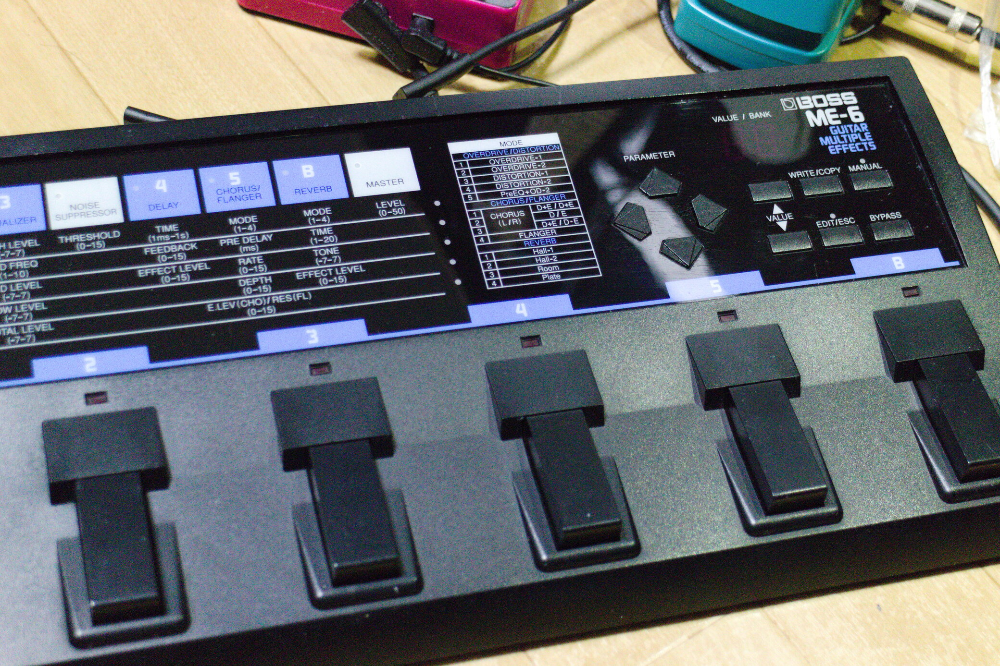
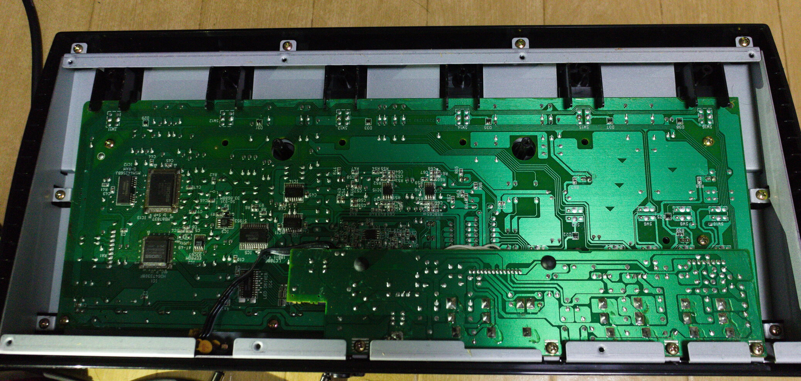
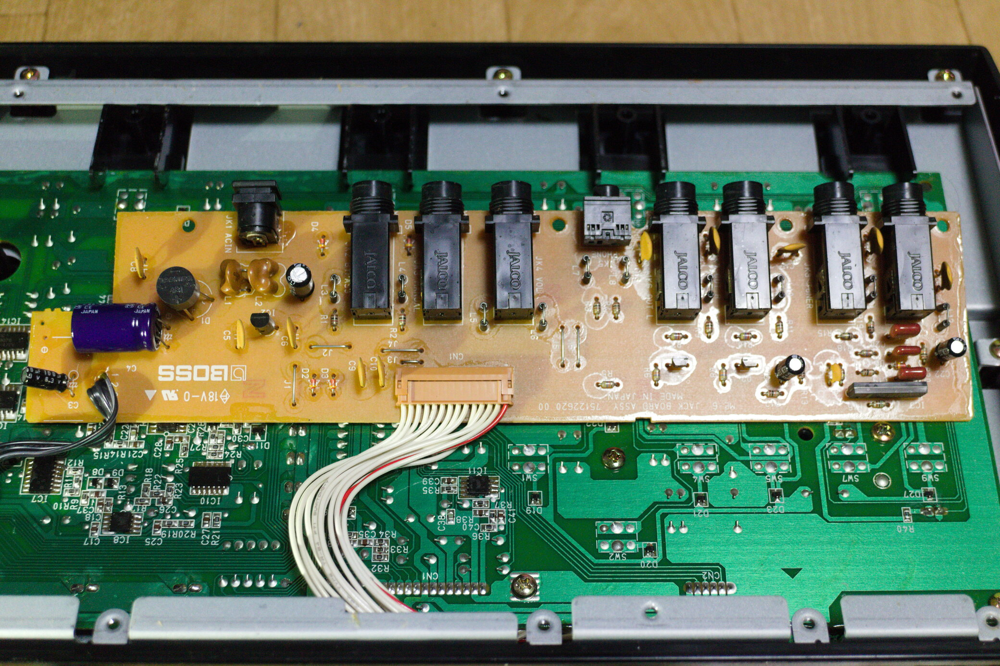
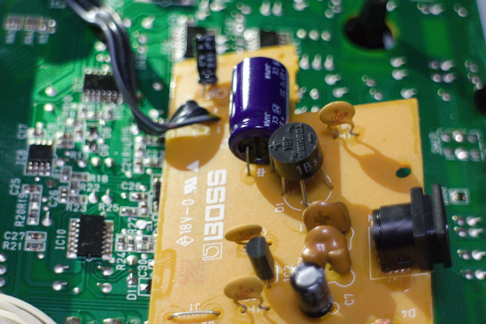
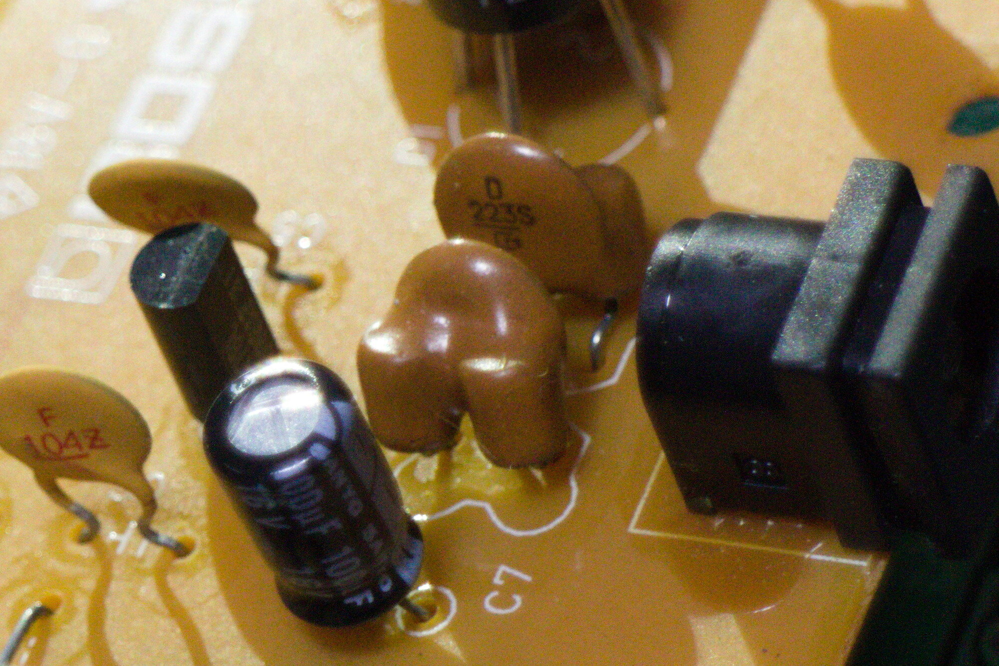

こんにちは。

BOSS の ME-6、ハードオフで 1500 円でした。
使っているアンプ^[[MG2CFX（生産完了品） | MG Series | Guitar Amps | 製品情報 | Marshall Amps（マーシャルアンプ）](http://www.marshallamps.jp/products/amplifiers/mg/mg2cfx/)]がエフェクト付きでいろいろできるんですがつまみをいじる必要があり、やはり足元で切り替えがしたいという気持ちがあったためマルチエフェクターがほしかったところがあります。まあ安いし、ということで何も考えず購入しました。あとで気づいたんですがこれすっごい古い機種ですね。びっくり。

さて、購入時に電源アダプタが付属していない旨、12V である旨を伝えられ、まあ 12V ぐらいあるやろとたかをくくっていたのですが、調べると本来付属しているはずだった電源は AC12V のよう。
BRA-100 という機種です。**AC**12V です。交流 12V。そんなことがあるか？

帰って遊び倒すつもりでいた私は絶望に打ちひしがれ勢い良く AC12V のアダプタを探し出して購入しました^[[AC/AC アダプター 12VAC/500mA :50438:デンシ電気店 ヤフーショップ - 通販 - Yahoo!ショッピング](https://store.shopping.yahoo.co.jp/denshi/50438.html)]。
購入したはいいのですが、インターネットには「交流入力のエフェクターは内部でダイオードブリッジを持っているので別に直流でも良い」のような記述が。
また同じく BRA-100 代替品を探した人のブログでどうも DC のアダプタで動作したような記述があり、もしかして DC12V で動くんじゃないか？との疑惑が。

直流流してみて壊れました！みたいなのは 1500 円とはいえ悲しいので、中を分解して見てみることにしました。
普通に後ろの 10 個のネジを外せば開きます。昔のものは分解しやすくて良いなあ…

開くとこんな感じです。今回興味があるのは電源周りなので電源がありそうな基板が表から見えるように外してやります。
これも側面から外す必要はなく、裏で見えている 4 つのネジを外せば外れます。

こんな感じ。電源ジャックの周りを見ると怪しい部品が…

どうみてもダイオードブリッジです。型番はおそらく 1J4B1^[<!-- textlint-disable ja-technical-writing/ja-unnatural-alphabet -->[ブリッジダイオード（丸型）　６００Ｖ１Ａ　１Ｊ４Ｂ１（５０個入）: 半導体(モジュール) 秋月電子通商-電子部品・ネット通販](https://akizukidenshi.com/catalog/g/gI-01168/)<!-- textlint-enable ja-technical-writing/ja-unnatural-alphabet -->]。あ〜やはりそうなのですね…

コンデンサ風がブリッジダイオードとの間に挟まっているように見えます（裏のパターンを見てもおそらくこれが挟まっています）。
これで直流が流れないとかはあるんじゃないかと思いましたがこれは３端子フィルタと呼ばれるようなものと推測され、電源ジャックとダイオードブリッジをつないでいる両端は導通しているようでした^[テスターに入れる電池がどっかいってめんどくさくなって測ってはいない]。
そして電源はこれとダイオードブリッジにしか直接つながっていないように見えました。

これはもう DC12V で動くだろうと思い家にあった適当な DC12V を投入。何事もなく動作しました。

めでたしめでたし^[それはそれとして AC12V アダプタは届いてしまったので今はそれを使っています]。

## 口径について

これの電源は外径 6.3mm× 内径 3.0mm のようです。Amazon.co.jp で売っている適当な変換器具で刺さりました。
