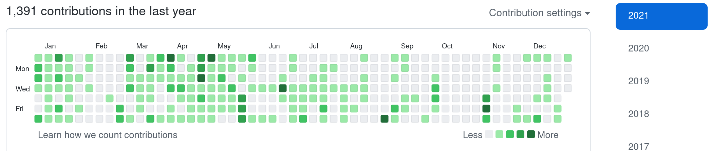

こんにちは。今年の義務がほぼ全て終わり^[勤怠を締めていなかった。今締めました。]かなり開放感があるので 2021 年を振り返ってしまう。

## ライブイベント

### 成人

20 歳になった。酒を飲めるようになったので酒を飲んでいる。
もとより酒には興味があったため積極的に酒を飲む習慣がついてしまったが、健康にも同じぐらい興味があるため 2 日に 1 回ぐらいのレートリミットをかけている。
しかしそれでも健康かと言われれば怪しいし飲みまくってると慣れてきておもしろくないとか酒が減るのが早くて単に困るとかいうのがあるので、もうすこし頻度を落とすことを検討している。

### 免許

大学の同期と合宿で普通自動車免許を取得した。楽しかった。
９月頃に合宿に行ったのだがそれ以来まだ一度も公道で走っていない^[いざ走ってみようと思ったら駐車場から出る間もなくエンジンが壊れて動かなくなったので修理に出している]。怖すぎる。

## パソコン

明らかにパソコン活動量は 2020 年と比べて減っている。成すぞ成すぞみたいな緊張感をやめようと思い、思ったので、そういうことの結果らしい。

前半期は学園祭のための内部システムを書いていた。バックエンドを Rust で書いていて、だいぶ変ではあるけど周りに変なオタクしかいなかったのでこういう暴挙を許してくれた。

[embed](https://github.com/sohosai/sos21-backend "sohosai/sos21-backend: 雙峰祭オンラインシステム2021 バックエンド"){ description="雙峰祭オンラインシステム 2021 バックエンド" }

なんだかんだ設計！！！みたいなのが初めて肌身になった実感がある。
作った当時はよくできたものだと思っていたけど今見ればデカい負債って感じですね。

後半期は物事の運用と監視に興味が出た。発端として家の気温や湿度などを観測して InfluxDB に上げて Grafana で見るというのをやったのだけど、物事がグラフになって動いているとすごくおもしろいことがわかった。
そこからサーバーの監視にも興味が出て、Prometheus とかをいじくるようになった。
ネットワークやらインフラやらがまるでちんぷんかんぷんだったが、今年はその過程で少しは知識が付いた。

プログラミング言語でみるとほぼ Rust しか書いていない。去年と比べると手癖で書ける範囲が広がったように思う。
一時期異文化交流と叫びながら Go を書いていた。結果 Go への耐性が付いた。

## 労働

2 年近くお世話になった HERP でのバイトをやめ、クックパッドで就業型インターン^[たぶんこれ？[https://internship.cookpad.jp/jobtraining](https://internship.cookpad.jp/jobtraining)]を始めた。
もとは大学の同期がサマーインターン経由か何かで次々と吸い込まれていったのがきっかけだった。彼らから楽しそうな話を聞いて、普通に楽しそう・働きやすそうだなと思ったのもあるし、職場に友達がいる環境が羨ましかったのもあると思う。

もとより自分に合った職場を模索するためにもそろそろ別のインターンに行ってみようと思っていたため、いい機会だった。
飽きやすい自分には当事者意識とか強い関心とかがなくてもちゃんと働ける場所が必要で、そういう期待を抱いてクックパッドに行ったし、
今のところは期待通りそういう場所であってくれているように感じている^[いい話]。

クックパッドでは SRE として CI を速くしたりととのえたり、Go を書いたり Go で書かれたソフトウェアを Rust に移植したりしている。
文化がソフトウェアエンジニア寄りになっているおかげかだいぶやりやすく、たのしく続けさせてもらっている。
Ruby でもなんでも書いてやろうと覚悟の上だったので、Rust を書かせてもらえていてびっくりしていたりする。

## ギター

趣味１。たのしい。ギターから出た音が好きなのもあるし単にギターの上で手を動かすのがだいぶ好きらしい。
つまり完成形だけでなく作業自体が好きなので、頑張ろうと思うことなく自然に上達できる良い趣味になった。
エフェクターに手を出す余裕も出てきてだいぶ遊びの幅が広がってきている。

## 絵

趣味２。がんばっている。
これは手を動かすことはそんなに好きというわけではないらしいが、しかしそんなに嫌いでもなく、なにより生成物が魅力的過ぎるのでやや続いているみたいな感じがある。

いままで絵を描く習慣があったわけではないのでだいぶ勘がなく、まずは上手とか下手とか以前に普通に人間を描いたり線を引いたりできるようになりたい^[描いた絵を左右反転すると毎回同じ歪み方をしているので目が歪んでいるだと思う]。
それと同時にモチベーションとかの意味でも^[すごいことをやっている感が消えるとやる気が続かない（面倒な性質！）]、「こういうのが描きたいからここに線を引く」ができるような、空間を把握する能力みたいなものもちょっとずつ付けていけたらなと思う。
時間をかけると良いものができるらしいことはわかってきたので、サクッと終わる落書きではなくちゃんと設計がある絵を描きたいし、そのために何を描くかを日常的に想像して出力する訓練をやっていく必要がある。

## そのほか

気持ち環境^[精神衛生？というとなんか短期的な印象になるしまあ]が 2020 年よりだいぶよくなっている。
2020 年はだいぶ投げやりになっており、すごい不安定な元気さでやっていっていた感覚がある。つまり元気ではあったけど全然健康ではなかった。
2021 年はそうみると元気さはすこし減ったけれど投げやりではなく<!-- textlint-disable @textlint-ja/no-dropping-i -->「わけあって元気やらせていただいてます」<!-- textlint-enable @textlint-ja/no-dropping-i -->みたいな感覚がついてきているので、うっかり「おれやばいんでない？」みたいな気持ちになってもちゃんと回復ができる。
それもあってか、不安を感じたときに解決がそれを取り除くと強めに理解できてきた^[というより、強めに理解すれば体が動くとわかってきた]ところがあり、不安が長引いて調子が悪くなることは少なくなった。
あまりにも強い不安を感じると逆に解決のために強い行動に出ることになったが、まあ衝動的とはいえ解決に向かっているので悪くはないと思う。

## 2022

- 趣味と仕事が問題なくできればええみたいなムードなので学業をやるのかやらないのかはっきりさせる
- 金がなくてこまるみたいなことがないように働きと消費の調整をやる
- はたらき先をもうちょっとちゃんと探す

2021 年は全体的に消費が下手くそで金策が破滅することが多かったのでそこをどうにかという感じがする。
それはそれとして、前文から考えるとありえない話に聞こえるが、4 月にすこし良いところに引っ越しをする。地理的にも環境的にも良いので楽しみ。
