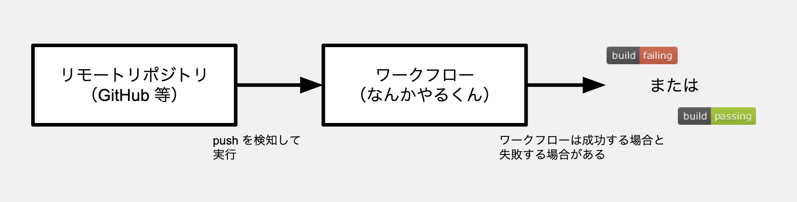
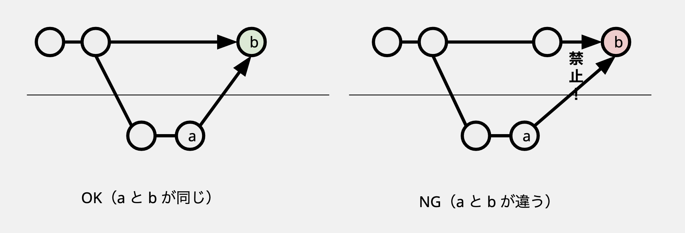

こんにちは。天久保 Advent Calendar 2022 の 9 日目の記事です。明日は休日なのでやすみです。

[embed](https://adventar.org/calendars/8233 "天久保 Advent Calendar 2022 - Adventar"){ description="茨城県つくば市の町域であるところの天久保とは無関係な任意団体" }

CI の色について話します。CI は緑色の方がいい、というのは皆さんの共通認識としてあると思うのですが、私は CI は緑色でなければならない、と強い気持ちを持っています。今回は、その強い気持ちに根拠をつけるための調べ学習の成果と、CI を緑色に保つための一般的な取り組みについて紹介します。

## 目次

[:contents]

## CI とは？

CI とはもとよりどのような意味合いを持ったものなのか、どんな目的で導入されているのか、Circle CI と AWS の説明を元に理解します。

<!-- textlint-disable -->

> CI とは、継続的インテグレーション（Continuous Integration) の略であり、デプロイするコードの品質を確保しながら、開発スピードを向上させる DevOps ソフトウェア開発手法です。開発者は継続的にコードを少しずつ (少なくとも 1 日 1 回、可能なら 1 日に数回) コミットし、そのコードが共有リポジトリにマージされる前にビルドとテストが自動的に実行されます。
>
> <https://circleci.com/ja/continuous-integration/>

> 継続的インテグレーションは、開発者が自分のコード変更を定期的にセントラルリポジトリにマージし、その後に自動化されたビルドとテストを実行する DevOps ソフトウェア開発の手法です。継続的インテグレーションという用語が最もよく使われるのは、ソフトウェアのリリースプロセスのビルド段階または統合段階を指す場合で、オートメーションの要素 (CI やビルドサービスなど) と啓発の要素 (頻繁に統合する必要性を学習することなど) の両方が含まれます。継続的インテグレーションの主な目的は、バグを早期に発見して対処すること、ソフトウェアの品質を高めること、そしてソフトウェアの更新を検証してリリースするためにかかる時間を短縮することです。
>
> <https://aws.amazon.com/jp/devops/continuous-integration/>

<!-- textlint-enable -->

リリース前に全員の作業を統合して品質を検査する従来の開発スタイルに対して、高頻度でリリースブランチに変更をマージすることで開発スピードを向上させる・リリース時間を短縮する手法のことをいうようです。CI の実践により、リリース前の各人の作業を統合するための作業が必要なくなり、本来の開発に集中できたり、リリースサイクルを短縮できたりするなどの効果が期待できます。これはリリースサイクルが短いアジャイルな開発パターンにおいて特に有効です。なお、毎日のマージでリリースブランチの品質が損なわれてしまうと、結局リリース前に品質を再度検証する必要が発生し、CI を導入する利点が半減してしまうため、リリースブランチのコードの品質を確保しながら開発を進める必要があります。

### CI のための自動化ワークフロー

一方でこの開発スタイルでは、一見してリリースブランチのコードの品質を確保するのは難しいように思えます。これまでコードの品質はリリース前に集中して検証すればよかったものが、高頻度な毎日のマージで常に意識する必要が出てくるからです。これを人力で達成するのは難しく、ここで自動化の必要性が生じます。共有リポジトリへの push のたびに自動的な品質チェックを行い、チェックが通ったものだけをリリースブランチにマージすることにすれば、自動的にリリースブランチの品質を保ち、常にリリース可能な状態にすることができそうです。



今後、このような push によってトリガされる自動的な品質チェックのことを指して CI ワークフローと呼ぶことにします。また、あるブランチの HEAD において CI ワークフローが成功している状態を指して「ブランチが緑」のような表現をすることがあります。

## CI ワークフローの良い性質

さて、この CI ワークフローですが、リリースブランチにおいて常に成功する（品質が確保された）状態に保つのが良いとされています:

<!-- textlint-disable -->

> The Not Rocket Science Rule Of Software Engineering:
>
> automatically maintain a repository of code that always passes all the tests
>
> <https://graydon2.dreamwidth.org/1597.html>

<!-- textlint-enable -->

これは、緑のリリースブランチから作業を始める人は自分が加えた変更の品質のみを気にすれば良くなるからです。もし失敗しているリリースブランチからブランチを切って作業を始めてしまうと、そのブランチでの失敗がはたして自分の変更の影響なのか元から存在していた失敗なのか区別するのが難しくなります。これでは結局マージのタイミングで複数人の作業の統合作業を行うことになってしまいます。

つまり、緑のリリースブランチから作業を始めると、リリースブランチへのマージのタイミングで心配すべき統合作業が自分の変更のみになります。これによって統合作業の責任がブランチの作業者のものとして明確になり、各人の作業の独立性が高まると私は考えています。逆にいえば、リリースブランチが緑ではない状態で作業を始めてしまうと各人が他人の作業について意識しなければいけない状態になり、開発スピードが落ちるということです。そのため、そのような状態で作業を始めるべきではなく、結果としてリリースブランチが緑でない状態はプロジェクト全体の作業を緩くブロックすることになります。これはプロジェクトが価値を新たに生むことができない状態に陥っているということであり、避ける必要があると考えています。

さて、先に述べた「チェックが通ったものだけをリリースブランチにマージする」は一見してリリースブランチが常に緑であることを保証しているように見えますが、実際にはそうではありません。ここから先は、一般的な CI ワークフローにおいてリリースブランチが失敗状態になってしまう原因とその解決策について述べます。

## リリースブランチを緑に保つために

なぜ「チェックが通ったものだけをリリースブランチにマージする」でリリースブランチが緑であることを保証できないのでしょうか？基本的には、次の 2 つの原因が考えられます。すなわち:

- 不安定な CI ワークフローによる問題。CI ワークフローの成否がソースコード以外から影響を受ける結果、一度成功になったソースコードに対して 2 回目以降のチェックで失敗が返る可能性がある。
- マージコミットによる問題。HEAD ブランチの内容は、マージコミットの結果、もとの HEAD と異なる可能性があり、それによってチェックが失敗する可能性がある。

どちらも、一般的な CI ワークフローで発生しうる問題です。それぞれについて、問題の詳細と解決を記述します。

### 不安定な CI ワークフローによる問題

CI ワークフローの成否がバージョン管理対象のソースコード以外の要因から影響を受ける結果、一度成功したソースコードに対して 2 回目以降のチェックで失敗が返る可能性があります。極端な例で言えば、「乱数生成機から得た値が偶数だったら成功する」ワークフローがこれです。現実的には、ネットワーク越しにダウンロードするパッケージのバージョンを指定していないワークフローはこのような問題を抱えています。プログラミング言語エコシステム固有のパッケージマネージャによってインストールされるパッケージについては一般的に lockfile と呼ばれる依存ツリー全体の完全なバージョンとチェックサムを記録したファイルが存在し、これによりこの問題は回避されています。どちらかというと CI ワークフロー内で利用するコマンドラインツールや、言語ランタイムやコンパイラような暗黙の依存関係について、この問題が発生しやすい印象があります。例えば GitHub Actions のワークフローで下のような記述をしていた場合:

```yaml
steps:
  - uses: actions/checkout@v3
  - run: npx prettier --check .
```

これは `npx` を用いて最新バージョンの `prettier` をインストールしているため、`prettier` のバージョンアップによってスタイルの変更が起きると、ソースコードに変更がないにも関わらずこのワークフローが失敗するようになります。

この問題への解決策は「暗黙の依存関係についてもバージョンを正確に記述する」に他なりません。しかし、暗黙の依存関係のバージョンを固定しながら更新し続けるのには、プログラミング言語エコシステム固有のパッケージマネージャによって管理されるパッケージと比べてある程度の開発コストがかかることがあります^[Dependabot が対応していない、そもそも固定するのが難しい、など]。幸い、私たちには Semantic Versioning などによって保護されたある程度の互換性の保証があることがほとんどなので、プロジェクトの開発スピードへの要件や温度感を考慮してメジャーバージョンのみを指定するなどの妥協が現実的には発生するでしょう。

### マージコミットによる問題

次にマージコミットによる影響を考えます。リリースブランチへマージを行った際、そのブランチのコミットに加えてマージコミットがリリースブランチへ入ることになります。そのため、ブランチの HEAD で CI ワークフローが成功していたとしてもマージコミットでは失敗する可能性があります。

極端な例として、「ディレクトリ A にファイルが 2 つ以上あると失敗する」CI ワークフローを考えます。リリースブランチにファイルが 1 つもない状態でブランチ X を作成し、X で A 以下にファイルを作成します。その後にリリースブランチ上で A 以下に別名のファイルを作成したとします。すると X の HEAD でもリリースブランチの HEAD でも CI ワークフローは成功していますが、X をマージした途端、マージコミットの時点で A 以下に 2 つファイルが存在して CI ワークフローが失敗するようになります。そして、これと同じような状況が関数名の変更などで現実的に発生し得ます。

<https://github.com/bors-ng/bors-ng#but-dont-githubs-protected-branches-already-do-this>

この問題への解決として、まずマージコミットでの変更を無くすことが考えられます。すなわち、マージしようとしているブランチのベースをベースブランチの HEAD と一致させるということです。これは GitHub では Branch Protection の機能「Require branches to be up to date before merging」で実現できます。しかし、こういった対策は同時に複数の Pull request が立つ開発ではブランチのアップデート作業が面倒で開発効率が大きく下がる可能性があります。複数の Pull request が同時に立っている場合、1 つの Pull request がマージされたあとは他のすべての Pull request を rebase するなりして更新する必要があるのです。Auto-merge で解決できるのはたかだか 2 つのブランチが同時に立っている状況までで、それ以上の開発規模では別の解決策を考える必要があります。



さて、もう 1 つの解決策が [Bors-NG](https://bors.tech/) のようなマージボットの導入です。これは承認された Pull request をマージキューに入れてマージ作業自体を bot に任せるための仕組みです。マージ前にもマージコミットを作ることはできるため、マージコミットに対してチェックが通ったものを自動的にマージし、通らなかったものをそのままにするマージキューを作ることができます。このようなマージキューの利用により、開発効率を下げないままリリースブランチの品質を保証することができるようになるでしょう。

## まとめ

- CI を実践する場合、リリースブランチを緑に保つことが重要（事実）
- リリースブランチを*常に*緑に保つべき（主張）
- リリースブランチを*常に*緑に保つために有効な取り組みを紹介（事実）

_リリースブランチを必ず緑にしような…😎_（主張）
