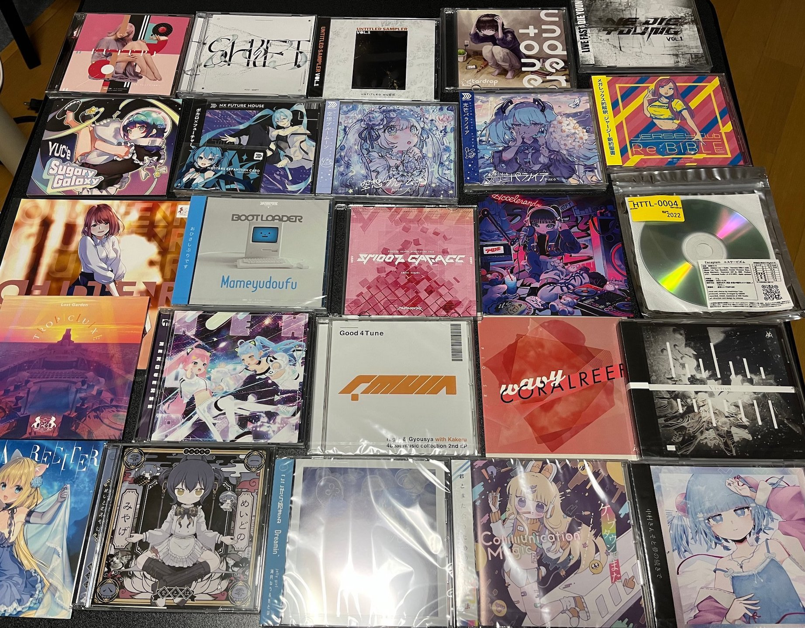
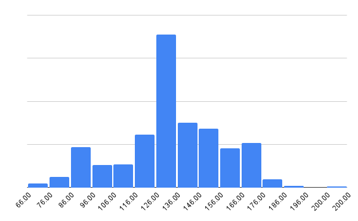
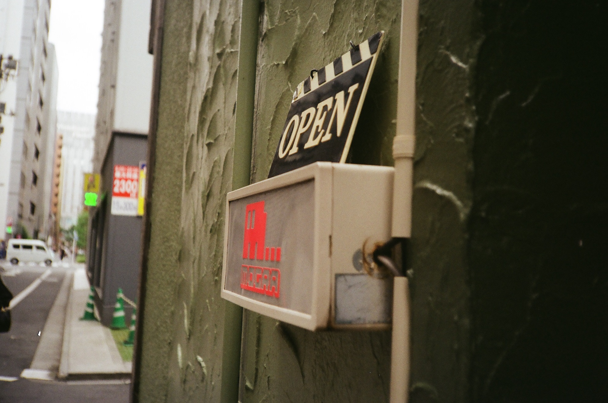
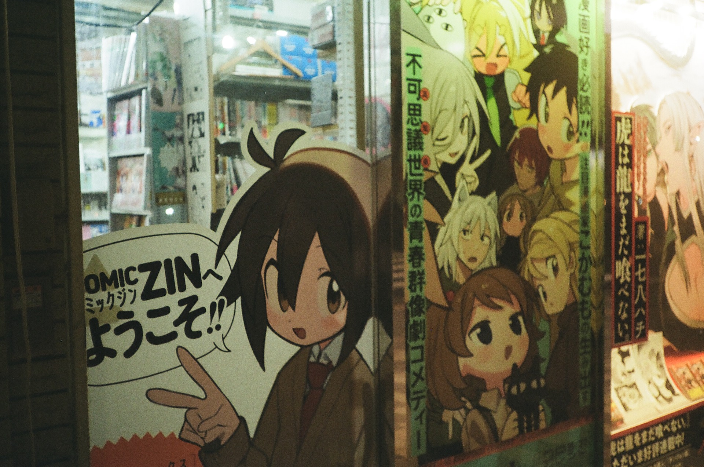
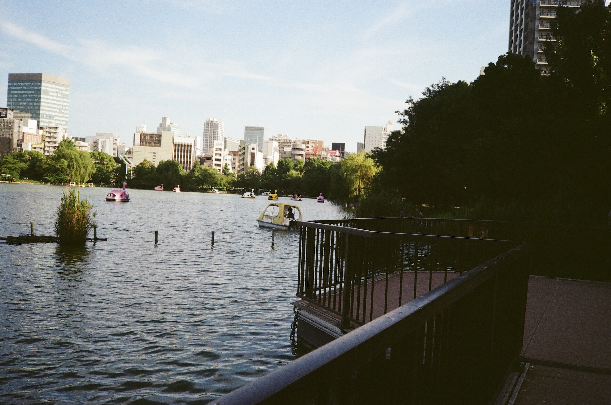

こんにちは。消費活動 2022、サブカル行動 2022 みたいな感じです。こういうのを書くか書かないかって毎年末に結構迷うことが多いんですけど、今年はこれがよかったという気持ちを文章にできるようになりたいという目標が明示的にあり、そういった理由をつけると何となく書きたいという気持ちに正当性が出たので（浅）、書いているわけですね（メタ）

天久保 Advent Calendar 2022 の 16 日目の記事です。

[embed](https://adventar.org/calendars/8233 "天久保 Advent Calendar 2022 - Adventar"){ description="茨城県つくば市の町域であるところの天久保とは無関係な任意団体" }

## 目次

- [音楽](#音楽)
- [漫画](#漫画)
- [それ以外](#それ以外)

## 音楽

激動の一年となりました。もとより私はギターポップ+ボーカロイド系サブカル界隈、みたいな感じだったのですけど、あるとき突然顔がダンス（エレクトロニック）になり、夏頃から完全にダンス（エレクトロニック）でした。顔がダンスになりました！とダンス顔の友達に報告したら [Nekomimix](https://www.youtube.com/watch?v=QDLYMyz8bpg) と [🎧Dance Music Mix | Club Remixs🎧 #DENONBU #電音部](https://www.youtube.com/watch?v=HclKpbdM1j4) を教えてもらって、世界が広がるきっかけをもらいました。 🎧Dance Music Mix | Club Remixs🎧 はいろいろなジャンル・界隈への架け橋になって非常に価値のあることだなあと思います。だんだんコンピ単位で聴いていくことを覚えていって、MEGAREX と MOTTO MUSIC のオタクになっていくうえ、この段階で 🎧Dance Music Mix | Club Remixs🎧 で「これはあまりに刺さっている」という認識が数トラックに芽生え、そこをきっかけにサウンドクラウドでも音楽を探すようになりました。印象に残っている音楽を 10 曲ぐらい並べていこうと思います。とはいえ、最近聴いたものほど印象が強いので、最近聴いたものが並ぶのでしょうけど…

### kamome sano - feel (feat. mami)

<iframe width="560" height="315" src="https://www.youtube.com/embed/-6YIG6_4504" title="YouTube video player" frameborder="0" allow="accelerometer; autoplay; clipboard-write; encrypted-media; gyroscope; picture-in-picture" allowfullscreen></iframe>
この世で最も良い曲の一つ。kamome sano さんの曲でギターが急に鳴るやつ大好きです。

### 東雲和音(CV:天音みほ) - Mani Mani (Letiamash Bootleg)

<iframe width="100%" height="166" scrolling="no" frameborder="no" allow="autoplay" src="https://w.soundcloud.com/player/?url=https%3A//api.soundcloud.com/tracks/927202051&color=%23ff5500&auto_play=false&hide_related=false&show_comments=true&show_user=true&show_reposts=false&show_teaser=true"></iframe>
<a href="https://soundcloud.com/letiamash" title="Letiamash" target="_blank" style="color: #cccccc; text-decoration: none;">Letiamash</a> · <a href="https://soundcloud.com/letiamash/buyfreedl-mani-mani-letiamash-bootleg" title="[Buy→FreeDL] -電音部-  Mani Mani (Letiamash Bootleg)" target="_blank" style="color: #cccccc; text-decoration: none;">[Buy→FreeDL] -電音部-  Mani Mani (Letiamash Bootleg)</a>

🎧Dance Music Mix | Club Remixs🎧 から、自分の中での全ての始まりという感じです。ドロップの二発目のキックの後に音が切れてるの本当にそうという感じで、感謝... Letiamash さんのリミックス大好きで、イントロとかで流れる「ティーン」みたいな特徴的な音があるんですが、それが聞こえると、来たな...と思います。

### Dotnoi & Tom-i

<iframe width="100%" height="166" scrolling="no" frameborder="no" allow="autoplay" src="https://w.soundcloud.com/player/?url=https%3A//api.soundcloud.com/tracks/1076450305&color=%23ff5500&auto_play=false&hide_related=false&show_comments=true&show_user=true&show_reposts=false&show_teaser=true"></iframe>
<a href="https://soundcloud.com/dotnoi" title="Dotnoi" target="_blank" style="color: #cccccc; text-decoration: none;">Dotnoi</a> · <a href="https://soundcloud.com/dotnoi/dotnoi-tom-i-luminous-feat-rei-tsumugine" title="Dotnoi &amp; Tom-i - Luminous (feat. 紡音れい)" target="_blank" style="color: #cccccc; text-decoration: none;">Dotnoi &amp; Tom-i - Luminous (feat. 紡音れい)</a>

<iframe width="100%" height="166" scrolling="no" frameborder="no" allow="autoplay" src="https://w.soundcloud.com/player/?url=https%3A//api.soundcloud.com/tracks/768903292&color=%23ff5500&auto_play=false&hide_related=false&show_comments=true&show_user=true&show_reposts=false&show_teaser=true"></iframe>
<a href="https://soundcloud.com/dotnoi" title="Dotnoi" target="_blank" style="color: #cccccc; text-decoration: none;">Dotnoi</a> · <a href="https://soundcloud.com/dotnoi/templime-breath-dotnoi-tom-i-remix" title="TEMPLIME - Breath ft.をとは &amp; Yaca (Dotnoi &amp; Tom-i Remix)" target="_blank" style="color: #cccccc; text-decoration: none;">TEMPLIME - Breath ft.をとは &amp; Yaca (Dotnoi &amp; Tom-i Remix)</a>

Dotnoi & Tom-i のグリッチ？っぽい音でハウスにアクセントが入るやつ大好きで本当に強い衝撃があったし聴くたびにひっくり返っています、この二曲に出会って、ああ、俺はダンスになるんだなと確信しました。
今思うと、普通にプログレッシブハウスが好きだから、ビルドアップが長いとその分盛り上がっちゃうんですよねみたいなところもあります。期待を高められると素直に盛り上がってしまう。ビルドアップの終わりのチャッチャッチャッみたいなやつで、ドロップ入る瞬間に大声が出ます。

### 余談

12/27 発売の Image. にも Ignite という Dotnoi & Tom-i の曲があって、クロスフェードを聴き、頭部を発射することができる

[embed](https://mottoms.net/re/07 "MOTTO MUSIC「Image.」特設サイト"){ description="MOTTOMUSIC「Image.」特設サイト" }

楽しみすぎる！

MOTTO MUSIC だと（全部大好きなんですけど）Fortune. が特に好きで、アルバム全体で吹いている元気さとシリアスさをうまく合わせたような（まっすぐな、みたいな）雰囲気がちょうどよく自分に刺さりました。

### KO3 - backstab (feat. BOOGEY VOXX)

<iframe width="560" height="315" src="https://www.youtube.com/embed/9w4tMEMk4CM" title="YouTube video player" frameborder="0" allow="accelerometer; autoplay; clipboard-write; encrypted-media; gyroscope; picture-in-picture" allowfullscreen></iframe>
これは MOTTO MUSIC の Version. がきっかけです。Version. はデザインがめちゃめちゃかわいくて、ダンス時代に入ってから初めて買った物理盤だったかな...
ラップとビルドアップの相性の良さみたいなの大好きです。ドロップの最初 2 小節溜めるみたいな概念に初めて触れたのもこの曲だったか、結構この頃には初めて聴くタイプの曲だったので新鮮でいい体験でした。

### poplavor - Broken Light (feat. mami)

<iframe width="100%" height="166" scrolling="no" frameborder="no" allow="autoplay" src="https://w.soundcloud.com/player/?url=https%3A//api.soundcloud.com/tracks/801628939&color=%23ff5500&auto_play=false&hide_related=false&show_comments=true&show_user=true&show_reposts=false&show_teaser=true"></iframe>
<a href="https://soundcloud.com/poplavor" title="poplavor" target="_blank" style="color: #cccccc; text-decoration: none;">poplavor</a> · <a href="https://soundcloud.com/poplavor/broken-light" title="Broken Light (feat. mami)" target="_blank" style="color: #cccccc; text-decoration: none;">Broken Light (feat. mami)</a>

SPD GAR 漁りをしていたところから。和っぽさがありつつもそうでもないようなドロップの高い音がすごい好きです。この曲はこんなにノリノリでも跳ねより横に動く運動の方が強い気がして面白いです。腕と首めっちゃ振ります。

### AXiS - HEAVEN'S RAVE

<iframe width="560" height="315" src="https://www.youtube.com/embed/t5DpysMzAMQ" title="YouTube video player" frameborder="0" allow="accelerometer; autoplay; clipboard-write; encrypted-media; gyroscope; picture-in-picture" allowfullscreen></iframe>
[NEON MIXTURE vol.1](https://twitter.com/NEON_MIXTURE/status/1527242708946804736) で初めて聴いて（"良い曲は何度かけても良い"）、頭から離れなくて二日間ほど入眠に苦労しました。同じく SEVENTH HEAVEN も好きですが、たまたまダンスになる前に大学の友人から譲り受けたナナシスのCDがあり、なんか音源手元にあるやんとなったのが面白かったです。

### 星宮とと+TEMPLIME - リンクロット

<iframe width="100%" height="166" scrolling="no" frameborder="no" allow="autoplay" src="https://w.soundcloud.com/player/?url=https%3A//api.soundcloud.com/tracks/665614841&color=%23ff5500&auto_play=false&hide_related=false&show_comments=true&show_user=true&show_reposts=false&show_teaser=true"></iframe>
<a href="https://soundcloud.com/templime" title="TEMPLIME" target="_blank" style="color: #cccccc; text-decoration: none;">TEMPLIME</a> · <a href="https://soundcloud.com/templime/linkrot" title="リンクロット ft.星宮とと[from &quot;Watertank e.p.&quot;](w/STEM)" target="_blank" style="color: #cccccc; text-decoration: none;">リンクロット ft.星宮とと[from &quot;Watertank e.p.&quot;](w/STEM)</a>

何となく Blank Paper と Hand Over に共通して吹いている風の聴き心地が良く、それをきっかけに TEMPLIME/KBSNK さんにハマりました。特にリンクロットからしか摂取できない栄養素を感じています。なんですかね、テチテチいうキックというか...ありませんか？そういうの...
最近のギターのポップスっぽい曲も^[俺が元々ギター畑だったから]やっぱり良くて、あ〜と思っていたらエレクトロニック感とギターポップ感が合わさった「全て」みたいな supernova（feat. KBSNK）がリリースされて本当に最高でした。

<iframe width="100%" height="166" scrolling="no" frameborder="no" allow="autoplay" src="https://w.soundcloud.com/player/?url=https%3A//api.soundcloud.com/tracks/1389590674&color=%23ff5500&auto_play=false&hide_related=false&show_comments=true&show_user=true&show_reposts=false&show_teaser=true"></iframe>
<a href="https://soundcloud.com/kbsnk" title="KBSNK / Limre" target="_blank" style="color: #cccccc; text-decoration: none;">KBSNK / Limre</a> · <a href="https://soundcloud.com/kbsnk/supernova" title="Such × KBSNK &quot;supernova&quot;" target="_blank" style="color: #cccccc; text-decoration: none;">Such × KBSNK &quot;supernova&quot;</a>

サビの3拍目と4拍目の間に巨大なエネルギーを感じる...

### 余談

KBSNK さんの曲をきっかけに何となく Garage/2step の風を得ました^[ここで SPD GAR が Speed Garage の意だったことを知りへぇ〜となった]。SPRAYBOX からゆっくりと UK Garage に入門してみて、ガラージという枠で見るとハイハット？あの高いほうのドラムのリズムがいいよなあみたいな気分になります。とはいってもやっぱりドロップでベースライン〜という感じになるアレのインパクトが強いほうが好きになりがちでした。

### 夢乃ゆき - メロディ(Ide_Co Remix)

<iframe width="100%" height="166" scrolling="no" frameborder="no" allow="autoplay" src="https://w.soundcloud.com/player/?url=https%3A//api.soundcloud.com/tracks/953462596&color=%23ff5500&auto_play=false&hide_related=false&show_comments=true&show_user=true&show_reposts=false&show_teaser=true"></iframe>
<a href="https://soundcloud.com/ide_co" title="Ide_Co" target="_blank" style="color: #cccccc; text-decoration: none;">Ide_Co</a> · <a href="https://soundcloud.com/ide_co/ide_co-remix" title="夢乃ゆき - メロディ(Ide_Co Remix)" target="_blank" style="color: #cccccc; text-decoration: none;">夢乃ゆき - メロディ(Ide_Co Remix)</a>

[pop enemy (Ide_Co Remix)](https://soundcloud.com/ide_co/pop-enemy-featshinpei-nasuno-ideco-remix) ですっかりジャージー君になってしまったのですが、これは確実にベスト… ジャージークラブは印象的なサンプルと音数がドロップでどかっと減りがち^[これ実は空白がある、なのか？]なのが好きなところです。これはそれが顕著で、キックとボーカルが綺麗に出ていてたまらない感じになっています。いわゆるドンドンドッドッドだけでなくIde_Coさんの曲によく出てくるドンドドンドド（1:18~ これ何ですか？マジで）みたいなリズムに踊らされる毎日です。

### LADY'S ONLY feat. Marpril - Throwback

<iframe width="560" height="315" src="https://www.youtube.com/embed/5dqixBi8TPU" title="YouTube video player" frameborder="0" allow="accelerometer; autoplay; clipboard-write; encrypted-media; gyroscope; picture-in-picture" allowfullscreen></iframe>
[patchwork](https://twitter.com/patchwork_prj) でめっちゃ流れてすごい嬉しかったな… LADY'S ONLY によくある音程がスムーズにうねうねするやつ（2:10~ これ何ですか？マジで）大好きです。基本的にサウンドロゴ（えっアタシ同じく）で盛り上がってしまう性分だというのもあります。
LADY'S ONLY にハマったきっかけは SPD GAR 003 の [Square Connection (feat. Such)](https://www.youtube.com/watch?v=OX_zAR0cA14) か Fortune. の [MAGICAL MEMES (feat. BOOGEY VOXX)](https://www.youtube.com/watch?v=Ot6-obITVkg) かだったと思います。先日 [UNDER Freaks 4th Anniversary](https://twitter.com/under_freaks/status/1583050536269774848) で DC Mizey さんの DJ を観ることができて、人生が一つ終わりました^[死ぬまでにやりたいことリストに一つチェックマークがついたの意]。

Throwback EP はついてくる Remix が本当にすごいので買ったほうがいい。

<!-- textlint-disable -->

[embed](https://booth.pm/ja/items/2486157 "【シングル】「Throwback」EP - Marpril - BOOTH"){ description="「サイバー衣装」を身に纏い、新たなるスタートを切った「Marpril」 彼女達の門出をド派手に飾るトラック「LADY’S ONLY feat. Marpril - Throwback」がダウンロードカードとなってリリース！" }

<!-- textlint-enable -->

Marpril については友達の車で Girly Cupid が流れていたのがきっかけで見つけたはず。Throwback も LADY'S ONLY からというより Marpril を見つけたタイミングで見つけたような気がします。

### 紡音れい - DANCE is the answer

<iframe width="560" height="315" src="https://www.youtube.com/embed/41HO4jn0FR0" title="YouTube video player" frameborder="0" allow="accelerometer; autoplay; clipboard-write; encrypted-media; gyroscope; picture-in-picture" allowfullscreen></iframe>
[USAGI Production Presents DJ Party](https://twitter.com/usagipro777/status/1581100076449267713) に行くときに予習で [VirtuaREAL](https://www.virtuareal.net/index.html) 聴いていたら激突した。ずっと上で流れてるピアノのフレーズが激オシャレで気分がホイホイ持ち上がります。ドロップでも同じフレーズが流れてるからこその、跳ねを押さえつけられてる感じと、どう考えても跳ねてしまう強いシンセの音があって、耳でバトルする感じがたまらないですね。顔が縦に潰れる感じがします。

### 管弦楽器っぽい音が大好きで激刺さりだった三曲

<iframe width="560" height="315" src="https://www.youtube.com/embed/WWUzQN4HSLA" title="YouTube video player" frameborder="0" allow="accelerometer; autoplay; clipboard-write; encrypted-media; gyroscope; picture-in-picture" allowfullscreen></iframe>
<iframe width="560" height="315" src="https://www.youtube.com/embed/yTIc0czDk4w" title="YouTube video player" frameborder="0" allow="accelerometer; autoplay; clipboard-write; encrypted-media; gyroscope; picture-in-picture" allowfullscreen></iframe>
<iframe width="560" height="315" src="https://www.youtube.com/embed/t9PW9qLDoKE" title="YouTube video player" frameborder="0" allow="accelerometer; autoplay; clipboard-write; encrypted-media; gyroscope; picture-in-picture" allowfullscreen></iframe>

<!-- textlint-disable ja-technical-writing/no-exclamation-question-mark -->

管弦楽器っぽい音が大好きで激刺さりだった三曲。デカい印象を受けると嬉しくなってしまう性分なのですが、こういう音はそれを助長してくれている気がします。ここら辺はその軸で調べられていなくて偶然出会っているので、もう少し深堀できたらいいかもな…（そういうの、あるんですか？）NEW FRONTIER! の 2 サビとかやばくないですか？意識が、飛ぶ

<!-- textlint-enable ja-technical-writing/no-exclamation-question-mark -->

### rejection - Beat Of The Drum

<iframe width="100%" height="166" scrolling="no" frameborder="no" allow="autoplay" src="https://w.soundcloud.com/player/?url=https%3A//api.soundcloud.com/tracks/1360937980&color=%23ff5500&auto_play=false&hide_related=false&show_comments=true&show_user=true&show_reposts=false&show_teaser=true"></iframe>
<a href="https://soundcloud.com/rejectionjp" title="rejection" target="_blank" style="color: #cccccc; text-decoration: none;">rejection</a> · <a href="https://soundcloud.com/rejectionjp/beat-of-the-drum" title="Beat Of The Drum 【F/C WE DIE YOUNG vol.1】" target="_blank" style="color: #cccccc; text-decoration: none;">Beat Of The Drum 【F/C WE DIE YOUNG vol.1】</a>

もともとベースハウス目当てで WE DIE YOUNG vol.1 を購入したのですが、それをきっかけにトラップ・ダブステップ時代が始まりました。この曲はビルドアップが長くてえっいいんですか！？いいんですか！？？みたいな感じになって嬉しいですね。ハーフテンポで頭がびっくりしてデカい！デカいよ！みたいな感じになるのが好きです。

### おわり

ハウスジャージーその他という感じでした！最近は UK Hardcore もイケるか…？みたいな感じで、まあ刺さる音楽を探していきたいですね。今年は、なんかこう、1 回聴いて刺さらなかったけど戻ってくると激刺さりみたいな体験が多かったです。顔が、音楽に合わせて、変形して、いくんやね

<!-- textlint-disable prefer-tari-tari -->

<!-- textlint-enable prefer-tari-tari -->

## 漫画

昨年はその年に買った漫画を手動で集計してグラフとかにしていたんですけど流石にちょっとアドベントカレンダーの記事を書くのに忙しい（メタ）ので今年は難しそうです。あと続刊を追うのに必死でそんなに 2022 年から読み始めた作品が少ない。2022 に読み始めたではなく 2022 年に読んだ中で印象に残っている作品をまとめます。去年までは GL！関係性！という感じだったんですが最近は日常とビジュアルに嗜好が寄っている感じがします。

### 『ねことちよ』せらみっく

[embed](https://houbunsha.co.jp/comics/detail.php?p=%25A4%25CD%25A4%25B3%25A4%25C8%25A4%25C1%25A4%25E8 "ねことちよ│漫画の殿堂・芳文社"){ description="芳文社発行のねことちよ紹介ページ。" }

二人暮らしの日常漫画。日常は日常でも生活なので日常度が高くて、食事を作る、買い物、ご近所など…本当に可愛くて気分がいいです。個人的には、ふみのキャラがすごく好みで嬉しくなります。素直な可愛さ、ありますよね

### 『廃バスに住む』イチヒ

[embed](https://www.kadokawa.co.jp/product/322103000327/ "「廃バスに住む １」 イチヒ[コミックス] - KADOKAWA"){ description="コミック「廃バスに住む １」イチヒのあらすじ、最新情報を KADOKAWA 公式サイトより。美人教師の雨森先生は、なぜか空き地に捨てられた廃バスに住んでいる――。『おとなのほうかご』のイチヒがお送りする、SNS で話題沸騰のマイペースでお茶目なおひとりさま車中泊コメディ！" }

タイトルと表紙の質感にかなり惹かれ、同じイチヒ先生の『おとなのほうかご』を読んでいたので、確信を持って購入しました。全体的に雨森先生が楽しそうでうれしいです。個人的には、カレンちゃんの描かれ方がすごく魅力的で気に入っています。学生の距離感みたいなものからしか得られない栄養、ありますよね

### 『クロシオカレント』こかむも

[embed](https://www.kadokawa.co.jp/product/322205000863/ "「クロシオカレント　１」 こかむも[青騎士コミックス] - KADOKAWA"){ description="コミック「クロシオカレント　１」こかむものあらすじ、最新情報を KADOKAWA 公式サイトより。神様も怪獣も魔女もいる摩訶不思議な高知でお送りするいびつな日常群像劇。壊れた世界の常なる日々は、どこかおかしく、割と愉快だ。" }

こかむも先生の新作。表紙がめちゃめちゃかわいい。ぬるめたが好きなのと同様に登場人物の言葉回しが大好きで、本当に大爆笑しています。個人的にはバウムクーヘンの回が好きです。

### 『ぎんしお少々』若鶏にこみ

[embed](https://houbunsha.co.jp/comics/detail.php?p=%A4%AE%A4%F3%A4%B7%A4%AA%BE%AF%A1%B9 "ぎんしお少々│漫画の殿堂・芳文社"){ description="芳文社発行のぎんしお少々紹介ページ。" }

表紙に一目惚れして買った作品ですが、結果的に言葉回しが大好きで、一年を通して読んではめちゃめちゃ笑っていました。
それはそれとして、カメラで繋がるガールズストーリーです。トイカメラを挟んでいろんなことが急がないことになる、ゆっくりした空気感が大好きです。

今年はぎんしお少々の影響でフィルムカメラに興味を持って、（トイカメラじゃないけど）コニカ C35 を購入、3 回ほど現像を行いました。この記事に貼ってある写真はほとんど C35 で撮ったやつです。サブカル行動としては、ポストカード欲しさに津田沼まで車を走らせて、現像をお願いしたりとか。

## それ以外

- アニメ観たいな〜と思って観ない一年。リコリス・リコイルは観ました、強い女カッコ良くてよかったです。
- 去年の秋ぐらいからやってなかったブルーアーカイブを再開しました。
