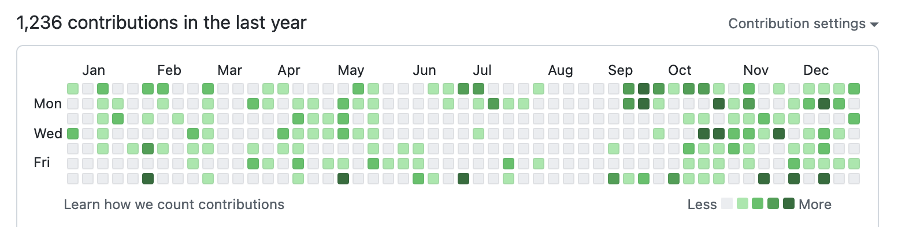
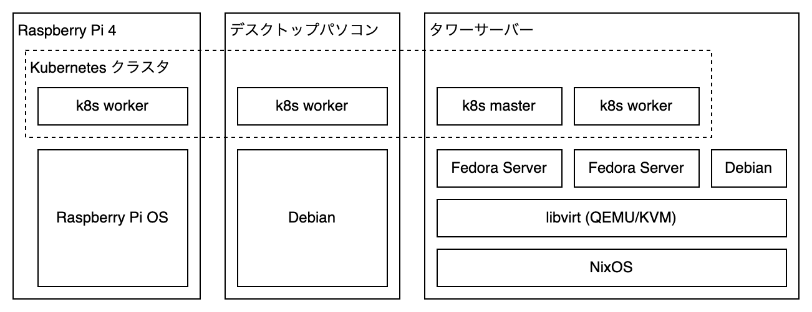
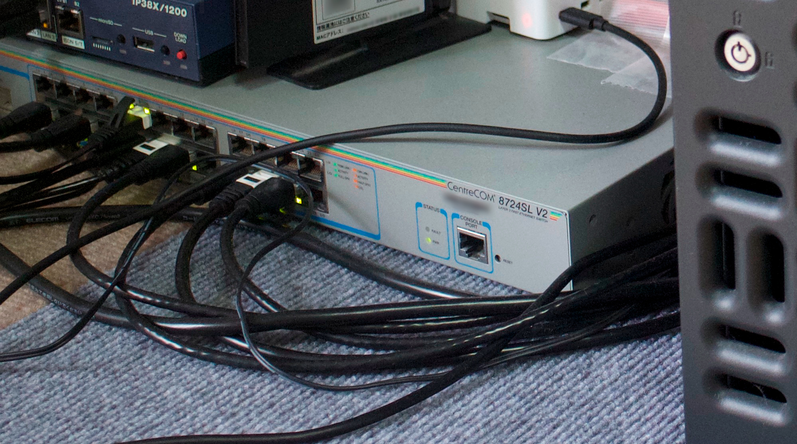
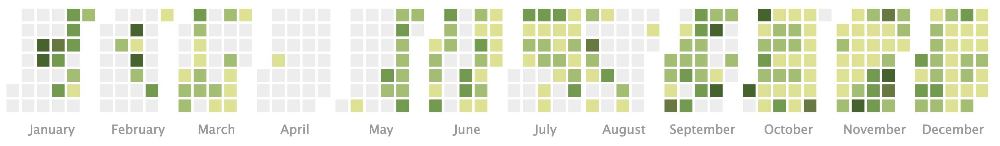

こんにちは。一年を振り返ることができるのは一年の中でもこの時期だけです^[べんり]。

## ライフイベント

### 進級

した。次はない。

### 引っ越し

した。美味しい飯屋が近くにたくさんある。友達と同じマンションに住んでいて、集まりやすくて楽しいです。

## パソコン

パソコン活動量は去年よりやや少ないぐらいでした。パソコン時間の大部分を労働に割いていたので、そういうことの結果らしい。

<!-- textlint-disable ja-engineering-paper/ja-hiragana-keishikimeishi -->

秋ごろ、ソフトウェアのメンテナンスに気持ちが出ました。そこをきっかけにパソコンに気持ちが戻ってきて、ちょっとづつ活動が増えている^[まあ Dependabot のマージが大半か]気がします。基本的にはソフトウェアのメンテナンスに関する周辺（CI とかも、そう）に興味が継続していて手が動いています。それから、後に述べる Kubernetes クラスタを通年でいじっていたので、その辺りでも少し活動がありますね。あとは昔書いた magicpak という OSS を使ってくれている方がいて、その関係でしばらく放置していたメンテナンスを再開したりとかですね。

<!-- textlint-enable ja-engineering-paper/ja-hiragana-keishikimeishi -->

### 家パソ

家のパソコン、家パソ

2021 年までは一台のマシンに NixOS で全てを収容するスタイルで様々を運用していたのですが、色々ありそれを解体することになりました。解体してどうするかですが、せっかくなので去年から余らせていたサーバーマシンとくっつけて Kubernetes クラスタとして運用していくことを決めました。同時期にコマンドが打てるスイッチングハブをハードオフで購入して"ネットワーキング・やりたいやりたい状態"になっていたのでちょうどよく、家ネットワークの構築と Kubernetes クラスタの構築を同時に進める流れとなりました。家ネットワークは普通にサーバー類と普段使いで VLAN を分けて、みたいな特に言うこともない感じです。Kubernetes クラスタは下のように:

なんかホストの OS 迷子やんね。SELinux デフォルトの世界に憧れて Fedora Server を試したく、適当に潰せる VM にはそれを使うみたいな流れがありました。また VM 畑の母艦にはベアメタルマシンの IaC 化の試みとして NixOS を採用してみています。しかしこれのメンテナンスは大変で、というかほとんどできていなくて、困っています。ここら辺はシュッとなったら結構アツいと思うのですが物理マシンはいかんせん替えがないから遊びにくい。もう一台サーバーを買うのが目下の目標かもしれません。

Kubernetes クラスタでは身内サーバーで使っている Discord や Misskey の bot などが今のところ動いており、マニフェストを GitHub のリポジトリから Argo CD でデプロイしています。今年は監視に凝る作業を主にやっていて、kube-prometheus を動かしつつ、RAID コントローラなど色々なものに追加で監視を入れました。一人 PagerDuty でオンコールごっこをしていますが、今のところ夜中に起こされたことはないので楽しくやっています。運用面では Argo CD の使い方をもう少し改善したい^[権限管理が曖昧なのと、PR に対してステージング環境が用意されるアレをやりたい]とか、今 cloudflared で外からトラフィックを取り込んでいるがそれをやめたいとか、色々やりたいことがあります。開発面でも、身内で使っている bot を公開できるレベルにするとか、Misskey インスタンスを再建するとか、このクラスタでやりたいことはたくさんありますね。来年に期待です。 ただとにかく 3 ノードでやっていくのはキツくて、drain 回らないよ〜まあ再起動しちゃえ w みたいな感じなので、流石にもう一台サーバーを買うのが目下の目標かもしれません（２）。

また、この Kubernetes クラスタに HDD を明け渡すために作業マシンを再構築する流れになり、SELinux デフォルトの世界に憧れて（２）Fedora Workstation をベースに環境を組みました。とはいっても基本的にはその上に Debian/Windows の VM を建て、実際の作業はそこですることにしています。もともと作業マシンは Arch Linux だったのですが、だいぶ色々とシステムに変更を加えていて何が何だかわからない・何が起きるかわからないような不安感がありました^[家で PKI をやろうと思ったとき、このマシンは信頼ならないからここで秘密鍵を生成したくないと思うぐらいには信頼がなかった]。実作業を VM 上で行うことでホストのシステムにはほとんど変更を加えることがなく、また作業環境の VM が汚れてきたら潰して立て直すのも容易です。そういった意味で精神衛生が保たれていて気分がいい一年だったと言えるでしょう。

### 労働

去年と変わらずクックパッドで就業型インターンを続けています。去年は CI 高速化や移植作業など手慣れたことが多かったですが、今年は AWS と向き合ったり、大量のデータと向き合ったり、プロダクションで動いている外向きのサービスに向き合ったりと今までにない体験をたくさんすることができました。特に面白かった業務をテックブログに掲載させていただく機会があり、それが下です。AWS ピタゴラスイッチ × 大きなデータストリームという感じで楽しいですね。

[embed](https://techlife.cookpad.com/entry/2022/07/08/110000 "Fluentd 集約ノードのオートスケール - クックパッド開発者ブログ"){ description="クックパッド開発者ブログ" }

すごくできることが増えた実感があります。2021 年まではコードを書くのが主な活動だったのですが、今年はちゃんと「インフラ」としての仕事ができたので、それが嬉しかったですね。とはいってもあまり触れられなかった分野は存在し、例えばデータベース (RDBMS) のことは相変わらずあまりわからないままなので、来年はデータベースと仲良くしたいです。

## 趣味

消費の方は別記事にまとめました。

[embed](https://coord-e.com/post/2022-12-16-otaku-2022 "オタク 2022 - coord-e.com"){ description="消費活動 2022" }

ここでは生産系の趣味の話をします。生産系の趣味は気を抜くと失われてしまうので、基本的にはやめない、継続するのを一番の目標としてやっています。結果、上達が二の次になって気が楽^[べんり]ですね。

### Mix

これですよ

[embed](https://coord-e.com/post/2022-12-14-touchosc-pcdj "iPad で PCDJ - coord-e.com"){ description="明らかにタッチインターフェースを備えている iPad を PCDJ 機材の代わりにできないか検討し、実際にある程度の体験を得ることができたのでここではそれを紹介します。" }

なんか一人で音楽流して椅子の上で跳ねる行為を DJ と呼ぶのがこっパズなので Mix とか言ってるんですがまあいわゆる DJ 行為ですね。この前の記事でも触れたとおり、音楽をつなげる遊びを覚えました。好きな音楽をいい感じの順番で繋げていくやつです。流している音楽が大好きなものであることから自分の行為のクオリティにかかわらず一定度盛り上がれて趣味として質がいいと思います。また、曲を繋げるために色々な曲を聴くモチベーションが発生するのも嬉しいところです。これまでは同じアーティストの音楽をずっと聴くような生活だったのですが、これによって幅広く色々な音楽を開拓することができるようになってきました^[べんり]。

たまに Discord で配信してそれを友達が聴いてくれています（嬉しい）。ちゃんと音が出る場所で DJ をしたみたくないかと言われるとそりゃあいつかしてみたいですが、なにせ rekordbox すら使ったことない状態なので、まずは機材を買うところからかなと思います。

### 絵

これ意外なんですが続いています。すごい！線の引き方についてはほとんど上達していない自覚があるけれど、塗りに時間をかけるようになってからそこそこいい感じに塗れるようになってきたと思います。光と影に少し向き合えていて、それが全体のクオリティに影響するのが楽しいです。ベタまでそんなわけないだろと思っていた絵が影つけるだけで一気にかわいくなるの人智超えててびっくりしますね。目をデフォルメで描きがちだった去年はあまり色を塗ることに楽しさを感じていなかったんですけど、先述の通り塗りで絵が見違えることはあって、なのでもう雑な線でもとにかく色を塗って気分を上げながら線を綺麗にしていくような工程を踏んでいます。時間がかかります。

今年一番頑張ったのが、これ 👇 二週間ぐらいかかってて、一枚にこんなに時間かけたの初めて！リコリス・リコイルから受けた気持ちでどうにか真面目にやってやろうと気合を入れて、線を細くするとか背景とか光と影を真面目にやるとか、やりたいと思っていたことを色々やりました。線にちゃんと時間をかけたので線がちゃんと綺麗だなあと思います（満足）

<blockquote class="twitter-tweet">
リコリコ良かった！！銃を撃っている千束がカッコよくて好きなのでその絵 <a href="https://t.co/3A6pPpQ48h">pic.twitter.com/3A6pPpQ48h</a>
&mdash; こでい (@kord_eq) <a href="https://twitter.com/kord_eq/status/1574284316234092544?ref_src=twsrc%5Etfw">September 26, 2022</a></blockquote> 

## 車

車にちゃんと乗るようになり、生活が車中心になりました。気軽に遠くまで行くことができて便利です。7, 8 月に友達と立川まで『少女 ☆ 歌劇 レヴュースタァライト ロンド・ロンド・ロンド』『劇場版 少女 ☆ 歌劇 レヴュースタァライト』を観に行ったんですが、その時に立川がどこかも知らないまま適当に車でいけるじゃろと思っていたらめちゃめちゃ遠くてびっくりしました。夜の首都高でカラフルに光る巨大トラックにめちゃめちゃ詰められて^[私の乗っている車は非常に軟弱で加速が弱いため、十分に速度が出ていない状態で下手に速度があるトラックを背後に取ったりすると死んでしまう]文字通り死にそうになったので、これ以来夜の首都高は避けて移動しています。

乗り始めは運転楽しいにえ〜用事もないのに高速乗っちゃいまつよ〜という感じだったんですけど乗るにつれて自分の運転が本当に信用ならないことに勘付いたので最近は必要があるときにしか乗っていません。

## 元気さ

元気です。今年は元気さの可視化と一年前を振り返ったらおもろいだろうなみたいなところから日記をつける取り組みを始めました。日記の量を GitHub の草っぽくすると、こう 👇

なんかおもろいかなあと思って GitHub の草っぽくしてみたけどそこまで面白くない。まあでも書けてない時期（4-5 月とか）見に行くと確かに元気がなかった様子があるし、最近は元気なので日記が書けるのは元気な証なんですかね。でも 8 月は「起きたことを記録しておきたい時期と、別にそうではない時期がある」とか書いてあって、なんなんですか？

それはそれとして 11 月以降は皆勤で、寝る前に日記を書く習慣をつけるなんてことが自分に可能だとは正直思っていなかったので成長を感じています。最近は日記を書くことをきっかけに寝る前の定型動作が簡単に実現できるようになり、戸締りや暖房器具、アラームのセットなど寝る前にやるべきことをもれなく確認するといった非常に利のある行動につながっています^[べんり]。

## 2023

2022 年の目標を振り返っておきます。

[embed](https://coord-e.com/post/2021-12-29-retro-2021 "ふりかえり 2021 - coord-e.com"){ description="今年の義務がほぼ全て終わりかなり開放感があるので 2021 年を振り返ってしまう" }

- 趣味と仕事が問題なくできればええみたいなムードなので学業をやるのかやらないのかはっきりさせる
  - 検討の末、やることにしました^[卒業を諦めない、の意]。温度感は定まったのですが、体がついてきていません。
- 金がなくてこまるみたいなことがないように働きと消費の調整をやる
  - 収支をスプレッドシートで管理するようになってから、破産しなくなりました。推測するな、計測せよ
- はたらき先をもうちょっとちゃんと探す
  - 春インターンに行ったり逆求人をやってみたりしました。今いる場所がどういう理由で居心地がいいのか、解像度が上がった気がします。

まあいいんじゃないでしょうか。色々ありましたが大体いい感じに転んでいて満足度が高かったです。2023 年はもう少し高みを目指してみるか。

- お金に余裕を持つ
  - 2022 年は労働日数が目標より足りないと破産しうるような危うさがありました。幸い本当に少しづつ貯金ができてきているので、しばらく無職をやっても大丈夫なぐらいの余裕を持ちたいですね。
- スムーズに社会人になる
  - 一応 2024 年には社会人になっている予定なので、急に社会！？（卒倒）みたいにならないように体を慣らしていきたいです。これはすでに一応やっていて、働く日はなるべく 8 時間働くようにしてみています。2023 年は週 5 日労働に耐えられる心身を作っていくところですね。
- 長期的に成す
  - 〇〇に興味！ウオオ〜ン 🤩 みたいなのが減ってきたので、この機会に、目標をたて、そこに向かって長期的に成していくやつをやっていきたいですね。これはメタ目標で、前 2 つやそれ以外を達成するための長期的なプロセスを意識的にやってみよう！みたいな感じです。

がんばります！良いお年を。
