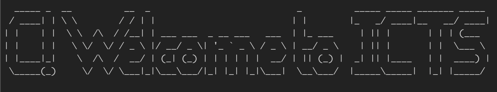

ICTSC というのがあり、

[embed](https://icttoracon.net/ "icttoracon.net"){ description="全国の専門学校生、高専生、大学生、大学院生を対象としたサーバー・ネットワークのトラブルシューティングや運用技術をチーム単位で競うコンテストであり、競技参加選手だけではなく、コンテストの企画、運営も学生が行う、学生の、学生による、学生のためのコンテストです。" }

大学の友達の友達から友達募集が入り、やっていくことになりました。

[:contents]

## チーム

word-unknown-tsukuba-otaku です。target triple を模しています（ネタの解説）。
それぞれ（順不同）

- tosuke <https://twitter.com/t0suk3>
- pyusuke <https://twitter.com/public_yusuke>
- coorde <https://twitter.com/coord_e>
- cyanolupus <https://twitter.com/cyanolupus>
- azrsh <https://twitter.com/azarashi_uni>


## 結果

満点を最初に達成し優勝しました。4 人友達がいてよかった


## やったこと

ISUCON とかと違ってそれぞれ問題が独立しているのでそれぞれがそれぞれの担当問題をやるに終始しました。
わからなくなったら手放して得意な人にやってもらったりもしていました。自分が解答の作成をした問題を列挙してみます。

<!-- textlint-disable ja-technical-writing/no-exclamation-question-mark -->

### Welcome to ICTSC! (lwg)

<!-- textlint-enable ja-technical-writing/no-exclamation-question-mark -->

問題をざっと見回して、急にシェルのオタク向け問題があったので景気がいいなあと思いながら手をつけました[^1]。画面にきらびやかな AA を出すワンライナーを作る問題です。

[^1]: わたしはシェルのおたくなので

1 つ目は figlet(6) の出力に色をつける問題でした。半角スペース 2 個分に背景色つければそういうふうになるやろ〜と思ってとりあえずそれを試していました。


この問題でちょっと厄介なのが、文字ごとに色が違う点です。すると figlet(6) の出力全体に対して処理をしていく方法ではうまくいきません。
figlet(6) のフォントを作るか文字ごとに出力して後でくっつけるか迷ったのですが、問題の趣旨として外にフォントファイルを用意するのはダメかと思われたので後者でやることにしました。シェルの出力を横にくっつけるのは良く悩むことなので、以前検索してやればできたなあということだけ覚えていて、実際に検索してみるとやればできることがわかります[^2]。

[^2]: horizontal cat と検索すると猫の画像が出てきてかわいいですね <https://www.google.com/search?q=horizontal+cat>

というわけで、文字をそれぞれ作って `paste -d ''` でくっつけて終わりです。

```bash
function show() {
  figlet -f block $1 | sed -e "s/_|/$(tput setab $2; echo -n '  '; tput sgr0)/g" -e '1d' | head -n -2
}
paste -d '' <(show I 1) <(show C 6) <(show T 4) <(show S 3) <(show C 2)
```


二つ目は figlet(6) の出力をアニメーションするものでした。文字をシフトしつつ画面を消してやっていけばできそうなので、やって、できます。0.2 秒ごとに更新をするように指示があったのですが、manpage 曰く問題環境の sleep(1) は小数点数を取れるとのことだったので、よろしいことだなあと思いました。

```bash
declare -i c=0
str="Welcome to ICTSC! "
l=${#str}
while :; do
  s=$(( c % l ))
  tput clear
  figlet -tf big "${str:s:l-s}${str:0:s}"
  c=c+1
  sleep 0.2
done
```



解答の全文をチェック :eyes: <https://gist.github.com/coord-e/230fc55f5c2e25e33156528f534e05f2#file-ictsc-lwg-1677898206-md>

### オレオレ S3 (cya)

Fluentd のエラーメッセージで `test.192.168.19.2:9000 (getaddrinfo: Name or service not known)` と言っており、virtual-hosted style で minio にアクセスしようとして失敗していることがわかります。そのため、path style を使うようにオプションで指定すればこれは直ります。
<https://github.com/fluent/fluent-plugin-s3/blob/master/docs/output.md#force_path_style>

これを治すと、次は Fluentd から nginx のログが読めない症状が出ます。普通にパーミッションの問題なので、グループで調整してあげます。

解答の全文をチェック :eyes: <https://gist.github.com/coord-e/230fc55f5c2e25e33156528f534e05f2#file-ictsc-cya-1677900647-md>

なんか解き始めてすぐ切り分け〜とか叫びながらクレデンシャルの確認してたのですが時間の浪費でした :upside_down_face:

### 答えてくれ Ping サーバー、ここには user モードと systemd と、俺がいる！ (dkv)

これはかわいい後輩くんが `systemd --user` で `WantedBy=multi-user.target` と書いているので、違うよ〜とやさしく教えてあげる問題なんですけど

問題の条件でやっていい操作が `webapp/webapp.service` の編集と `webapp/deploy` の実行のみだというのを見逃しており、後輩くんに `systemctl --user enable` を叩かせる 0pt 提出を繰り返していました[^3]。当時はなんで 0 点になるのかよくわからなかったので 2 日目に azrsh に投げて、諸々やってもらいました。どうも〜

[^3]: すみません

### 魔王様の求人 (avu)

Kubernetes 問題に見えましたが、蓋を開けると Rook/Ceph でした[^4]。症状としては OSD Pod の init container が起動に失敗しているという感じです。

[^4]: ずっと Rook/Ceph から目を背けてきた人生なのでついにきたな...と思いました

さて、Rook/Ceph のことはこれっぽっちも知らないので色々試していたんですが一向に直りません。なんかどこか[^5]のログで `/dev/vdb` にデータがすでにあるので無視するで〜w というのが見えたので、最初は `/dev/vdb` を初期化しては Rook の operator を再起動してを繰り返していたのですが、なんか OSD が増えてしまって変な感じに（本当に何が起きているのかわからなかった）なっていました（悲しい）。

[^5]: 忘れた

```console
user@k8s-master:~$ kubectl -n rook-ceph exec -it deploy/rook-ceph-tools -- ceph osd tree
ID  CLASS  WEIGHT   TYPE NAME            STATUS     REWEIGHT  PRI-AFF
-1         0.11691  root default
-5         0.03897      host k8s-node-1
 1    hdd  0.01949          osd.1        destroyed         0  1.00000
 3    hdd  0.01949          osd.3        destroyed         0  1.00000
-3         0.03897      host k8s-node-2
 0    hdd  0.01949          osd.0        destroyed         0  1.00000
 4    hdd  0.01949          osd.4        destroyed         0  1.00000
-7         0.03897      host k8s-node-3
 2    hdd  0.01949          osd.2        destroyed         0  1.00000
 5    hdd  0.01949          osd.5        destroyed         0  1.00000
```

わからないまま 2 日目になって頭が冴えてきたタイミングで、250 点問題でそんな Rook/Ceph の深い話をするか？とメタ読みをしました。そこでいったん正気に戻り、一番表層に出ているエラーメッセージであるところの `/dev/ceph-*` が存在しない、というところに注目しました。各ノードに `lvm2` パッケージが入っていないことから LVM 関係じゃあないのかなあと思っていたのですが、やっぱり LVM かあと思い直して `lvm2` を入れて lvdisplay(8) を叩いたらビンゴ。`/dev/ceph-*` は論理ボリュームで、inactive になっていました。ということで `lvchange -ay` で activate したら大丈夫になりました。

閉会式で `lvm2` をインストールして再起動でも良いと言われてそうなんだと思いました、LVM がどういうふうに動いているのかいまだによくわかっていない

解答の全文をチェック :eyes: <https://gist.github.com/coord-e/230fc55f5c2e25e33156528f534e05f2#file-ictsc-avu-1677987262-md>

## 感想

- いまだに自分はログをちゃんと見る前に変な推測で手をうごかしてしまうのか…
- ネットワ〜クがメインコンテンツかと思っていたけどネットワ〜ク以外でもちゃんと力になれることがあってよかった〜
