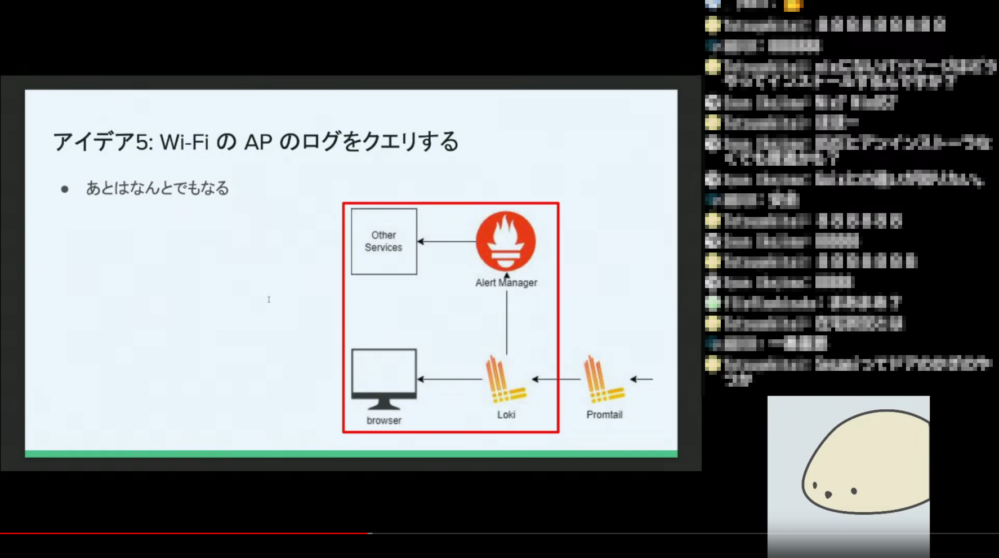
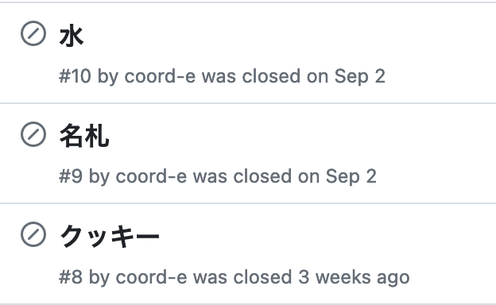

これは天久保 Advent Calender 2023 1 日目の記事です。

[embed](https://adventar.org/calendars/8938 "天久保 Advent Calendar 2023 - Adventar"){ description="今年もやります、茨城県つくば市の町域であるところの天久保とは無関係な任意団体「天久保」のアドベントカレンダー" }

私たち天久保は、2023/9/1 (金) に coinsLT#1000 を開催しました。当日は論理・物理合わせて 30 人以上に参加いただき、飛び入り含めて 11 人の発表が行われるなど、盛況のうちに終了しました。

[embed](https://amakubo.connpass.com/event/288675/ "coinsLT #1000 - connpass"){ description="1000 回目の coinsLT です。" }

coinsLT#1000 の開催にあたって、学内イベント特有の様々な難しさが存在しました。本記事では、当日までに行った準備などを一通りまとめます。大学で、というか、ほとんどは筑波大学特有の話になると思います。

[:contents]

## coinsLT とは

> simple & rough
> <https://coinslt.org/>

coinsLT は情報科学類生主体の LT 大会ですが、情報科学類外からの参加、発表も歓迎しています。2014 年に KOBA789 氏が始めてから、昨年までに 0b1000 回の開催がありました。2019 年からは Totsugekitai 氏が主催となって開催されており、今回天久保が引き継いで開催をしました。
coinsLT の引き継ぎは GitHub Organization <https://github.com/coinslt> の引き継ぎによって行われます。今回は azrsh 氏から Totsugekitai 氏・KOBA789 氏に連絡し、天久保メンバーの <https://github.com/coinslt> への追加を行っていただきました。

## 開催までの流れ

4 月ごろ、天久保で LT 会をやりたいよなあという話をしました。よくわからないですが腹を括っており、自分が旗振りを行うことにしている様子があります。

天久保主催で会をやりたいという話が前々からあったのもあり、発起当初は LT 会に合わせてやりたいことが天久保内で多数提案されました。

カンファレンスのノベルティが面白いみたいな話は往々にしてあり、夢が広がっています。

さて、現実的な話として大学で開催することは自然と決まっていたのですが、どのようにしたら大学で場所を借りることができるのか何も知らなかったので、それを調べることから始めました。当時調べた結果、次の 3 つの選択肢が上がりました。

<!-- textlint-disable terminology -->

- 図書館のコミュニティスペース <https://www.tulips.tsukuba.ac.jp/lib/index.php/ja/service/event-space>
- 施設部による講義室・会議室の貸し出し <https://shisetsu.sec.tsukuba.ac.jp/k_space/tsukuba_campus.html>
- 学生集会 <https://ssc.sec.tsukuba.ac.jp/office-of-student-welfare/generalguide/meeting>

<!-- textlint-enable terminology -->

図書館のコミュニティスペースは企画書等を提出して進める必要があり、当時私たちには場所だけが必要だという意識があったため除外しました。施設部による講義室・会議室の貸し出しというのは、非常に高額で、その様子から学外者に向けたサービスであろうと予想し、除外しました。
学生集会というのは、名前こそ仰々しいですが、学内で学生が授業と無関係の研究会や発表会を行う際に利用できる手続きです。最寄りの支援室に確認したところ学生集会が適していると確認をいただいたため、学生集会として開催する方向で進めることになりました。

### 日程の決定

教室利用を管理している表が各支援室に存在し、その表に日時を埋めることで教室を予約することができます。私たちは普段馴染みのある第三エリアの教室を担当しているシステム情報エリア支援室に赴き、教室の空き状況を確認して日程を決定しようとしました。5 月ごろに何度か確認した印象として、おおむね空いており、他の予約によって教室を確保できなくなる心配はなさそうでした。

当初、以下の理由から、まず 9/2 (土) という日付を選びました。基本的に、なるべく多くの人が参加してくれるような日程を選ぼうとしています^[会には人が来たほうがいいため。]。

- 大学院入試直前を避ける。
- お盆休み付近を避ける。

しかし、ほどなくして冷房の問題が浮上しました。9 月は夏であり、冷房のない教室で LT 会を開催するのは現実的ではありません。私たちは、開催日に確実に冷房が利用できることを確認する必要がありました。では、どのような場合に教室の冷房が稼働しているのでしょうか。まず基礎知識として、筑波大学の教室は空調の種類で二種類に大別することができます。

- 個別空調: 教室ごとに稼働・停止を制御できる。
- 中央式空調: 稼働日・稼働時間が決まっており、教室ごとに制御ができない。

教室ごとの空調区分は施設部の Web サイトから確認ができます。直接のリンクは控えますが[^url-changes]、学内向けページから見つけることができるはずです。

[embed](https://shisetsu.sec.tsukuba.ac.jp/ "筑波大学 施設部 ホームページ"){ description="" }

[^url-changes]: なんか最近 URL が変わってびっくりした

さて、中央式空調は土日に稼働しないという事前情報を得ていました[^ztt]。そのため、個別空調の教室を借りるか、中央式空調が稼働している日に日程を変更するかのどちらかを選ぶ必要がありました。しかし、空調区分平面図とシステム情報エリア支援室の教室使用管理表を照らし合わせた結果、第三エリアには学生集会で使用可能な個別空調の教室が存在しないことがわかりました。そのため、私たちは日程を 9/2 (土) から変更することにしました。

[^ztt]: 所属しているサークルで教室を借りる必要があり、そちらを担当している友人が先行して色々調べていたため参考にさせてもらった

では、中央式空調はいつ稼働しているのでしょうか。空調の運転期間も施設部の Web サイトから確認ができます。しかし、運転期間が発表されるのは 6 月頃であり、日付を検討していた時期にはまだ運転期間が不明でした。さらに、休業日に関する記述に不明な点がありました。土日に稼働しないことは知っていたのですが、「休業日」の解釈によっては、夏季休業中に稼働するかどうかも怪しく、場合によっては 9 月中の開催すら難しくなってしまいます。そこで私たちは、空調についての情報の発信源である施設部を直接訪ね、当年度の空調の稼働期間と、休業日の扱いについて伺いました。その結果、当年度は 9 月第 1 週に中央式空調の稼働を止める予定であること、とはいえ例年終期がある程度延長されるということを教えていただきました。さらに、夏季休業中でも稼働期間中であれば 8/14 週[^univ-holiday]以外は中央式空調が稼働しているともおっしゃっていました。

[^univ-holiday]: 2023/8/14 の週は全学的に休み（？）という感じだった

このように得られた情報を総合し、夏季休業中の平日で、9 月の第 1 週である 9/1 (金) に開催することを決定しました。また、リハーサルのために 8/21 (月) を確保することにしました。大学院入試等の関係で 9/1 以前に長らく教室が利用できない期間があり、直前で利用できるのが 8/21 (月) だったためです。

### 教室の決定

さて、日程が決定したら次は利用する教室の検討に移りました。私たちは 3A204 のような非常に大きなスクリーンを備えた教室に憧れがあり、当初はそこの利用を検討していました。しかし、システム情報エリア支援室に問い合わせた結果、学生集会による教室利用では既設のプロジェクターやマイクなどの設備は利用できないことがわかりました。スクリーンは利用しても良いらしいのですが、どちらにせよ 3A410 の巨大な 3 つのスクリーンに投影できるプロジェクターを自分たちで用意するのは割にあっていません。夢を見るのをやめ、適当に下見をして coord_e がサイズ的に気に入った 3A410 という教室に決定しました。

### 学生集会（催）願

筑波大学の学生は、学生集会（催）願を支援室に提出することで、教室を予約することができます。学生集会（催）願は、開催の 1 ヶ月前から 5 日前の間で提出する必要があります。

[embed](https://ssc.sec.tsukuba.ac.jp/office-of-student-welfare/generalguide/meeting "学内で研究会などを開きたい – 筑波大学スチューデントサポートセンター"){ description="" }

学生集会（催）願の裏面には集会時間と教室を複数記載できる記入欄があり、そこにリハーサルと当日の予約時間を記入しました。提出と同時に支援室の教室利用を管理している表に日時と教室を記入しました。提出の二日後以降に、承認済みの学生集会（催）願を受け取り、予約が完了しました。

提出の際、「天久保」という団体名に戸惑われる一幕がありましたが、学生団体ではなく有志の集まりであることを強調し、事なきを得ました。

### 機材

先述の通り既設の設備が利用できないため、プロジェクターやマイク、スピーカーなどを自前で調達する必要がありました。幸いにして、学生生活課にて課外活動用具の貸出しという形でその類の機材を無料で借りることができます。貸出し期間は基本的に 1 週間となっています。

[embed](https://ssc.sec.tsukuba.ac.jp/office-of-student-welfare/activities-application-2 "様々な活動のために – 課外活動やサークル活動の申請をする (手続き一般) – 筑波大学スチューデントサポートセンター"){ description="" }

私たちは以下の物品を借りました。ビデオカメラは内部用の記録として当日の様子を録画しておこうという趣旨で利用することになりました[^norec]。

- プロジェクター
- ワイヤレスマイクアンプ[^micamp]
  - マイクを追加で一本
- マイクスタンド
- ビデオカメラ
- ビデオ用三脚

[^micamp]: 調べるまでよくわからなかったんですが、ワイヤレスマイクと繋がってマイクの声をスピーカーから出す機械をこう呼ぶらしい <https://www.google.com/search?q=%E3%83%AF%E3%82%A4%E3%83%A4%E3%83%AC%E3%82%B9%E3%82%A2%E3%83%B3%E3%83%97>
[^norec]: しかし録画ボタンを押し忘れていたので当日は録画をすることができませんでした

私たち天久保は筑波大学の学生団体ではありません。そのため、私たちは個人として課外活動用具の貸出しを受ける必要がありました。個人は貸出しにおいてもっとも優先度が低く、予約を 2 週間前からしか行うことができません。とはいえ、幸い私たちが借りるプロジェクター等の用具は多数用意されており、全てが貸出されてしまって私たちが借りることができなくなる心配はありませんでした。リハーサル日と当日の間に 1 週間以上の間があるため、2 回受取と返却を行う必要があったのですが、どちらでも問題なく借りることができました。

## 配信

せっかく LT 会をやるなら配信がしたいものです。天久保内では各メンバーから配信について多くの気持ちが上がり、おおむね以下の要求を達成するように配信環境を考えることになりました。

- 現地の発表者に配信のための要求をしない
- 現地プロジェクターへの投影がライブ配信のためのあれこれで阻害されない
- 発表者の声をちゃんと聞き取れるように入れる
- 顔を出すが、顔出し NG にきちんと対応する

現地の発表者に配信のための要求をしないためには、会場用の映像をそのまま利用して配信に繋ぐ必要があります。私たちはパススルー機能付きの HDMI キャプチャボードを利用し、発表者 PC とプロジェクターの間で映像をキャプチャして配信用 PC に取り込むことにしました。パススルー機能がついたキャプチャボードを利用することで、現地プロジェクターへの投影がライブ配信のためのあれこれで阻害されないという要求も達成することができます。

さらに、課外活動用具として借りたワイヤレスマイクアンプが LINE 出力を備えていたため、それを配信用 PC に取り込んで合成することで会場用のマイク音声を直接配信に利用することができました。これに加えて OBS でノイズゲートとノイズ抑制を使用し、発表者の声が聞き取りやすい形で配信するようにしました。これらはリハーサル日に実際に配信を行ってみて調整を行いました。

発表者 PC からの音声出力については、もともと積極的に対応するつもりはありませんでした。しかし、リハーサル日に試してみると、課外活動用具として借りたワイヤレスマイクアンプが LINE 入力を備えており、ワイヤレスマイクアンプからの LINE 出力はマイクからの入力とその LINE 入力がミックスされて出力されていました。そのため、発表者 PC から LINE 出力を行ってもらい、それをワイヤレスマイクアンプの入力に繋げるだけで会場と配信の両方に発表者 PC 音声を出力することができました。当日、リモートで飛び込み発表が行われる場面があり、その際に発表者とビデオ会議を繋いだ coord_e の PC から LINE で音声を出力するだけでリモート発表が簡単に実現できたのは今思うといい話です。

顔出しを行うため、発表者の近くに顔用の Web カメラを設置しました。そして、配信用 PC で発表者 PC 映像と顔用カメラ映像を OBS のシーンで合成し、YouTube Live へ配信を行いました。顔出し NG については OBS のシーン切り替えで対応しつつ、物理的なブラインドのついた Web カメラを用いて万全を期しました。OBS のシーン作成や当日のオペレーションなどを kuresugutaira 氏が担当してくれました。

## ノベルティ

発起当初にもっとも話が盛り上がっていたノベルティ（グッズ）ですが、実際には開催に必須ではないということもあり制作は難航しました。何より、おおむねノベルティにはロゴが必要ですが当時の天久保にはロゴがありませんでした。

何度か天久保メンバーで案を出し合い検討をし、最終的に HosokawaR 氏がロゴを制作してくれました。天久保の略称である “AMKB” と、天久保の “天” のモチーフを組み合わせた、非常にスタイリッシュで使い勝手の良いデザインになっています。このロゴは天久保のランディングページ <https://amakubo.land/> などにも使用されています。

このロゴを使い、ステッカーをラクスルで発注しました。“天” の円形ステッカーと、横長のロゴのステッカーを、それぞれ 50 部ずつ用意しました。ロゴの形状に合わせてカットされたステッカーも作りたかったのですが、思いの外カットパスの制約が厳しく、断念しました。

また、ラベルレスのペットボトル水にステッカーを貼付けて配布しようという考えがメンバー内でありましたが、水だけ購入したのち忘れてしまい、特に配布をすることはありませんでした。

## 当日

当日は会場で 15 人以上、オンライン見物を合わせると 30 人以上の方々に参加いただき、非常に楽しい会となりました。connpass での発表者の登録は 7 人で、さらに飛び込みで当日 4 人の方に発表いただきました。時間の使い方について何も考えておらず発表が終わってやることがなくなってしまったのですが、自然と懇親が発生して楽しい雰囲気で終えることができたなど、皆様の協力があって楽しい会にすることができたと感じています。本当にありがとうございました。

## まとめ

2023/9/1 (金) に天久保として開催した coinsLT#1000 について書きました。自分は学内でイベントを開催するのが初めてで、準備において多くの戸惑いや疑問がありました。そこから得られた知見や経験をまとまった記事としてこのように公開することで、私たちにとっての備忘録にとどまらず、今後学内で誰かがイベントを開催する際の参考になればと思っています。

最後になりますが、coinsLT は引き継ぎ手を募集しています。引き継ぎ・共同開催問わず、coinsLT の未来の開催を担うことに興味のある個人・団体がいらっしゃいましたら、お気軽に天久保のメンバーや [info@amakubo.land](mailto:info@amakubo.land) にご連絡ください。

