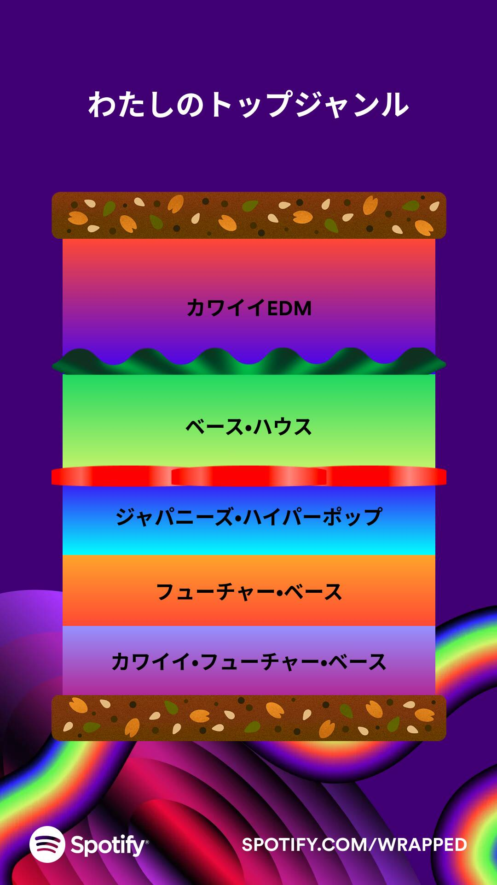
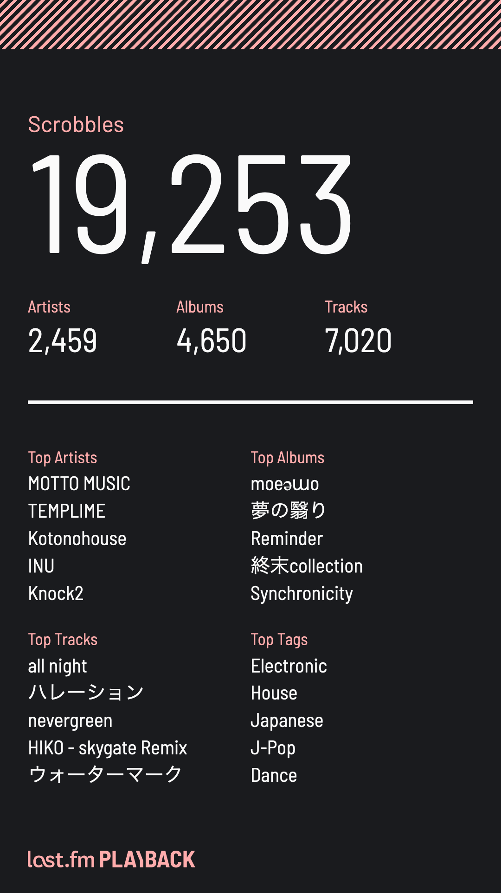
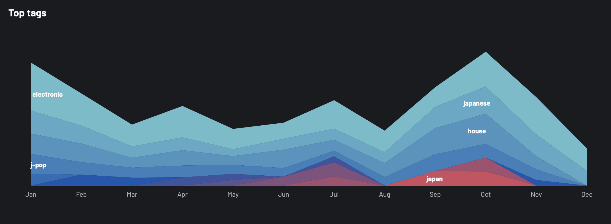

うお〜こでい音楽大好き

Spotify くん！どうかな？ババン

## カワイイ EDM

<iframe style="border-radius:12px" src="https://open.spotify.com/embed/album/3RJHinZKQbuWpWFLaRZX15?utm_source=generator" width="100%" height="352" frameBorder="0" allowfullscreen="" allow="autoplay; clipboard-write; encrypted-media; fullscreen; picture-in-picture" loading="lazy"></iframe>
最高！！

<iframe style="border-radius:12px" src="https://open.spotify.com/embed/album/7mqmXs3jAldyiZKxRmraZv?utm_source=generator" width="100%" height="352" frameBorder="0" allowfullscreen="" allow="autoplay; clipboard-write; encrypted-media; fullscreen; picture-in-picture" loading="lazy"></iframe>
最高！！

<iframe style="border-radius:12px" src="https://open.spotify.com/embed/album/3kY7VacBnRk0O0tzBwlpqE?utm_source=generator" width="100%" height="352" frameBorder="0" allowfullscreen="" allow="autoplay; clipboard-write; encrypted-media; fullscreen; picture-in-picture" loading="lazy"></iframe>
最高！！

## ベース・ハウス

腕を振るのを止められないので電車で聴けない

<iframe style="border-radius:12px" src="https://open.spotify.com/embed/track/6THfFUlHUQEQzDSTzUHRqo?utm_source=generator" width="100%" height="152" frameBorder="0" allowfullscreen="" allow="autoplay; clipboard-write; encrypted-media; fullscreen; picture-in-picture" loading="lazy"></iframe>
𝒏𝒐𝒍𝒊𝒎𝒊𝒕...

<iframe style="border-radius:12px" src="https://open.spotify.com/embed/track/6NRvZuFXn2ixp8YdzUvG5n?utm_source=generator"     width="100%" height="152" frameBorder="0" allowfullscreen="" allow="autoplay; clipboard-write; encrypted-media; fullscreen; picture-in-picture" loading="lazy"></iframe>
ブーンブーンブンブンブンブンブーン

<iframe width="100%" height="166" scrolling="no" frameborder="no" allow="autoplay" src="https://w.soundcloud.com/player/?url=https%3A//api.soundcloud.com/tracks/1310864302&color=%23ff5500&auto_play=false&hide_related=false&show_comments=true&show_user=true&show_reposts=false&show_teaser=true"></iframe>
<a href="https://soundcloud.com/tkmhouse" title="TKM 2nd SEASON" target="_blank" style="color: #cccccc; text-decoration: none;">TKM 2nd SEASON</a> · <a href="https://soundcloud.com/tkmhouse/the-secret-n1ght-tkm-bootleg-mix" title="THE SECRET N1GHT (TKM Bootleg Mix)" target="_blank" style="color: #cccccc; text-decoration: none;">THE SECRET N1GHT (TKM Bootleg Mix)</a>

一週間頭から離れなくてびっくりした。これはすごいですよ

<iframe style="border-radius:12px" src="https://open.spotify.com/embed/track/3eQZbK5mweA7WkbPnSaejl?utm_source=generator"     width="100%" height="152" frameBorder="0" allowfullscreen="" allow="autoplay; clipboard-write; encrypted-media; fullscreen; picture-in-picture" loading="lazy"></iframe>
一週間頭から離れなくてびっくりした。これはすごいですよ

- あと Bass House Music と Night Bass Records をずっと聴いていた時期があった
- 腕を振りすぎるとコップを吹っ飛ばしたりする危険がある（広い場所で踊るといい）

## ジャパニーズ・ハイパーポップ

何それ？

<iframe style="border-radius:12px" src="https://open.spotify.com/embed/track/0V52jGh1x16pESlCdtY5NF?utm_source=generator"     width="100%" height="152" frameBorder="0" allowfullscreen="" allow="autoplay; clipboard-write; encrypted-media; fullscreen; picture-in-picture" loading="lazy"></iframe>
ハイパーポップではないですがずっと聴いてた

<iframe style="border-radius:12px" src="https://open.spotify.com/embed/track/1Ix1U1bCRpgyx3BFNgZR5a?utm_source=generator"     width="100%" height="152" frameBorder="0" allowfullscreen="" allow="autoplay; clipboard-write; encrypted-media; fullscreen; picture-in-picture" loading="lazy"></iframe>
終末collection 一生聴いてる

<iframe style="border-radius:12px" src="https://open.spotify.com/embed/track/0dOY28G8B0lshppMnrs8vS?utm_source=generator"     width="100%" height="152" frameBorder="0" allowfullscreen="" allow="autoplay; clipboard-write; encrypted-media; fullscreen; picture-in-picture" loading="lazy"></iframe>
ジャパニーズではないですが、クリーンなギターとハイパーポップみたいなので印象が強い

<iframe style="border-radius:12px" src="https://open.spotify.com/embed/track/5Gs0yo1002k0e9rcpatJha?utm_source=generator"     width="100%" height="152" frameBorder="0" allowfullscreen="" allow="autoplay; clipboard-write; encrypted-media; fullscreen; picture-in-picture" loading="lazy"></iframe>
ジャパニーズ・ハイパーポップじゃん。Spotify 曰く今年のトップソング

<iframe style="border-radius:12px" src="https://open.spotify.com/embed/track/2N4HffuhFJjAHTwsNorujH?utm_source=generator"     width="100%" height="152" frameBorder="0" allowfullscreen="" allow="autoplay; clipboard-write; encrypted-media; fullscreen; picture-in-picture" loading="lazy"></iframe>
ハイパーポップではないと思うけど同じ気持ちで聴いている。歌詞の意味具合で気持ちの緩急がつくの新鮮～

- ハイパーがどうとかというか、ギターと歌に 808 ドカーンみたいなのが良いですねえ
- ギターポップへの回帰がある場合、もう少し広く手を伸ばしたい

## そのほか

フューチャー・ベースを意識して聴いていたことはないのだけど、カワイイ EDM からだいぶ聴いていそう。

### エレクトロ・ハウス

<iframe style="border-radius:12px" src="https://open.spotify.com/embed/track/6twgfxGhTj4hEtVqU7M0tt?utm_source=generator"     width="100%" height="152" frameBorder="0" allowfullscreen="" allow="autoplay; clipboard-write; encrypted-media; fullscreen; picture-in-picture" loading="lazy"></iframe>
今年、Guy Arthur を知って、耳がだいぶ変わった気がする

<iframe style="border-radius:12px" src="https://open.spotify.com/embed/track/4ua054tXQghpwJB1OatLFq?utm_source=generator"     width="100%" height="152" frameBorder="0" allowfullscreen="" allow="autoplay; clipboard-write; encrypted-media; fullscreen; picture-in-picture" loading="lazy"></iframe>
ドロップがカラーな音で始まりエレクトロに変わる瞬間がたまらない

<iframe style="border-radius:12px" src="https://open.spotify.com/embed/track/0vfn9tIUUxJ696pHI4bYyt?utm_source=generator"     width="100%" height="152" frameBorder="0" allowfullscreen="" allow="autoplay; clipboard-write; encrypted-media; fullscreen; picture-in-picture" loading="lazy"></iframe>
ドロップでファーwするやつ

<iframe style="border-radius:12px" src="https://open.spotify.com/embed/track/11Z2OZ1KlRfi8g0SX3KKc6?utm_source=generator"     width="100%" height="152" frameBorder="0" allowfullscreen="" allow="autoplay; clipboard-write; encrypted-media; fullscreen; picture-in-picture" loading="lazy"></iframe>
2020 年前後の Mo Falk の音がね〜〜〜

<iframe style="border-radius:12px" src="https://open.spotify.com/embed/track/2Ob32JvBtRXdSvLxoQHmWf?utm_source=generator"     width="100%" height="152" frameBorder="0" allowfullscreen="" allow="autoplay; clipboard-write; encrypted-media; fullscreen; picture-in-picture" loading="lazy"></iframe>
🔥🔥🔥🔥🔥🔥🫨🫨🫨🫨🫨🫨🫨🫨

- ベース・ハウス要素が好きで聴いてるのとコンプレクストロ要素が好きで聴いてるのがある気がする
- STMPD や FHM を漁っていたけど好きなものを探すのが難しかった
  - 最近は Monstercat のエレクトロ界隈に手ごたえがある

### テック・ハウス

<iframe style="border-radius:12px" src="https://open.spotify.com/embed/track/2Oh4jKif9YIlxbg8aX6Km0?utm_source=generator"     width="100%" height="152" frameBorder="0" allowfullscreen="" allow="autoplay; clipboard-write; encrypted-media; fullscreen; picture-in-picture" loading="lazy"></iframe>
𝑛𝑒𝑤𝑎𝑔𝑒𝑜𝑓ℎ𝑜𝑢𝑠𝑒𝑚𝑢𝑠𝑖𝑐

<iframe width="100%" height="166" scrolling="no" frameborder="no" allow="autoplay" src="https://w.soundcloud.com/player/?url=https%3A//api.soundcloud.com/tracks/1513201564&color=%23ff5500&auto_play=false&hide_related=false&show_comments=true&show_user=true&show_reposts=false&show_teaser=true"></iframe>
<a href="https://soundcloud.com/yukimuraoi" title="yukimuraoi" target="_blank" style="color: #cccccc; text-decoration: none;">yukimuraoi</a> · <a href="https://soundcloud.com/yukimuraoi/raiseonesvoice" title="Raise One&#x27;s Voice remix" target="_blank" style="color: #cccccc; text-decoration: none;">Raise One&#x27;s Voice remix</a>

自分の中で火がついたのはこれがきっかけ

- テック・ハウスは何聴いても気持ちいいので手を広げていきたい。Chris Lake Radio とか流すと調子いい
- <!-- textlint-disable ja-engineering-paper/unify-kuten-and-touten -->Baby again..<!-- textlint-enable ja-engineering-paper/unify-kuten-and-touten --> とか出た当初よくわからなかったんだけど今聴くとムオ～ ☝ という感じがする、変化

### UK ガラージ

<iframe style="border-radius:12px" src="https://open.spotify.com/embed/track/78rRLDGVaJXpGrLvk2VlQJ?utm_source=generator"     width="100%" height="152" frameBorder="0" allowfullscreen="" allow="autoplay; clipboard-write; encrypted-media; fullscreen; picture-in-picture" loading="lazy"></iframe>
MPH は変な音が多くて好き

<iframe style="border-radius:12px" src="https://open.spotify.com/embed/track/1PKbKI4i9kKAnnaLYljUPm?utm_source=generator"     width="100%" height="152" frameBorder="0" allowfullscreen="" allow="autoplay; clipboard-write; encrypted-media; fullscreen; picture-in-picture" loading="lazy"></iframe>
ンァ、なんかいろいろなクラブで聴いた気がする

<iframe style="border-radius:12px" src="https://open.spotify.com/embed/track/44mKv7n3B10lktZDAMhNnc?utm_source=generator"     width="100%" height="152" frameBorder="0" allowfullscreen="" allow="autoplay; clipboard-write; encrypted-media; fullscreen; picture-in-picture" loading="lazy"></iframe>
これまで "LADY'S ONLY のアレ"として認識していたアレが Off Me Nut Records のそれに近いことがわかった

- とはいえオフミナサウンドはオフミナと Wub Club Records ぐらいしか探せなかったので来年はもうちょっと調べたいですね

### フューチャー・ハウス/フューチャー・バウンス

<iframe style="border-radius:12px" src="https://open.spotify.com/embed/track/770w6mnSwpmzespUznpTcA?utm_source=generator"     width="100%" height="152" frameBorder="0" allowfullscreen="" allow="autoplay; clipboard-write; encrypted-media; fullscreen; picture-in-picture" loading="lazy"></iframe>
音も声も構成も気持ち良すぎる

<iframe style="border-radius:12px" src="https://open.spotify.com/embed/track/7cPabCN9l0y7gp2EJ7aLP2?utm_source=generator"     width="100%" height="152" frameBorder="0" allowfullscreen="" allow="autoplay; clipboard-write; encrypted-media; fullscreen; picture-in-picture" loading="lazy"></iframe>
Tollef, Lenno, 月読のダンス、どういったジャンルですか？ギターが聴けてうれしいですね

<iframe width="100%" height="166" scrolling="no" frameborder="no" allow="autoplay" src="https://w.soundcloud.com/player/?url=https%3A//api.soundcloud.com/tracks/1492956889&color=%23ff5500&auto_play=false&hide_related=false&show_comments=true&show_user=true&show_reposts=false&show_teaser=true"></iframe>
<a href="https://soundcloud.com/alicemetix" title="Alicemetix" target="_blank" style="color: #cccccc; text-decoration: none;">Alicemetix</a> · <a href="https://soundcloud.com/alicemetix/constant_moderato" title="Blue Archive OST - Constant Moderato (Alicemetix Bootleg)" target="_blank" style="color: #cccccc; text-decoration: none;">Blue Archive OST - Constant Moderato (Alicemetix Bootleg)</a>

パッチワークでアリスメ先生のところでブルアカオタクをやったのが今年のクラブ思い出

<iframe style="border-radius:12px" src="https://open.spotify.com/embed/track/3weExe0wuLmePRTEr7eHEq?utm_source=generator"     width="100%" height="152" frameBorder="0" allowfullscreen="" allow="autoplay; clipboard-write; encrypted-media; fullscreen; picture-in-picture" loading="lazy"></iframe>
ベストオブフューチャー・バウンス 2023

<iframe style="border-radius:12px" src="https://open.spotify.com/embed/track/5YigMeGLYbP097ZVyXdkKk?utm_source=generator"     width="100%" height="152" frameBorder="0" allowfullscreen="" allow="autoplay; clipboard-write; encrypted-media; fullscreen; picture-in-picture" loading="lazy"></iframe>
ベストオブ最終回 2023

### ダブステップみたいな

たまに聴いてる

<iframe style="border-radius:12px" src="https://open.spotify.com/embed/track/4g3o3KScQl3MVW8THLDBVQ?utm_source=generator"     width="100%" height="152" frameBorder="0" allowfullscreen="" allow="autoplay; clipboard-write; encrypted-media; fullscreen; picture-in-picture" loading="lazy"></iframe>
ヤバ

<iframe style="border-radius:12px" src="https://open.spotify.com/embed/track/4dZhy8DJkN3R7xwijXeng6?utm_source=generator"     width="100%" height="152" frameBorder="0" allowfullscreen="" allow="autoplay; clipboard-write; encrypted-media; fullscreen; picture-in-picture" loading="lazy"></iframe>
ヤバ

<iframe style="border-radius:12px" src="https://open.spotify.com/embed/track/43u8aaS31Ci2NeZ71S66wZ?utm_source=generator"     width="100%" height="152" frameBorder="0" allowfullscreen="" allow="autoplay; clipboard-write; encrypted-media; fullscreen; picture-in-picture" loading="lazy"></iframe>
ヤバ

### トラップみたいな

たまに聴いてる

<iframe style="border-radius:12px" src="https://open.spotify.com/embed/track/6Hkp2t6GLN8Lgj5NWQVcJM?utm_source=generator"     width="100%" height="152" frameBorder="0" allowfullscreen="" allow="autoplay; clipboard-write; encrypted-media; fullscreen; picture-in-picture" loading="lazy"></iframe>
ヤバ。アシッド・トラップみたいなのどこに行けば聴けます？

## last.fm くん

