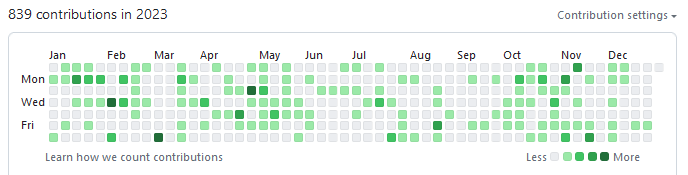

こんにちは。年は明けてしまったのですが、むしろ 2023 を完全な形で振り返ることができます^[いい話]。

## ライフイベント

### 内定

内定式があったので内定したということです。

### 進級

意外にも秋に進級することができ^[いい話]、名実ともに 4 年次です。

### ほか

友達とスキーに行ったり、海へ行ったり、[coinsLT#1000 を開催した](https://coord-e.com/post/2023-12-04-coinslt1000)り、学園祭でダチョウ肉を売ったりしました。いいですね。

<blockquote class="twitter-tweet">
雙峰祭でオタクとダチョウ肉売る企画やります。体芸エリアK09です。食べにきてください（美味しいので）。 <a href="https://t.co/9IZqmlcElO">pic.twitter.com/9IZqmlcElO</a>
&mdash; coord_e (@coord2e) <a href="https://twitter.com/coord2e/status/1720078710794260587?ref_src=twsrc%5Etfw">November 2, 2023</a></blockquote> 

特に意識していたわけではないのに、失った青春を最後の一年で取り戻していると言われる…悔しい……

## パソコン

パソコン活動量は去年より少ないです。パソっ気の絶対量が減っている感覚は往々にしてあるし、気持ちとして AWS 遊びの方向なので、そういうことの結果らしい。

全身インフラ人間としての体格ができつつあるのを感じます。3 月には[パソコン大会で友達と優勝しました](https://coord-e.com/post/2023-03-11-ictsc-2022)。4 月と 10 月に情報処理技術者試験を受験し、それぞれネットワークスペシャリスト試験とデータベーススペシャリスト試験に合格しました。総じて気持ちはインフラとセキュリティに向いています^[職〜]。

### 家パソコン

サーバーマシンがピーピー言うようになって普通に無理だったので全部解体しました^[睡眠の質が上がりました]。ただ、サーバーレスで実装し直す時間がないけど動かしておきたいものがあったので、夏頃から適当に k3s を建てて動かしています。実際のところ動かし始めたその日から指 1 つ触れていません。
作業パソコンは Windows にいれかえました。WSL2 で全然困らないしセキュリティキーの体験がいいです。

### 労働

去年と変わらずクックパッドで就業型インターンを続けています。2022 は AWS ふれあいがメインだったのですが、2023 はアプリケーションふれあいが多く、力〜と思いながら筋肉を作っていました。デプロイをする仕事。いろいろなチームと話すみたいな苦手なことができるようになって、そこそこ成果が出ていて、頑張りましたねと思います、今見ると^[いい話]。

## オタク

オタ〜

### 絵

<!-- textlint-disable @textlint-ja/no-dropping-i -->

いろいろあって年末年始は自然とそうなるんですが絵に気持ちがある^[アドベントカレンダーやこの記事の投稿が遅れたのも、パソコンを脇に置いて絵をやっていた結果で…]。やれてます。

<!-- textlint-enable @textlint-ja/no-dropping-i -->

<blockquote class="twitter-tweet">
絵です <a href="https://t.co/jvyqRD2OYi">pic.twitter.com/jvyqRD2OYi</a>
&mdash; こでい (@kord_eq) <a href="https://twitter.com/kord_eq/status/1739313024224444923?ref_src=twsrc%5Etfw">December 25, 2023</a></blockquote> 

わたくしのような本当に何も素養がないところから絵をやっていると絵というのはそもそも物理的におかしいものを描かないということが大事で、物理的におかしい部分を探しては修正するというのが主な作業になります。この修正というのを絵の早い段階で大部分行えるようになった、具体的には線の下書きの段階で直しきれるようになったというような、成長があると思います。なので、下書きをなぞったら急に残念になるみたいな体験が減ってきていて、嬉しいです。まあそう、問題意識が脳内 3D レンダラの筋トレになっていて、本質〜と思いました。

7 月ぐらいにほぼ毎日ポーズ模写^[<https://www.dessinpose.com/poseviewer>]を頑張っていたんですけど、まあひと月はできたしもうちょっと頑張ってみるかと思ってモルフォ^[<https://www.amazon.co.jp/dp/4766133684>]を買ったら急にやらなくなった^[😇]。
線を初っ端からちゃんと描けようという気持ちはまだあんまりなくて、整合性の調整を効率化していくほうが性に合ってるかな〜と思っています。

最近は絵よりキャラを見るようなコンテンツを摂る機会が増えているので、気持ちになって自分で絵に描くみたいなことに繋げやすくていいですね。

### DJ

MOGRA で DJ をしました^[成果]。ええ、あの秋葉原 MOGRA のことです

3 月に DDJ-FLX4 を購入しました。それで、2023 の前半のうちに現場で 1 回は DJ をしてみようという目標が明示的にあったんですが、なんか DJ STAGE 4 BEGINNERS Supported by PioneerDJ という企画が 5 月に発生しており、ええ？タイミングすぎる笑と気持ちで応募したら通過し、初現場が MOGRA というびっくり状態になりました。

[embed](https://club-mogra.jp/2023/05/14/4891/ "DJ STAGE 4 BEGINNERS Supported by PioneerDJ - MOGRA 秋葉原"){ description="MOGRA と Pioneer DJ の共同企画「DJ STAGE 4 BEGINNERS Supported by Pioneer DJ」に参加してみたい初心者 DJ の方を大募集！MOGRA で一緒に DJ プレイ、クラブイベントを楽しみませんか？" }

これはすごい体験でしたね、MOGRA のステージで変な踊りができてとても楽しかったです。ゲストの DJ さんや MOGRA の D-YAMA さんとお話しできたのもよかった。

それ自体は素晴らしい体験だったのですけれど、ちょっと 2023 後半になって今曲を買う金はないなと思った他一件の理由でいったん DJ は下火です。それはそれとしてずっと家で踊ってはいますが……

なんか現場の機材を触ってみて、割と機械いじりの方向でも面白いなという気分があり、たくさん機材を買いたいな〜

### DTM

Splice のサブスクに入ったら Ableton Live Lite がついてきて、少しやっています。音程の概念が体感としてわかってないっぽくて、サンプルを気持ちで置くことでしか成功体験が得られていないんですが、まあ、やるのが大事だと、思います

### オタク

- ブルーアーカイブ
  - RABBIT 小隊の供給が多くてヤバかった
- アニメ
  - ゆゆ式のアニメをみた。おもしれ～
  - スローループのアニメをみた、漫画はかわいくていい話だったけどアニメは泣けるいい話だった。
  - ほかにもちまちまみてるけど全然完走しない
- 漫画は、ぱらのま、ゆゆ式、ひだまりスケッチ、苺ましまろ、を、読んでいました
- 音楽イベント
  - [RIP with DJ Q](https://circus.zaiko.io/item/357159) と [WE DIE YOUNG ON THE FLOOR](https://club-mogra.jp/2023/11/02/5011/) が特に記憶に残っている、好きなジャンルしか流れない音楽パーティー楽しすぎワロタ
  - あと、界隈の象徴的なイベントである[暴力的にカワイイ](https://twitter.com/boukawa2023)に行けたのはだいぶ良かったですね。

## 2024

2023 年の目標を振り返っておきます。

[embed](https://coord-e.com/post/2022-12-31-retro-2022 "ふりかえり2022 - coord-e.com"){ description="一年を振り返ることができるのは一年の中でもこの時期だけです" }

- お金に余裕を持つ
  - 実際のところ 2023 始まってすぐにこれは嘘じゃない？ということになり、社会人になるタイミングで金を使い切る方向に舵を切った。したがって、社会人が近付いている今、金が、ありません
- スムーズに社会人になる
  - まだ社会人ではないのでわかりません。目標設定が悪い。
  - とはいえ、週 5 で働いているわけではないのだけれど、研究などで平日は常に努力の風が吹いており、かなり週休 2 日のリズムができている^[いい話]。
- 長期的に成す
  - 今年は意識的にずっとこれをやっていたし収穫もありました
  - coinsLT や雙峰祭出展は長い間計画と準備をして成功体験を得ていて、経験だと思います
  - 長期休みにどのくらい単一の物事に集中できるか測って、5 日が限度であることがわかりました。週休 2 日じゃん
  - 最近は「〇〇に興味！ウオオ〜ン 🤩」みたいなのがちょっと戻ってきて、逆にそういうものに向き合うことになる側面もあったんですが、まあいろいろありますよね

目標の外ですが、なんか気持ち的には 2022 年ほど大丈夫って感じではなかったです。印象として大学生活の終わりがチラついてきて環境の変化に焦りだしてさまざまな加減速があり不安定になっていたと思いました。

2024 を考えるうえで、社会人になるというのが大きすぎ、どうなるのか全然よくわからないし、目標と言いましても…

- 環境の変化に耐える
  - マジの入社をするので流石に人生大荒れというか、環境の変化でぶっ潰れる^[大学はそうだったわけで]未来がよく見えるので、そうならないことに集中して、とにかく、安静にしたいですね。
- 仕事をする
  - パソキャリア・スタートダッシュ

がんばります！あけましておめでとうございました。
