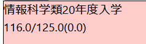

自分は去年の秋から筑波大学の 4 年生で、今年の春から社会人 1 年目なのですが、今秋から大学を休学します。復学はしばらく先になります。教育を受けるということが自分にとって長らく大きな悩みだったのですが、人生で初めて教育を受けていない状態になるので、晴れやかな気持ちです。

## なぜ休学なのか

あと何単位なの？と聞かれて 15 程度と答えると若干引かれるのが日常になってきています。実際にはこれは卒業研究を含めた数字で、つい最近卒業研究はめでたく完遂できたので今は残り 9 単位になっています。これが多いのか少ないのかはよくわかりません。

実は自分は卒業研究も単位不足で開始できず半年遅れています。なんでこんなにも単位が足りないのかというと、大学一年の春にいろいろあって（もしくはいろいろなくて）何もしなかった（文字通り何もしなかった）ことが主な原因です。この期間は精神的にかなり強い風が吹いており、とても自分の状況を客観視できる状態ではなかった。まあ要するに、単位が非常に足りないのは頭が悪いからではない。この期間に落としているたくさんの科目については、このまま働きながらでも修得できることが予想されます。

一方で、そのとき割けるリソースを全力で使っても取ることができなかった単位や、真面目に受けようとしたが本気でわからなくなって落とした単位が存在します。それらは正直いくら頑張っても労働しながらでは取れないだろうという感覚があります。すなわち、卒業ができないのは頭が悪いからなのです。そして労働していても頭は良くならないので、このまま大学生兼社会人を続けていても卒業の見込みはありません。卒業するためには、フルタイムで学業をやり、学力を付ける必要がある。

では選択肢は退学か休学です。私自身にはずっと、卒業したいという気持ちはありませんでした。いわゆる"日本では大学を卒業をしないと損をする"系の言説も、こういう話をするたびに全員から言われましたが、正直なところ響いてはいませんでした。しかし友人や親族に卒業してほしいと言ってもらえており、それは素直に嬉しかったので、その点で頑張ろうという気持ちはありました。また、いわゆる教養へのあこがれに由来して、いい大学に入ったのにポテンシャルを回収できていないな、という思いも若干あり、今大学を切り捨てるのはもったいないなとも感じています。そして今卒業研究を終えてみて、おお結構頑張ったな、これは学位をもらわないともったいない、という気持ちにもなってきました。

そこで休学です。実際のところフルタイムで学業ができない理由は学費などが払えないからなので、休学をして、お金をためて、戻ります。休学の期間ははっきり決めていませんが、必ず戻って卒業します。

## 教育が悪いのではないのかもしれない

単位が取れないのもそうなのですが、私はずっと教育を被るのが苦手だという意識がありました。教育対象の領域における能力形成を勉強というのなら、これは勉強ができないと同じになります。苦手というのは、周りができていることが自分にはできていないという体験から得た感想です。

これは何なのだろうとずっと不思議でした。結局コンピュータ関係については教育されずに能力形成ができたという点から考えて、なんらか教育というものに自分に向いていない部分があるんだろうと認識してここまで生きてきました。大学ではなるべく、すりぬけるように教育を回避する方向を選んできたのは否めません。大学で得られる経験は教育だけではなく、そこで教育以外に重きを置いたということです。

しかし、卒業もそうですが、教育が不可避である局面がやはり存在します。また、人生において計画的に能力を形成する必要があるとき、その一手段として教育は確立されており非常に強力なのは間違いないですし、教育で能力形成ができなかった人間が果たしてほかの手段で計画的に能力形成ができるのかも怪しいでしょう。そして、往々にして、これからの人生において計画的に能力を形成する必要があることが予想されます。そこで、なぜ自分が教育で利益を十分に享受できなかったのかを検討し、問題を改善することによって、教育によって計画的に能力形成を行うパスを確立したいわけです。

大学に入ったころは提出物の締め切りをまったく覚えていないだとか家から出られず授業に出られないといった根本的な問題が根強かったのですが、幸いそういうものはここ 2 年で Google カレンダーと身体を一体化させたことで大きく改善しました。これで多くの簡単な単位は取れるようになりました。特に、周りに後輩しか居ない体育に 2 年間出席して単位を取り切ったのは快挙といっても過言ではないでしょう。しかし、ここで教育が苦手と言っているのはそういう話ではなく、4 年かけて微分積分がとうとう修得できなかったという話なのです。

そして今、実際のところ、原因は教育にあるのではなく単に自分の優先順位の問題なのだろうと予想しています。結局大学の授業が優先順位として上に来ることはなくて、苦し紛れに割り当てた短い時間で新しい知識を仕入れることができるほど自分は器用ではなかった、ということです。たとえば友人と行った自動車の免許合宿では、周りの友人と同時に自分も合格ができました。これは合宿免許の環境によって優先順位付けがうまく行った例でしょう。これを踏まえて考えると、しっかり労働を休んでフルタイムの学業ができればちゃんと教育の利益を享受できるのではないか。こんな俺でも微分積分を理解できるようになるのではないか。そういう期待を未来の自分に抱いているわけです。不安ですね。

優先順位付けがへたくそなのは今に始まったことではないですが、ここを正していくのに労働はちょうどよいと感じています。実際、いろいろと他にやりたいことはあるのですが、一日 8 時間は労働に時間を割けているわけです。それを思うと、労働を休めば一日 8 時間は大学に時間を割けるのでは？でも労働は学問より楽しいからな……大丈夫かな。復学するころには優先順位付けが今より上手になって、大局的な目線で適切なリソースの割り当てができるようになっていると良いですね。

なお、知識の吸収効率が悪く、短い時間で新しい知識を仕入れることができないというのは問題としては認識しています。どうも外からの知識の吸収が苦手で、手を動かして経験を知識とすることしかできないようです。これはなんだか、これまで教育を避けてきた弊害という感じが若干しますね……そして、これは筑波大学の卒業年限ぐらいのスケールで解決できるものではないように感じています。まず卒業しないといけないので、効率が悪くても確実に単位が取れる道を選ぶのが良いでしょう。

まあ何にせよ、自分にとって、人生の選択肢を考えたとき、どこかの時点で教育や学力に対するコンプレックスを解消するのは必須だと感じています。そういうこともあるので、大学には必ず戻って卒業します。
