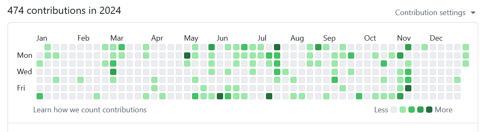
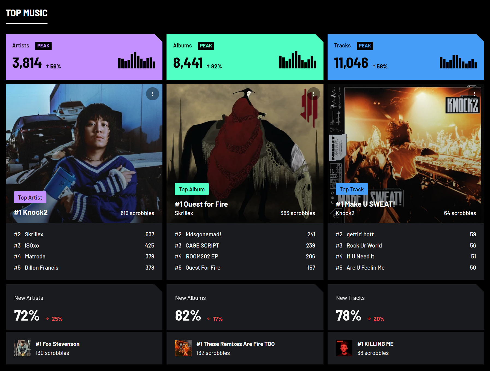
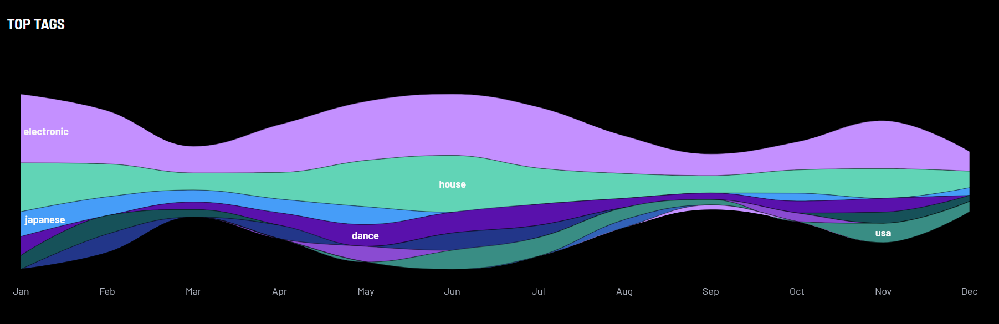

こんにちは。一年を振り返るのは楽しいから、今年も一年を振り返ります。

## ライフイベント

### 就職

した。今は会社員をやっています。

また、就職に伴って引っ越しがありました。当時は入居が遅れて家が消えるなどいろいろありましたが、今はおだやかに暮らせています。

### 休学

した。つまり卒業はしていません。

[/post/2024-09-10-suspension-of-education](/post/2024-09-10-suspension-of-education) に詳しく書きました。

## パソコン

仕事以外のパソコンを全然やってないです。

フルタイムパソコンワーカーになってプライベートパソコニズムが衰退するのは目に見えていたので、少ない時間でも形になって公開できるものを優先して作ろうという意識をもってそういうのをいくつか作っていました。けっこう、気持ちになってから 3 日とかで形にする動きができていて、そういうのっておもちゃ遊びとしての効率がいいので、今後もこんな感じでちまちま作っていけたらいいですね。

- <https://hondana.coord-e.dev>: うちの本棚の本が検索できる。Step Functions でインデックス作成ワークフローを回して DynamoDB にぶちこみ、全文検索をしている。列挙をされたくないので 15 件以下の検索結果しか出ません。
- <https://space.coord-e.dev>: Lambda の上に SilverBullet をのっけて Markdown を書いたものを Cloudflare Workers からレンダリングして配信している。今年は頑張ってここに週報みたいなのを出していた時期があったが結局最近は無理になっている。
- <https://pulse.coord-e.dev>: おれが生存していることによって発生する Webhook 等のイベントを集めて Timestream にぶちこみ、適当に表示している。ここにイベントが出ていなかったら、心配してください。

あとは研究活動のコミットが多い… というかほとんど研究だと思います。フルタイム労働をしながら卒業研究やその延長をするのは本当に大変でした。気持ちとしては就職前にすべて終えるつもりだったのですが、"本当の締め切り"を知っている以上そんな器用なことができるはずもなく……

### 労働

今年は Aurora MySQL アップグレード職人とか、Karpenter アップグレード職人とか、Rails アップグレード職人とか… パソ屋としてやっていくうえで欠けているなと常々思っていた MySQL や Rails あたりと和解しつつあるのが偉い。あとはこういうの ↓

[embed](https://techlife.cookpad.com/entry/2024/10/28/204340 "Flux + Helm における即時ロールバック - クックパッド開発者ブログ"){ description="クックパッド開発者ブログ" }

社会人生活においては、自分の力が効果的に発揮できる課題を見つけてタイミングよくボタンを押すのが大事だと思っています。これはタイミングよくボタンが押せた例ですね。細かい機序に課題の本質が潜んでいて、それを見極めて最善手を打つみたいなのが好きなので、その点でとても楽しかった仕事です。もっとインパクトが大きいところでこういうのをやってみたい。

Techlife の周辺のポストから察せるとおりけっこう大変な時期に入社してしまったもので総じてまいったなあという感じでしたが、結果的に予期せず Kubernetes に触れてラッキーです。まさかおうち Kubernetes 経験が活きることになるとは全く想像していなかったけれど、プロダクションで Kubernetes をやる経験は欲しかったところなので。別に Kubernetes がいいと思ってるわけでは全然ないんですが。

社会人どうなの？みたいなところとしては、まあぶっ倒れてはいないので OK って感じかなあ。手札や体験は確実に増えてるけど、まだ快適に働き続ける構えが身に染みてないし、力に自信がついているわけでもないです。一筋縄ではいかないですね。

## オタク

オタ～。振り返ってみると今年はサブカル消費者活動が非常に活発でした。

### サブカル消費者活動

なんといってもラブライブ！虹ヶ咲学園スクールアイドル同好会ですね。去年 1 期まで観ていて、今年は映画があるということでそれに合わせて 2 期と OVA を視聴し、映画も 2 回ぐらい観ました。なんかやっていたニジガク展に行ったり、ふらふら台場に行ったりもした。こう一年追ってみたけどみんな可愛くて明確に 1 人推しが決まらなくてすごい。箱推しの概念が初めて理解できた。ヒトリダケナンテエラベナイヨー

虹はサァ…絵が良いんですよ。虹アニメのダンス映像の合間に絵がぱちぱち出るやつあると思うんですけどめちゃめちゃあれが好きで、アニメを全部観れば全員に惚れる仕組みになっている。とか言ってたら映画のダンスシーンの出来良すぎて卒倒！？どこを一時停止しても絵になるのどうなっていますか？

<iframe width="560" height="315" src="https://www.youtube.com/embed/iUv2QSYEdhk" title="YouTube video player" frameborder="0" allow="accelerometer; autoplay; clipboard-write; encrypted-media; gyroscope; picture-in-picture; web-share" referrerpolicy="strict-origin-when-cross-origin" allowfullscreen></iframe>
<iframe width="560" height="315" src="https://www.youtube.com/embed/9hIhTy0fMro" title="YouTube video player" frameborder="0" allow="accelerometer; autoplay; clipboard-write; encrypted-media; gyroscope; picture-in-picture; web-share" referrerpolicy="strict-origin-when-cross-origin" allowfullscreen></iframe>

<!-- textlint-disable @textlint-ja/no-dropping-i -->

こういう大きめの？コンテンツにハマるのが初めてて、供給の豊富さにもビビりました。アキバでアニメイトとか渡り歩いてると何となしに知らないイラストのグッズがあるのヤバすぎて目が開きっぱなしでドライアイなった。ブルーアーカイブで一枚の絵にあんなに執着していたのが嘘みたい。なんかお台場行くと常に何かイベントやってますしね。便利やね。

<!-- textlint-enable @textlint-ja/no-dropping-i -->

それから今年は学園アイドルマスターがサービス開始しましたね。アソビノーツプロデュースということで界隈が盛り上がりそうだったのと、葛城リーリヤさんが可愛かったので流行に乗ることができました。ブルーアーカイブと違ってちゃんとやらないとストーリーがみれないので、大変ですが、アイドルが成長するとうれしいです（？）

ブルーアーカイブについては、百鬼夜行イベントで里浜ウミカさんが実装されたのが印象深いですね。ウミカチャンめちゃめちゃかわいいと思います。Sheside Outside もよかった、アリウススクワッドが元気そうにしていると嬉しいので。今年はイベストは全体で半数ぐらいは読めた気がします。

別路線として、W シリーズという森博嗣先生の小説シリーズがあるんですが、ヒロインが非常に良くて、今年の萌え成分の 2 割ぐらいはここから来ています。W シリーズは全部読んで、今は続編の WW シリーズを読んでいます。長く楽しめるコンテンツでたのしい。

いっぽうで漫画を全然読んでいない。全然読んでないっていうか、ほとんど開拓をしてない。全然前から読んでるのだけど『クロシオカレント』の新刊がめちゃめちゃ良かった。新規で読み始めたのは『オールドヨコハマラジオアワー』と『しゅがー・みーつ・がーる！』ぐらいしか思いつかん。どちらも良いです。

<!-- textlint-disable ja-technical-writing/no-exclamation-question-mark -->

今はラブライブ！蓮ノ空女学院スクールアイドルクラブとガールズバンドクライに頭を突っ込みかけてるので来年はそのあたりですね。3D コンテンツと徐々に和解しつつあるから MyGO!!!!! のアニメとかもみてみたい。

<!-- textlint-enable ja-technical-writing/no-exclamation-question-mark -->

### 絵

社会人になって絵をやめていない ✅

<blockquote class="twitter-tweet" data-dnt="true">
最近は全身の立ち絵みたいなのに興味があってそういうのを描いていました <a href="https://t.co/noIgywYcNJ">pic.twitter.com/noIgywYcNJ</a>
&mdash; こでい (@kord_eq) <a href="https://twitter.com/kord_eq/status/1872628068818497651?ref_src=twsrc%5Etfw">December 27, 2024</a></blockquote> 

なんか、こなれてきて、描き始めさえすれば低コストで作業できるようになってきた感じがします。とはいってもまだ当てずっぽう感が否めなくて、したがって描きはじめるコストが高い。最近は安定しているような気もしているので、たくさん描いてこれを自信としたい。

一度モチベーションが崖ったことがあったんですが、その時に実際にはやりたいのはキャラ絵だというのを思い出して、その後はそれを意識しています。好きな絵と自分の絵を比べて、足りない部分を補うみたいな、絵をやり始めた頃に何かの本か動画でみてなんか怠いなと思って聞き流していたやつが急に身に染みてくるの可笑しいですね。

### 音楽消費者活動

<!-- textlint-disable ja-technical-writing/no-dropping-the-ra -->

MBMG で Guy Arthur 観れたのがとっても嬉しかったです。EDM パーティってそうだよな〜っていう雰囲気を知れるいい機会でもありました。なんかチャラそうで普段行かないので。

<!-- textlint-enable ja-technical-writing/no-dropping-the-ra -->

- <https://t.livepocket.jp/e/0427_mbmg>

最近あった UNTITLED SESSIONS もめっちゃ楽しかった。こういうパーティのウォームアップの雰囲気がすごく好きです。

- <https://club-mogra.jp/2024/11/22/5440/>

UKG は意外と Higgo だけかも。MPH で声出すの楽しかった。

- <https://circus-tokyo.jp/event/rip-with-higgo/>

あとはなんか振り返ってみると rejection 先生の追っかけでした。王すぎて毎回呼吸器なくなってる。

- <https://t.livepocket.jp/e/thebass>
- <https://midnightbrawl.com/>
- <https://x.com/boukawa2024>
- <https://circus-tokyo.jp/event/we-die-young-on-the-floor/>

ISOKNOCK が Ultra Japan に来るということで今年こそは Ultra Japan に行こうと思っていたんですが、普通に忘れていて行けませんでした。悲しい。

印象に残ってる曲はこんな…

<iframe width="100%" height="166" scrolling="no" frameborder="no" allow="autoplay" src="https://w.soundcloud.com/player/?url=https%3A//api.soundcloud.com/tracks/1834037661&color=%23ff5500&auto_play=false&hide_related=false&show_comments=true&show_user=true&show_reposts=false&show_teaser=true"></iframe>
<a href="https://soundcloud.com/knockthisoff" title="knockthisoff" target="_blank" style="color: #cccccc; text-decoration: none;">knockthisoff</a> · <a href="https://soundcloud.com/knockthisoff/rush-x-leave-me-like-this-knock2-rmx" title="RUSH X LEAVE ME LIKE THIS - KNOCK2 RMX" target="_blank" style="color: #cccccc; text-decoration: none;">RUSH X LEAVE ME LIKE THIS - KNOCK2 RMX</a>

<iframe style="border-radius:12px" src="https://open.spotify.com/embed/track/3WRGbgDpzjL2VM42kc3uJx" width="100%" height="152" frameBorder="0" allowfullscreen="" allow="autoplay; clipboard-write; encrypted-media; fullscreen; picture-in-picture" loading="lazy"></iframe>
<iframe style="border-radius:12px" src="https://open.spotify.com/embed/track/2v4bGopODBEOQqWzg31R2s" width="100%" height="152" frameBorder="0" allowfullscreen="" allow="autoplay; clipboard-write; encrypted-media; fullscreen; picture-in-picture" loading="lazy"></iframe>
<iframe style="border-radius:12px" src="https://open.spotify.com/embed/track/1TOBYH7YalbblKJ7M8ufRx" width="100%" height="152" frameBorder="0" allowfullscreen="" allow="autoplay; clipboard-write; encrypted-media; fullscreen; picture-in-picture" loading="lazy"></iframe>
<iframe style="border-radius:12px" src="https://open.spotify.com/embed/track/4Wmx73WdyIsWYeGTCqm6lY" width="100%" height="152" frameBorder="0" allowfullscreen="" allow="autoplay; clipboard-write; encrypted-media; fullscreen; picture-in-picture" loading="lazy"></iframe>
<iframe style="border-radius:12px" src="https://open.spotify.com/embed/track/4vyG9ZhHT8MKJE5mTICMFC" width="100%" height="152" frameBorder="0" allowfullscreen="" allow="autoplay; clipboard-write; encrypted-media; fullscreen; picture-in-picture" loading="lazy"></iframe>
<iframe style="border-radius:12px" src="https://open.spotify.com/embed/track/3hKSrFN4Vwsx8rpc6A0UPH" width="100%" height="152" frameBorder="0" allowfullscreen="" allow="autoplay; clipboard-write; encrypted-media; fullscreen; picture-in-picture" loading="lazy"></iframe>
<iframe style="border-radius:12px" src="https://open.spotify.com/embed/track/5v13BAVyqNEqyY6ZvfTxSm" width="100%" height="152" frameBorder="0" allowfullscreen="" allow="autoplay; clipboard-write; encrypted-media; fullscreen; picture-in-picture" loading="lazy"></iframe>

一方 last.fm くん

{ width=90% }

{ width=90% }

### DJ

なんか、パーティにおいて作りたい瞬間の解像度が上がって、目的意識がしっかりし、目的をもってセットをつくったりするようになりました。また、やりたいことに対して手札が増えてないのを自覚して、ちゃんと手札を増やしていく方法を意識するようになりました。聴く曲の範囲もすごく広がって手札も増えて DJ でやりたいことが増えてとても楽しいです。

<iframe width="100%" height="120" src="https://player-widget.mixcloud.com/widget/iframe/?hide_cover=1&light=1&feed=%2Fkord_eq%2F%25E5%2586%258D%25E7%258F%25BEmix-ukfes3%2F" frameborder="0" ></iframe>

くわえて、今年はマッシュアップをいろいろと作りました。DTM ができるわけではないが DAW の使い方がわかってきて、これとこれ重ねた杉みたいんときにすぐに手が動くのが楽しいです。いくつかオリジナルのマッシュアップとか edit ができてくるとどこかで披露したくなる。へへ。

来年はどうかなあ… 実際には客がいないとやりたいことが達成できたのか確認ができなくておもしろくないという話があり、さすがに客前でやるためになにか動きたくもなるか…なあ。

## 2025

2024 年の目標を振り返っておきます。

[embed](https://coord-e.com/post/2024-01-06-retro-2023 "ふりかえり 2023 - coord-e.com"){ description="あけましておめでとう" }

- 環境の変化に耐える
  - これは杞憂でした。いろいろとあって環境は想定していたよりも非常に大きく変化し、あろうことか何度もそんな変化がありましたが、体は別に悲鳴をあげていないので、まあ、丈夫やねと思います
- 仕事をする
  - やれすぎってほどではないが、やれなさすぎという感じでもない。まずまずかなと思います。今年はとにかく無理せずというのが念頭にあったので、そのようにしていて、それが必要以上にブレーキをかけていたような、それともこれが自分にはちょうど良い負荷なのか…

とにかく無理せずというのは基本的に甘美な響きのある目標意識で、よって甘えた一年という印象が拭えません。4 月ごろには新生活の雰囲気に浮かされてもうちょっとやろうとしていたことがいろいろと脳裏にあったのに、結局目下のいろいろに流されてどうでもよくなってしまった。無理せずにやれるラインを理解するのも大事で、まあそういう意味では良かったんじゃないかと思っていますが…

2025 はなあ…

- 外に出せる仕事をする
  - 個人の能力が伸びたとして、外から観測できる場所になにもないと、会社の外ではあまり意味がなかったりします。武器を増やしていきたいです。
- コミュニケーションを意識
  - 最近プライベートでやっていることが内側を向きすぎていてうまく他人に説明できなくて不便とか、気づいたら声が小さく低く聞き取りにくい感じになっているとか、人と話すのむずすぎと思う場面がめちゃめちゃ増えてるとか、いろいろあり、全体的にコミュニケーションに課題感ありです。

いろいろありますよね。なんとかがんばりましょう。あけましておめでとうございました。

P.S. あんまり関係ないんですが、2025/1/18 の東京 Ruby 会議 12 に登壇します。全然仕事と関係ない話で出してしまったので年末年始の時間に大急ぎで準備していますが、いい話ができると思うので、聞きに来てくれるとうれしいです

[embed](https://regional.rubykaigi.org/tokyo12/talks/ "発表一覧 | 東京Ruby会議12"){ description="2025.1.18 横浜市鶴見区民文化センター サルビアホール" }
