

こんにちは。一年を振り返ると、楽しい思い出が蘇ります…

## ライフイベント

なくてびっくり^[なんだかんだ、去年までは毎年なんかあっておもろいと思ってたのだけれど、ついに…]　人生が進んでいません

## 労働

2025 年はデプロイ/デリバリの王になろうと思って、一年かけて会社のメインのプロダクトの CI/CD をいい感じにすることに注力しました。なんか流石に遅いよなあっていうことしかわかっていない状態だったのですが、デリバリ時間計測の仕組みを作り、ボトルネックを特定し、CI やデプロイを速くして、さらに人間をブロックしていたデプロイルールとかも改訂して、デプロイ体験はかなりいい感じにできたと思います。最近は小手先のあれこれではどうしようもないところまで体験を向上したくて新しいデプロイ基盤を作っています。

また、バイト時代からずっとメール配信に関する仕事をやっていて、それは今年もなんだかんだやることがありました。メール関係の仕事はなんか、いろいろありすぎて、世界…という気持ちになるから面白い。キャリアメールからのバウンスを読んで仰天^[<https://libsisimai.org/ja/docs/distinguish-between-the-unknown-and-the-filtered.html>]したり、BIMI の証明書を買うためにコミュニケーションに奔走したりしました。メールマンが板についてきて、社内のメール関係の相談とかもたまにもらうようになりました。嬉しいですね。

2024 年は正直バイトくんの延長だったという自覚なんですが、今年は自分の仕事をやってるなという感じがして、社会人になったなあと思います。年始にあるチームのキックオフミーティングでデリバリやりますと宣言できたのが自分としては大きく、これまでなんとなく自分で言いだした仕事を勝手に始めにくいところがあったのが、いい感じにやりたいことをやれるようになったかなという感じです。

## パソコン

2024 年よりプライベートパソコニズムが盛り上がりました。

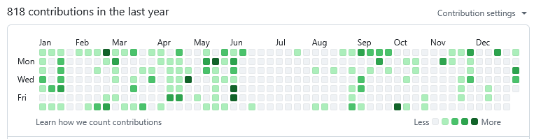

<!-- textlint-disable prefer-tari-tari -->

まずは研究でしょうか。パソコンカテゴリなのかは怪しいですが… Rust のリファインメント型システム Thrust の論文が採択されて、6 月に [PLDI 2025](https://pldi25.sigplan.org/) で発表をしてきました。卒研の延長の成果で、去年からずっとやっていたものが、ついに採択されて、非常に大変だったので、形になって良かったなあと思います。一緒にやってくださった先生方には頭が上がりません。一方で、成果として出たとはいえ、ツールとしての完成度はまだまだなので、発表後も開発を続けています。まだまだ実用段階ではないので、今後もやっていくことになるんじゃないかな〜

<!-- textlint-enable prefer-tari-tari -->

<blockquote class="twitter-tweet">
論文 &quot;Thrust: A Prophecy-Based Refinement Type System for Rust&quot; について、PLDI 2025 で発表します <a href="https://t.co/SnEBnQMoSi">https://t.co/SnEBnQMoSi</a> <a href="https://t.co/FBDAlO81Zg">pic.twitter.com/FBDAlO81Zg</a>
&mdash; Hiromi Ogawa (@coord_e) <a href="https://twitter.com/coord_e/status/1935304872972403117?ref_src=twsrc%5Etfw">June 18, 2025</a></blockquote>

<!-- textlint-disable ja-engineering-paper/no-synonyms -->

ちなみに 5 月末にある濃い芝は PLDI 全然関係なくて、[技術書典 18](https://techbookfest.org/event/tbf18) に天久保で出したときの追い込みです。あれは楽しかった。サーバーレス技術に特に興奮している時期で、自分はサーバーレスでサーバーレスを監視するというどこにも需要の存在しない記事を書いたらあまりにも売れなくて面白かった。この時は前日から電子書籍の配信基盤を書いたり当日に POS レジを書いたりしていてかなり勢いがありました。調子に乗って刷りすぎて在庫があまりすぎているため、今後も即売会には出るつもりです。

<!-- textlint-enable ja-engineering-paper/no-synonyms -->

<blockquote class="twitter-tweet">
Ruby on Rails, ECS, Istio や Lambda 等 クラウドネイティブ 風技術の本です！<a href="https://twitter.com/hashtag/%E6%8A%80%E8%A1%93%E6%9B%B8%E5%85%B818?src=hash&amp;ref_src=twsrc%5Etfw">#技術書典18</a> か18 天久保 でお待ちしております <a href="https://twitter.com/hashtag/%E6%8A%80%E8%A1%93%E6%9B%B8%E5%85%B8?src=hash&amp;ref_src=twsrc%5Etfw">#技術書典</a> <a href="https://t.co/YPYyOqEs1V">pic.twitter.com/YPYyOqEs1V</a>
&mdash; Hiromi Ogawa (@coord_e) <a href="https://twitter.com/coord_e/status/1928856738956009784?ref_src=twsrc%5Etfw">May 31, 2025</a></blockquote>

他には、2025 年は Rails でいろいろ書いていた印象が強いです。Tailwind とコーディングエージェントの台頭、そして Amazon DSQL により Rails でなんか作るハードルが全くなくなっており最高の時代だと思います。流石に仕事でも Rails を書くので、個人的に Rails にハマったのはその点でも都合が良かったというか。普通に Rails は初心者だったため。

<!-- textlint-disable prefer-tari-tari -->

まず作ったのは自分用に Twitter とかからイベント情報を集めて iCal 作るサービスで、これは Twitter 見るのをやめるために Twitter を見ないでも音楽イベントやソシャゲの情報が自動で集まるといいなと思い、その非同期処理と管理画面の仕組みを Rails に載せようというものでした。これを書いていた頃は 3 月とかでまだコーディングエージェントもそんなに使っておらず、自分で UI を書いていて大変だった記憶があります。カレンダー情報の抽出を LLM にやらせているのですが、結局あまりノイズや重複が排除できず、今は、Twitter を、みています…

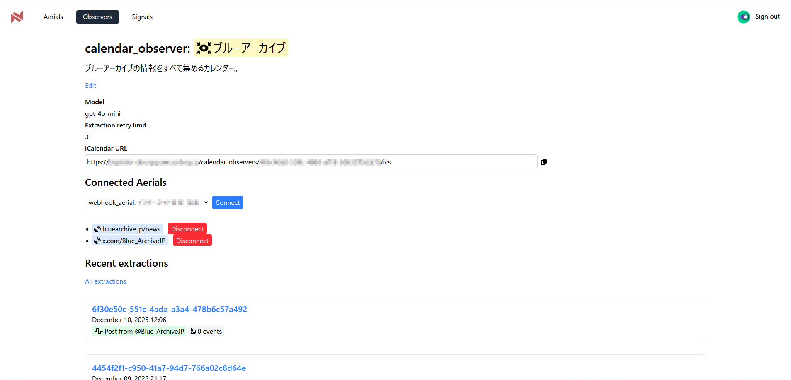

もう 1 つ、身内向け DJ 配信サービスを作りました。Discord の画面共有はモバイルで非常に音質が悪い（建前）Amazon IVS が使いたかった（本音）という理由です。rekordbox から Discord に音声をルーティングするのがだるいのもある。こちらも（ただの IVS なので）たいそうなものではないですが非同期処理と UI があって Rails に乗っかっているという感じです。こっちは身内でそれなりに使ってもらえていて、嬉しいなと思います。多分 Webhook 通知を実装した^[Webhook 通知を実装するの楽しすぎワロタ]のが良くて、人が配信するとみんな気付いてくれて、誰かが配信すればたいてい誰かが観てるような感じになっていて、良いです。コミュニティに感謝。

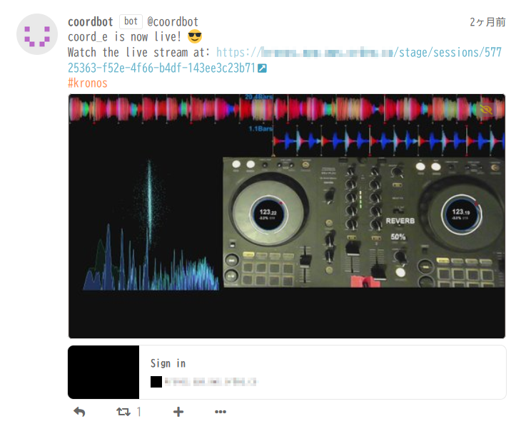

<!-- textlint-enable prefer-tari-tari -->

あと Rails とか関係ないんですが DJ 関連で、DJ 機材とパソコンの間のパケットを覗き見て自動で映像を出すソフトウェアを書きました。とは言ってもパケットの解析はネット上の有志によってほぼ終わっているのでそこはいうほど大変というわけではなく、どちらかというと得られた曲情報から対応する映像（YouTube 動画）を探す部分がやりがいがありました。まあ LLM を叩いて探す、という感じですが、一気にやらせると全然できないこともタスクを分けたり API 呼び出しの結果を食わせたりとやってやれば何とかなるというのが身をもってわかりました。今思うとそれってエージェントだ。非公式動画を拾わないとかが割と精度良くできるのが LLM 時代〜って感じでアツい。このソフトウェアは身内の DJ 会に合わせて実装していたのですがなぜか現地では半分ぐらいしか動作しなくてけっこう悲しかった。

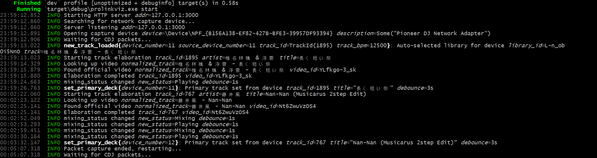

世は大エーアイ時代ですが、自分は仕事で使うのはもちろんのこと、仕事以外のパソコンで特にエーアイさん（コーディングエージェント）の恩恵を受けているなと思います。往々にして時間がなく、手戻りを避けたすぎるので、いったんエーアイさんに書き切らせて動くものにして方向性に確信を持ってから自分で納得いくまで手直しする、というフローが多い。「工数がかかるけどやればできるはず」をやるのが圧倒的に楽になって、非常に生産的になりました。いい時代だ。

## DJ

<!-- textlint-disable prefer-tari-tari -->

身内の DJ 会などで人前で DJ をやる機会がいくつかありました。あと [RubyMusicMixin](https://conference.pixiv.co.jp/2025/rubymusicmixin) に出たり… 2024 年や 2025 の頭は自分を客として想定したうえで気分のいいセットを組み立てている感覚だったのですが、人に聴いてもらう機会が増えるにつれて、徐々に聴き手のことを意識した選曲にトライするようになりました。この人はこれが好きだから、とか、こういう人たちの前だから、とか。とはいっても、思ったとおりにやれることは稀で、まだまだです。結局、自分の好きなものと被せようとするアプローチには限界を感じてしまって、じゃあどうするのかなあと… でもそういうのに向き合うのは大事なのかもなと思ったりもします。

<!-- textlint-enable prefer-tari-tari -->

特筆すべきこととして、身内で DJ パーティを企画して遊ぶやつを今年は初めて、2 回ぐらいやったんですが、これが良かったなと思います。友達に聴かせるならやっぱり楽しんでほしいというところで、選曲の意識も変わっていったし、よく知る人たちの様子を見るのはフィードバックとして大きいです。2026 年もこういうのは続けたいし、2026 年はもっと上手くやれたらいいなと思います。

物理的な話だと、[XDJ-RX3](https://www.pioneerdj.com/ja-jp/product/all-in-one-system/xdj-rx3/black/overview/) を買いました。いつか買うつもりだったのですが、浪費が得意な友達に煽られてしまい

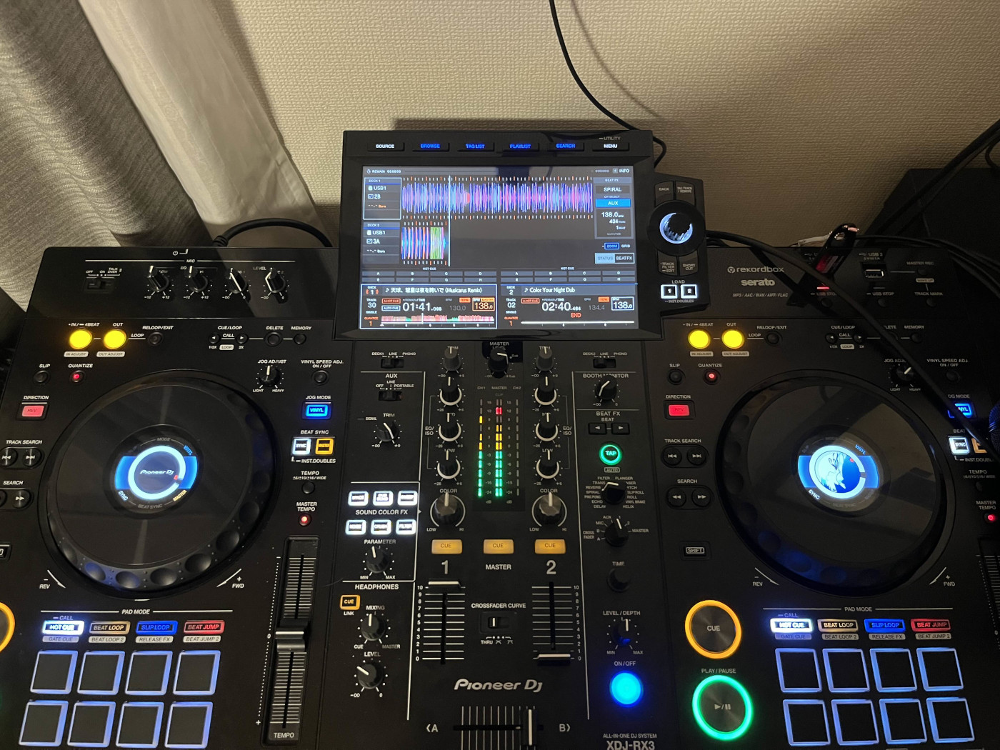

フィルタ以外の CFX とか BEAT FX をちゃんと使えるようになったし、機材の画面でも余裕で選曲ができるようになりました。もう現場は怖くありません。まあ、現場に出る機会がそんなにあるわけではないですが…

## DTM

なんかついに^[毎年、夏になると DTM ができるかもという気分になり、多少のトライをしてはあきらめていたのですが] DTM を楽しめるようになってきて面白い。公開してもいいなと思えるものが２つも作れました。

<iframe width="100%" height="166" scrolling="no" frameborder="no" allow="autoplay" src="https://w.soundcloud.com/player/?url=https%3A//api.soundcloud.com/tracks/soundcloud%253Atracks%253A2149902483&color=%23ff5500&auto_play=false&hide_related=false&show_comments=true&show_user=true&show_reposts=false&show_teaser=true"></iframe>
<a href="https://soundcloud.com/kord_eq" title="こでい" target="_blank" style="color: #cccccc; text-decoration: none;">こでい</a> · <a href="https://soundcloud.com/kord_eq/break-yo-face-down" title="BREAK YO FACE DOWN" target="_blank" style="color: #cccccc; text-decoration: none;">BREAK YO FACE DOWN</a>

<iframe width="100%" height="166" scrolling="no" frameborder="no" allow="autoplay" src="https://w.soundcloud.com/player/?url=https%3A//api.soundcloud.com/tracks/soundcloud%253Atracks%253A2177934252&color=%23ff5500&auto_play=false&hide_related=false&show_comments=true&show_user=true&show_reposts=false&show_teaser=true"></iframe>
<a href="https://soundcloud.com/kord_eq" title="こでい" target="_blank" style="color: #cccccc; text-decoration: none;">こでい</a> · <a href="https://soundcloud.com/kord_eq/its-gettin" title="it&#x27;s gettin..." target="_blank" style="color: #cccccc; text-decoration: none;">it&#x27;s gettin...</a>

楽しめるようになってみると、なんと Ableton Live もパソコン同様に生活破壊ファクターであることが判明して、ありえない。生活が破壊されると困るのもあって 2 つ目を作ってからはやってないんですが、来年も夏頃からはまた DTM を頑張りたい。今年作ったトラックも、今思えばもっと上手くやれた部分がいくつも見つかるし、まだまだやれる感じがして、ワクワクです。

## 音楽

音楽イベント… 去年と比べると絶対量は減って、コンテンツ系によく行くようになりましたね。

<!-- textlint-disable ja-technical-writing/no-exclamation-question-mark -->

- 2/16 LoveHype! <https://club-mogra.jp/2025/02/16/5508/>
  - 半分クラブとはいえ、アニメ^[™️]のイベントに初めて行きました。曲固有のノリってあるよな、みたいな感覚とかは、意外と今年から意識し始めたかもしれません。
- 4/26 Glitch <https://www.aniclover.com/event/2025-04-glitch>
  - Letiamash 先生の DJ が聴けて本当によかった
- 8/23 NIGHT HIKE Mid 2025 <https://tribalcon.zaiko.io/e/night-hike-mid-2025>
  - いつもの。なんか、コンテンツが多くて好きです。行くと絵をがんばろうとなる。
- 9/19 BlueEnsemble Vol.5 <https://tiget.net/events/399330>
  - 公募をやっているのを見かけて知って、公募は出していないんだけれど、ブルアカの DJ ってどうなるんだろうなあと思って、1 回行ってみたらおもしろかったので、その後の回にも行くようになりました
  - その後の回: feat. Aris Records <https://tiget.net/events/430277>, 拝啓、はじまりの音へ <https://haikei-hajimari-no-oto-he.vercel.app/>
- 10/5 暴力的にカワイイ 2025 <https://cultureofasia.zaiko.io/item/373783>
  - いつもの。前回よりたくさんの人と乾杯できて楽しかったです。
- 12/28 SPRAYFEST '25 <https://ra.co/events/2290770>
  - ずっと行きたかったけれど毎年都合が合わなかったのが、ついに行くことができました。サウンドシステム最高！UKG 最高！まじでナイスパーティーだと思う。
  <!-- textlint-enable ja-technical-writing/no-exclamation-question-mark -->

友達に連れていってもらって、ライブにも何個か行きました。楽しかったので来年も行きたい。

- 3/10 秋山黄色『5th anniversary「Re:Touch」』<https://www.sonymusic.co.jp/artist/kiroakiyama/info/570917>
  - 宇都宮遠すぎてウケ。黄色さんが喋ってるの初めて聞いたけど、喋り方ちょっと好きだなとおもった
- 7/6 Guiano Live 2025「Hold Me Tight」<https://alltstudio.jp/live/559/>
  - ぐいあの先生の曲を家で聴くときはたいてい自分も歌っていて、一方でライブでは、俺は歌わない必要があっておもろい
- 9/30 ヨルシカ LIVE TOUR 2025「盗作再演」<https://yorushika.com/feature/livetour2025_tousaku>
  - これまで行ったことないタイプのライブ。周りが立たないので興奮しても椅子で震えるしかなかったけど、さすがに没入感はすごかった。
  <!-- textlint-disable ja-technical-writing/no-exclamation-question-mark -->
- 12/6 ラブライブ！蓮ノ空女学院スクールアイドルクラブ 5th Live Tour ～ 4Pair Power Spread!!!!～ <https://www.lovelive-anime.jp/hasunosora/live-event/live_detail.php?p=4PPS>
  - ライブといっても声優なのでやれんのか？と思っていたが、普通に楽しすぎてありえない
  <!-- textlint-enable ja-technical-writing/no-exclamation-question-mark -->
  - どの曲でも流れたら絶叫ってぐらいには蓮に対する気持ちは高まっていたので、その状態で蓮の曲しかやらないイベント（ライブとはそういうものです）に行ったらもう…
  - これに行ってから乙女詞華集を聴くたびに涙が

続いてベストアルバム 2025 …

**MPH, EV - Euphoria** <iframe data-testid="embed-iframe" style="border-radius:12px" src="https://open.spotify.com/embed/album/42Qb9hUm8vloTMDTU1Sf9L?utm_source=generator" width="100%" height="152" frameBorder="0" allowfullscreen="" allow="autoplay; clipboard-write; encrypted-media; fullscreen; picture-in-picture" loading="lazy"></iframe>

- Against the Clock のイントロからドロップまでのストイックな煽りというか、ぜんぜんライザーとか意識に入ってこないのにこんなに落とせるんだって衝撃
- Hold On もすごくて、こちらはそれなりに派手なビルドをやっているんですが、ドロップのリードのオフ感が絶妙でエネルギーが横に残っていく感じがほんまに気持ち良い。あと聴いたことないハットの刻みとかディストーションに？オートメーションするとかフィルに新鮮味があってなんども聴きに来てしまう
- ミックスアルバムみたいになっていて全体を通して聴くと盛り上がります

**Knock2 - nolimit** <iframe data-testid="embed-iframe" style="border-radius:12px" src="https://open.spotify.com/embed/album/0m7RPdwNo1gte0nUSwh2yv?utm_source=generator" width="100%" height="152" frameBorder="0" allowfullscreen="" allow="autoplay; clipboard-write; encrypted-media; fullscreen; picture-in-picture" loading="lazy"></iframe>

<!-- textlint-disable ja-technical-writing/no-exclamation-question-mark -->

- crank the bass, play the muzik のセカンドドロップ大好き。ドラムが全部好きな音だしベースのグルーヴ感は Knock2 の本領という感じがします
- もう一曲挙げるとしてあえて言うならベースハウスオタクとしては feel U luv Me か nolimit といきたいところですが、あえて select@ を… フェイクアウトとドラムンの相性が良すぎだわ。bounce!
- このアルバムは全体的に初期と比べて少し硬派になった感じがしてかっこいいですね～。

**runThis - ULTimate** <iframe data-testid="embed-iframe" style="border-radius:12px" src="https://open.spotify.com/embed/album/4SN3OfUWoGO4sUCjVsDtKc?utm_source=generator" width="100%" height="152" frameBorder="0" allowfullscreen="" allow="autoplay; clipboard-write; encrypted-media; fullscreen; picture-in-picture" loading="lazy"></iframe>

- ボーカルの入れ方と緊張感の作り方が非常にうまく、1 トラック目の to the STARS のビルドはまじで何度聞いても度肝を抜かれる…
- get nAWty! のフェイクアウトがチャラすぎて最高。ていうかベースハウスのバースにデカいシンセリード入れるのそれなんよな〜〜
<!-- textlint-enable ja-technical-writing/no-exclamation-question-mark -->

印象に残っているトラック 10 選…

| Spotify                                                                                                                                                                                                                                                                                                                                   | コメント                                                                                                                                                                                                                                                                      |
| ----------------------------------------------------------------------------------------------------------------------------------------------------------------------------------------------------------------------------------------------------------------------------------------------------------------------------------------- | ----------------------------------------------------------------------------------------------------------------------------------------------------------------------------------------------------------------------------------------------------------------------------- |
| <iframe data-testid="embed-iframe" style="border-radius:12px" src="https://open.spotify.com/embed/track/3unK4aO28ZE2NNQM9BuCmX?utm_source=generator" width="100%" height="152" frameBorder="0" allowfullscreen="" allow="autoplay; clipboard-write; encrypted-media; fullscreen; picture-in-picture" loading="lazy"></iframe>             | kryptogram ってもとは UK とか IDM 文脈から知った気がするんですが、自分にとってはハウスの入門になりました。シャッフルされたハットといいタイトなクラップといい、自分の好きなハウスがここで決まった気がします。                                                                  |
| <iframe data-testid="embed-iframe" style="border-radius:12px" src="https://open.spotify.com/embed/track/5TI2k9dCT8RSxHxsPY0aPY?utm_source=generator" width="100%" height="152" frameBorder="0" allowfullscreen="" allow="autoplay; clipboard-write; encrypted-media; fullscreen; picture-in-picture" loading="lazy"></iframe>             | DeepTech と呼ばれる？ジャンルをずっと聴いてた時期があった。Deeperfect とか Pitch Records とか。その中でもこれはテックハウス的なチャラさがちょうどよく出ていてかなり気持ちが良いです。高まってくると最後のドロップのフェイクアウトの最後に存在しないフィルが聴こえてきてやばい |
| <iframe data-testid="embed-iframe" style="border-radius:12px" src="https://open.spotify.com/embed/track/2rLUKXLJN0iGm2F3zBxq3d?utm_source=generator" width="100%" height="152" frameBorder="0" allowfullscreen="" allow="autoplay; clipboard-write; encrypted-media; fullscreen; picture-in-picture" loading="lazy"></iframe>             | ラスサビでフィルタかけるのそれすぎて絶叫。K-POP ガラージを漁るようになったんですが宝の山でやばい                                                                                                                                                                              |
| <iframe data-testid="embed-iframe" style="border-radius:12px" src="https://open.spotify.com/embed/track/5NUCLEAAQKkP3OoCt19jrK?utm_source=generator" width="100%" height="152" frameBorder="0" allowfullscreen="" allow="autoplay; clipboard-write; encrypted-media; fullscreen; picture-in-picture" loading="lazy"></iframe>             | お気に入りプレイリストに入ったのは割と年始だったっぽいんですが、年中聴いてたし年中 DJ でも流した。なんか喋る系ガラージが好きなのかもしれない。                                                                                                                                |
| <iframe data-testid="embed-iframe" style="border-radius:12px" src="https://open.spotify.com/embed/track/0Y7xc20k1x25npbTyQ8fQK?utm_source=generator" width="100%" height="152" frameBorder="0" allowfullscreen="" allow="autoplay; clipboard-write; encrypted-media; fullscreen; picture-in-picture" loading="lazy"></iframe>             | 1 回目のドロップでありえない盛り上がり方しているのに（そもそもカラーベースの音でトラップをやられるとさあ！）そのままフェイクアウトまで煽られる気持ちがわかりますか！？！？普通に意識飛ぶかと思ったけど                                                                        |
| <iframe data-testid="embed-iframe" style="border-radius:12px" src="https://open.spotify.com/embed/track/5Qo9rki3ePQhCgWnCmFRfK?utm_source=generator" width="100%" height="152" frameBorder="0" allowfullscreen="" allow="autoplay; clipboard-write; encrypted-media; fullscreen; picture-in-picture" loading="lazy"></iframe>             | エモすぎてアニソンかと思った。来年はドラムンをまじめに掘りたいな                                                                                                                                                                                                              |
| <iframe width="100%" height="166" scrolling="no" frameborder="no" allow="autoplay" src="https://w.soundcloud.com/player/?url=https%3A//api.soundcloud.com/tracks/soundcloud%253Atracks%253A2128808127&color=%23ff5500&auto_play=false&hide_related=false&show_comments=true&show_user=true&show_reposts=false&show_teaser=true"></iframe> | 泣きのアニリミ好きすぎる。はるかなレシーブを観たのですが、このトラックの影響です                                                                                                                                                                                              |
| <iframe data-testid="embed-iframe" style="border-radius:12px" src="https://open.spotify.com/embed/track/2lPG70vasKoCGjNfl276RG?utm_source=generator" width="100%" height="152" frameBorder="0" allowfullscreen="" allow="autoplay; clipboard-write; encrypted-media; fullscreen; picture-in-picture" loading="lazy"></iframe>             | Le☆S☆Ca というひとたちの歌が好きになった。ナナシスも始めたけど、そんなに読み進められてないな…                                                                                                                                                                                 |
| <iframe data-testid="embed-iframe" style="border-radius:12px" src="https://open.spotify.com/embed/track/2Gtk9pBcq5dFPfeG0PN8iR?utm_source=generator" width="100%" height="152" frameBorder="0" allowfullscreen="" allow="autoplay; clipboard-write; encrypted-media; fullscreen; picture-in-picture" loading="lazy"></iframe>             | TRINITYAiLE というひとたちの歌が好きになった。アイプラはアプリをインストールはした。                                                                                                                                                                                          |
| <iframe data-testid="embed-iframe" style="border-radius:12px" src="https://open.spotify.com/embed/track/5Fug8tMJNWwCCPkQ4XFBKF?utm_source=generator" width="100%" height="152" frameBorder="0" allowfullscreen="" allow="autoplay; clipboard-write; encrypted-media; fullscreen; picture-in-picture" loading="lazy"></iframe>             | みらぱに出会えなければ今年生きていけなかった。ありがとう…                                                                                                                                                                                                                     |

書いてみたらフェイクアウトが…って言いまくっててドパガキすぎてありえない。一方 last.fm くん

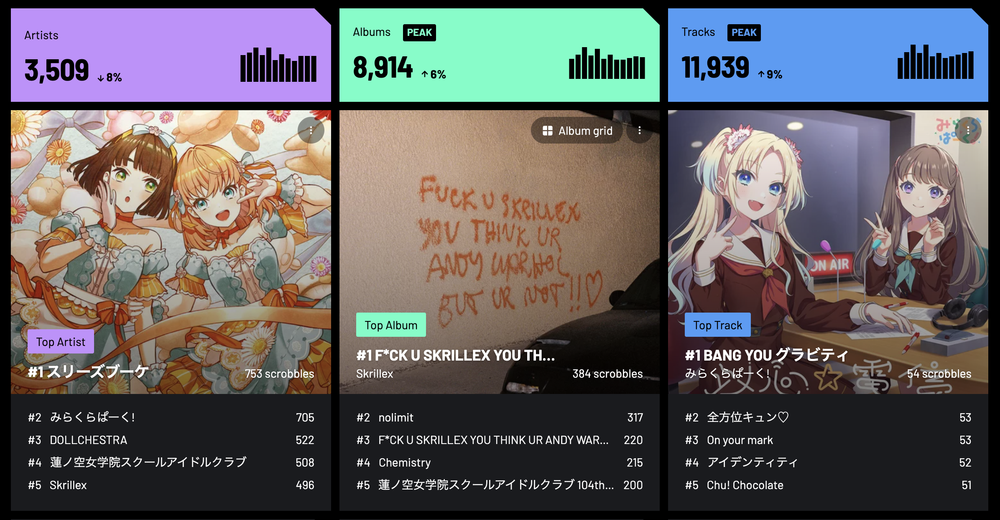

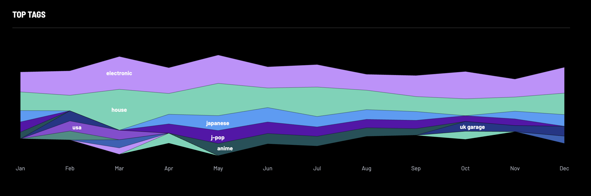

## サブカル

アニメと漫画を全然とってなくてびっくり… コンテンツ系に時間を吸われすぎた。ひびめしにコミカライズから入ってアニメも楽しんでいますとかはあるが。え、Annict みたら本当にはるかなとひびめし以外アニメ観てない、そんなことある？

アーケードの音ゲに触り始めたのも今年からですね。たまにしかやってないし上達しようという気持ちもあんまりないのでずっと素人ですがおもしろくはあるので来年もぼちぼち続けることになるかな… 色々試しましたが最終的には CHUNITHM とオンゲキをやることになりそう。好きな曲が入っているし、周りにやっている人が多い。コラボが多くて目的意識が発生しやすいというのもあるけど…

### 蓮ノ空女学院スクールアイドルクラブ

もう全身蓮ノ空。ありえない。もともと楽曲が好きで、活動記録（ストーリー）を読みはじめたら背景がついてハマってしまって、ウィズミーツ（なんか、キャラが配信するコンテンツ）をみるようになったらなんか推し ™️ みたいな概念が発生して全身蓮人間が完成…

今年見たウィズミーツのベスト３でも貼っておくか。なんか活動記録の進行度合い的にビビッて 2023 年のものを観ることが多かった。

<iframe width="560" height="315" src="https://www.youtube-nocookie.com/embed/CORz7DeojmE?si=WHrgrCnHkYXD3GEq" title="YouTube video player" frameborder="0" allow="accelerometer; autoplay; clipboard-write; encrypted-media; gyroscope; picture-in-picture; web-share" referrerpolicy="strict-origin-when-cross-origin" allowfullscreen></iframe>

<iframe width="560" height="315" src="https://www.youtube-nocookie.com/embed/ONrTpcgwEoE?si=G8dHBJz19afXTmLP" title="YouTube video player" frameborder="0" allow="accelerometer; autoplay; clipboard-write; encrypted-media; gyroscope; picture-in-picture; web-share" referrerpolicy="strict-origin-when-cross-origin" allowfullscreen></iframe>

<iframe width="560" height="315" src="https://www.youtube-nocookie.com/embed/EDX9t5wEs_0?si=sm2hH7KU2UHtrmuH" title="YouTube video player" frameborder="0" allow="accelerometer; autoplay; clipboard-write; encrypted-media; gyroscope; picture-in-picture; web-share" referrerpolicy="strict-origin-when-cross-origin" allowfullscreen></iframe>

活動記録は少しずつ読んでいるんですが、実際の時系列に全く追いつけてはいないのが悔しいところ。数日前に 102 期の卒業ストーリーを読んで、ボロボロに泣いてしまいました。BGP までには追いつく…

### ブルーアーカイブ

<!-- textlint-disable prefer-tari-tari -->

内海アオバと桜井ミヨに狂っていた… 好みを NEXON に見透かされており油断していると刺されるので大変なコンテンツだと思います。桜井ミヨはともかく内海アオバはストーリー読むまで自分がこんなにハマるとは思わなく、なんだか今までとは違う萌え方をしていて普通に世界が広がっているので、いやあブルーアーカイブさんさすがですとしか。

あと、PLDI で韓国に行った際にブルアカ旅行をしました。言語の壁があって現地でのリサーチが厳しいのですが、LLM によっておおむね大丈夫になっていて、なんという時代。

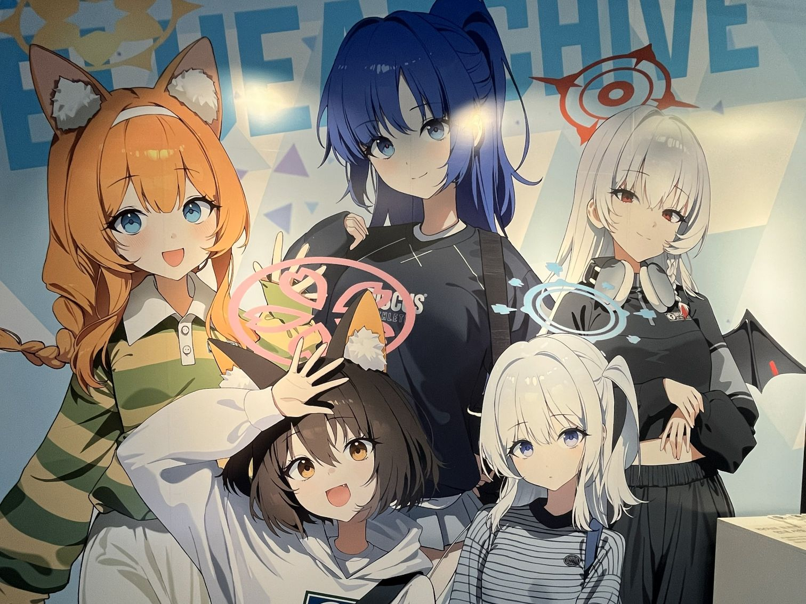

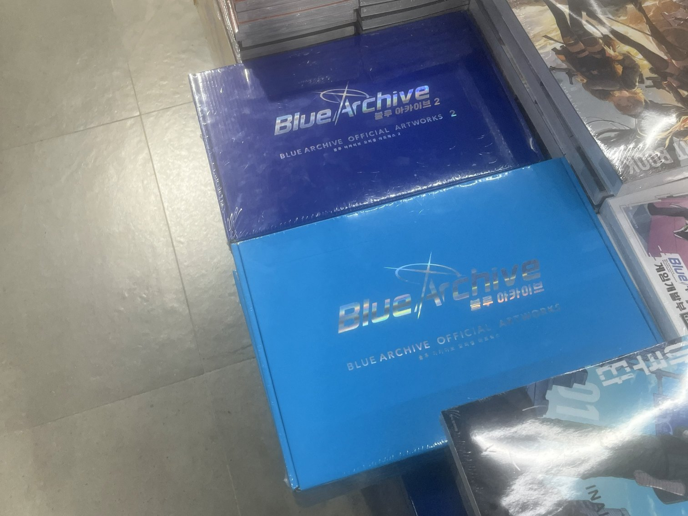

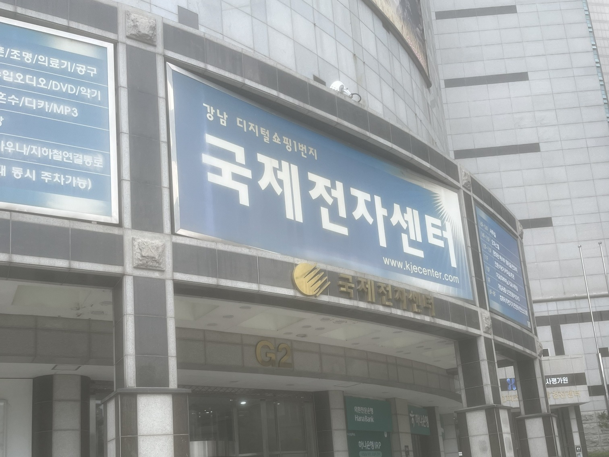

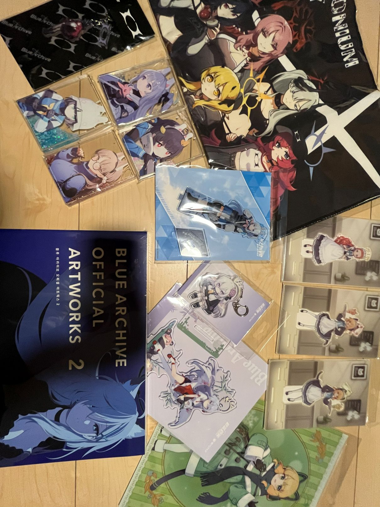

### イラスト

2025 年はやや下火だったかな… 一応 pixiv アカウントを作ったりはした <https://www.pixiv.net/users/114808249>

私は一枚の絵を時間をかけて完成させることが多くて、それをやめたいなと思いました。同じものを見ていればそれは目も慣れるというものだし、一番鍛えたいのは 0 から 1 をつくる部分なのにイテレーションが長すぎて毎回やり方を忘れてボゴソートで線を引いている感じがする。そのため、最近は意図的になるべく雑に小さな落書きをたくさん作るようにしています。何というか、線を引いてみてダメだったら消してやり直す、ではなくて、想像しながら線を引く、ということをすると、成功率が上がるような気もして、ちゃんと頭を使って描きましょう、ってことなのかもしれません… それでも、2 回に 1 回ぐらいしかうまくいかなくて、まだまだです。今の練習のやり方に手応えはあるので、今後もやっていって、頭が慣れていってくれればいいなあ。

<!-- textlint-enable prefer-tari-tari -->

そういえば上で言及した技術書典の本の表紙は自分でイラストを描いたりデザインをしたりしたのでした。こういう、物理的なモノのビジュアルをつくるのはずっとやりたかったことなので、めちゃくちゃいい経験になりました。言わずもがな、つくば市の天久保 3 丁目がテーマです。どこの写真と絵か、わかりますか？

<blockquote class="twitter-tweet">
表紙はわたしが描い/作ったんですがとてもカワイイ仕上がりになっているためおすすめです<a href="https://t.co/ntrBTKXedX">https://t.co/ntrBTKXedX</a> <a href="https://t.co/ifWUn0xjbr">pic.twitter.com/ifWUn0xjbr</a>
&mdash; Hiromi Ogawa (@coord_e) <a href="https://twitter.com/coord_e/status/1929195581487903029?ref_src=twsrc%5Etfw">June 1, 2025</a></blockquote>

## 使いすぎた言葉

<!-- textlint-disable ja-technical-writing/no-mix-dearu-desumasu -->

- 〜でありえない
- 〜やめたい
- びっくり
- 猫
- 犬
- 顔
- 朝
<!-- textlint-enable ja-technical-writing/no-mix-dearu-desumasu -->

## 2026

2025 年の目標を振り返っておきます。時期ごとにいつも何かしらに一生懸命で、全体的に well-utilized な一年だった感じがします。目標に向かっていたかどうかはさておき。

[embed](https://coord-e.com/post/2025-01-05-retro-2024 "ふりかえり 2024 - coord-e.com"){ description="あけましておめでとう" }

- 外に出せる仕事をする
  - した！これはすばらしいのですが、一方でアウトプットはサボっている。さっさとテックブログを書こうと思いました
  - 仕事以外でも公開アウトプットをサボりがちだった。結果としてふりかえりが長い。
- コミュニケーションを意識
  - 意識するとかで何か変わることはないです… 悩むことは多くて、課題感の解像度が上がったけど、まだどうしたいのかよくわかっていない。それはそれとして甘えによってサボっていたコミュニケーションをまじめにやるようになって、それはちゃんと功を奏している…

なんか、年単位で目標とかやるのは結構難しいことがわかりつつあります。一言でこうやって書けないようなやりたいこともたくさんあるわけだし… まあとはいえ 2026 年はなんと大学に戻るため、その辺りで自己を律していく必要がある。目標は最低限の制約ということにしよう。

- 大学に戻ってちゃんと単位を取る
  - ラストチャンス！頑張ろう [/post/2024-09-10-suspension-of-education](https://coord-e.com/post/2024-09-10-suspension-of-education)
- パソコン以外のアウトプットで定量的な成果を上げる
  - パソコン以外に割くリソースが年々増えていてパソコンの加速度が落ちているという自覚があり、その正当化のためにもパソコン以外でそろそろ成果（成果って何？）が上がるといいなあと思っています

あけおめでした～
